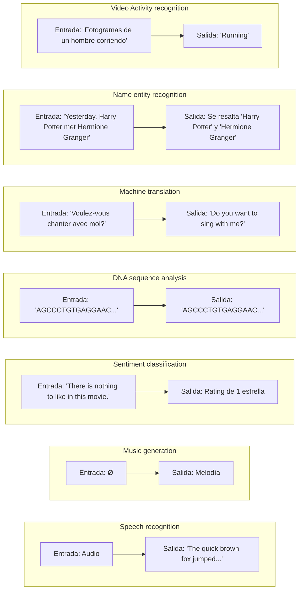

# Examples of sequence data

There are a lot of different types of sequence problems.

- In some, both the input X and the output Y are sequences,.
- Sometimes X and Y can have different lengths.
- And in some of these examples only either X or only the opposite Y is a sequence.

# Notation

- $x^{(i)}$ : ith training example
- $x^{(i)<t>}$ : t-ith element in the sequence of training example
- $T^{(i)}_x$ : the length of a sequence for training example $i$
- $y^{(i)}$, $y^{(i)<t>}$ y $T^{(i)}_y$ : analogous to $x$

$$
\begin{array}{cccccccccc}
x :  &  \underset{x^{<1>}}{\text{Harry}} & \underset{x^{<2>}}{\text{Potter}} & \underset{x^{<3>}}{\text{and}} & \text{Hermione} & \text{Granger} & \underset{x^{<t>}}{\text{invented}} & \text{a} & \text{new} & \underset{x^{<9>}}{\text{spell}} \\ \\
y : &  \underset{y^{<1>}}{1} & \underset{y^{<2>}}{1} & \underset{y^{<3>}}{0} & 1 & \dots & \underset{y^{<t>}}{0} & 0 & 0 & 0 
\end{array}{}
$$

- $T_x = 9$
- $T_y = 9$

## Representing words

We need a vocabulary or dictionary to representing a word in a sentence. For example, a vocabulary of $10 \ 000$ words.

$$
\begin{array}{cc}
\begin{bmatrix}
\text{a} \\
\text{aaron} \\
\vdots \\
\text{and} \\
\vdots \\
\text{harry} \\
\vdots \\
\text{potter} \\
\vdots \\
\text{zulu}
\end{bmatrix}
& 
\begin{matrix}
1 \\
2 \\
\vdots \\
367 \\
\vdots \\
4075 \\
\vdots \\
6830 \\
\vdots \\
10000
\end{matrix}
\end{array}
$$

By **one-hot-encoding**
- 'Harry' is a vector with dimension $10000$ with $1$ in the position $4075$ and zeros in the other positions.
- 'Potter' is a vector with dimension $10000$ with $1$ in the position $6830$ and zeros in the other positions.
- 'and' is a vector with dimension $10000$ with $1$ in the position $367$ and zeros in the other positions.
- 'a' is a vector with dimension $10000$ with $1$ in the position $1$ and zeros in the other positions.

A unknown word is denoted by $\text{<UNK>}$

# Recurrent Neural Network Model

**Why not use a standard network?
- Inputs, outputs can be different lengths in different examples.
- Doesn't share features learned across different positions of text.

## Recurrent Neural Networks

The RNN scans through the data from left to right and the parameters it uses for each time step are shared. 

- The parameters governing the connection from $x_1$ to the hidden layer will be some set of parameters $W_{ax}$ and is the same parameters uses for every time step.
- The activations (horizontal connections) will be governed by $W_{aa}$ and is the same parameters $W_{aa}$ use on every time step
- Similarly the parameters $W_{ya}$ that governs the output predictions $y_i$.

>[!important] Note
>One limitation of this particular neural network structure is that the prediction at a certain time uses inputs or information from the inputs earlier in the sequence but not information later in the sequence.

## Forward Propagation

![[Pasted image 20250731173843.png]]

- $a^{<0>} = \vec{0}$
- $a^{<1>} = g_1(W_{aa} \, a^{<0>} + W_{ax} \ x^{<1>} + b_a)$
- $\hat{y}^{<1>} = g_2(W_{ya} \ a^{<1>} + b_y)$

Where $g$ is the activation function (sigmoid, tanh, ReLU, etc.)

In general
- $a^{<t>} = g_1(W_{aa} \, a^{<t-1>} + W_{ax} \ x^{<t>} + b_a)$
- $\hat{y}^{<t>} = g_2(W_{ya} \ a^{<t>} + b_y)$

We can simplify $a^{<t>}$
$$
a^{<t>} = g(W_{a} \, [\, a^{<t-1>} , \, x^{<t>} \, ] + b_a  \,)
$$

Where $W_{aa}$ and $W_{ax}$ are stacked horizontally
$$
[\, W_{aa} \ |\, \ W_{ax} \,] = W_a
$$

and $a^{<t-1>}$, $x^{<t>}$ are stacked vertically
$$
[\, a^{<t-1>}, x^{<t>}] = \begin{bmatrix} a^{<t-1>} \\  - \\ x^{<t>}\end{bmatrix}
$$

And finally we can write $\hat{y}^{<t>}$ as
$$
\hat{y}^{<t>} = g(\, W_y \, a^{<t>} + b_y)
$$

> [!tip] Summary equations
> $$ \begin{align*} a^{<t>} &= g(W_{a} \, [\, a^{<t-1>} , \, x^{<t>} \, ] + b_a  \,) \\ \\
> \hat{y}^{<t>} &= g(\, W_y \, a^{<t>} + b_y) \end{align*} $$

![[Pasted image 20250803145222.png]]

---

**Instructions**:

* Create a 3D array of zeros, $a$ of shape $(n_{a}, m, T_{x})$ that will store all the hidden states computed by the RNN
* Create a 3D array of zeros, $\hat{y}$, of shape $(n_{y}, m, T_{x})$ that will store the predictions  
    - Note that in this case, $T_{y} = T_{x}$ (the prediction and input have the same number of time steps)
* Initialize the 2D hidden state `a_next` by setting it equal to the initial hidden state, $a_{0}$
* At each time step $t$:
    - Get $x^{\langle t \rangle}$, which is a 2D slice of $x$ for a single time step $t$
        - $x^{\langle t \rangle}$ has shape $(n_{x}, m)$
        - $x$ has shape $(n_{x}, m, T_{x})$
    - Update the 2D hidden state $a^{\langle t \rangle}$ (variable name `a_next`), the prediction $\hat{y}^{\langle t \rangle}$ and the cache by running `rnn_cell_forward`
        - $a^{\langle t \rangle}$ has shape $(n_{a}, m)$
    - Store the 2D hidden state in the 3D tensor $a$, at the $t^{th}$ position
        - $a$ has shape $(n_{a}, m, T_{x})$
    - Store the 2D $\hat{y}^{\langle t \rangle}$ prediction (variable name `yt_pred`) in the 3D tensor $\hat{y}_{pred}$ at the $t^{th}$ position
        - $\hat{y}^{\langle t \rangle}$ has shape $(n_{y}, m)$
        - $\hat{y}$ has shape $(n_{y}, m, T_x)$
    - Append the cache to the list of caches
* Return the 3D tensor $a$ and $\hat{y}$, as well as the list of caches

---

# Different types of RNNs

### Many-to-many architecture
**Name entity recognition**
- $T_x = T_y$

**Machine translation**
- $T_x \neq T_y$

### Many-to-one architecture
**Sentiment classification**
- input: text
- output: 0/1 or 1, 2, 3, 4, 5, etc.

### One-to-many architecture
**Music generation**

![[Pasted image 20250731193614.png]]

# Language model and sequence generation

## What is language modelling?

**Speech recognition**
- The apple and *pair* salad.
- The apple and _pear_ salad.

$$
\begin{align*}
P(\text{The apple and pair salad}) = 3.2 \times 10^{-13} \\ \\
P(\text{The apple and pear salad}) = 5.7 \times 10^{-10}
\end{align*}
$$

- $P(\text{sentence})$ = ?
- $P(y^{<1>}, y^{<2>}, \dots, y^{<T_y>})$

To build a language model using a RNN we need a training set comprising a large corpus of text.

>[!tip] corpus
> Is a NLP terminology that means a large body o very large set of english  sentences

# Sampling novel sequences

## Character-level language model

Vocabulary = \[a, b, c, . . . , z, space, . , : ,  ; ,  . . . ,  0, 1, . . . , 9 , A, B, . . . , Z]

- **Pros**: You don't have to worry about unknown word tokens.
- **Cons**: You end up with much longer sequences.

# Vanishing gradients with RNNs

# Gated Recurrent Unit

## Full GRU

$$
\begin{aligned}
\tilde{c}^{<t>} &= tanh(W_c [\Gamma_r * c^{<t-1>}, x^{<t>}] + b_c) \\ \\
\Gamma_u &= \sigma(W_u[c^{<t-1>}, x^{<t>}] + b_u) \\ \\
\Gamma_r &= \sigma(W_r[c^{<t-1>}, x^{<t>}] + b_r) \\ \\
c^{<t>} &= \Gamma_u * \tilde{c}^{<t>} + (1 - \Gamma_u) * c^{<t-1>} \\ \\
\end{aligned}
$$

In the literature
- $\tilde{h} = \tilde{c}^{<t>}$
- $u = \Gamma_u$
- $r = \Gamma_r$
- $h = c^{<t>}$

# Long Short Term Memory (LSTM)

- [Illustrated Guide to LSTM's and GRU's: A step by step explanation](https://www.youtube.com/watch?v=8HyCNIVRbSU)
- [Understanding LSTM Networks -- colah's blog](https://colah.github.io/posts/2015-08-Understanding-LSTMs/)

$$
\begin{aligned}
\tilde{c}^{<t>} &= tanh(W_c [a^{<t-1>}, x^{<t>}] + b_c) \\ \\
\Gamma_u &= \sigma(W_u [a^{<t-1>}, x^{<t>}] + b_u) \\ \\
\Gamma_f &= \sigma(W_f [a^{<t-1>}, x^{<t>}] + b_f) \\ \\
\Gamma_o &= \sigma(W_o [a^{<t-1>}, x^{<t>}] + b_o) \\ \\
c^{<t>} &= \Gamma_u * \tilde{c}^{<t>} + \Gamma_f * c^{<t-1>} \\ \\
a^{<t>} &= \Gamma_o * tanh(c^{<t>})
\end{aligned}
$$

![[Pasted image 20250802124211.png]]

# Bidirectional RNN

A standard RNN processes sequences in one direction (usually forward, from the first element to the last). It makes predictions at each step using **only the past and present context**.

A Bidirectional RNN is smarter: it processes the sequence **in both directions** (forward and backward) using two separate hidden layers. This allows the network, at any point in the sequence, to have **full context**—information from both the past and the future.

![[Pasted image 20250824121830.png]]

Given an input sequence $x^{<1>}$ to $x^{<4>}$, in the forward sequence we first compute  $\vec{a}^{<1>}$ (1), then use that to compute (2), then (3) and (4). Whereas the backward sequence will start by computing a backward  $\overleftarrow{a}^{<4>}$ (4), then (3), then (2) and (1)

$$
\hat{y}^{<t>} = g(W_y \ [\vec{a}^{<t>} \, , \, \overset{\leftarrow}{a}^{<t>}] + b_y)
$$

