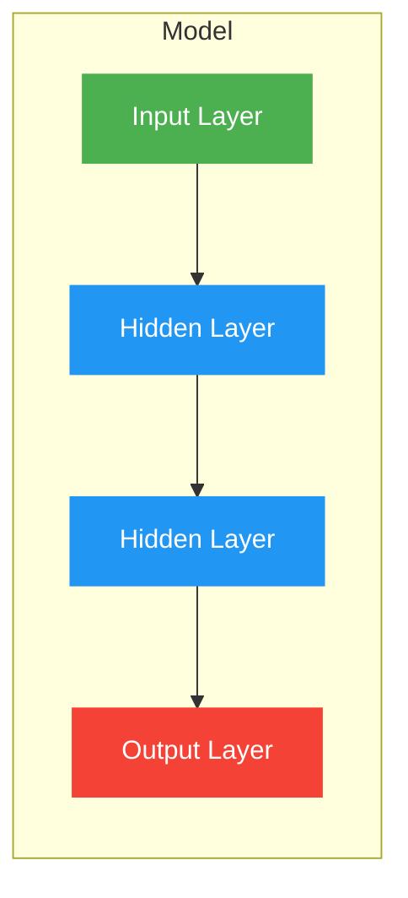

# Introduction to Deep Learning with Keras


- Deep Learning Framework
- Enables fast experimentation
- Runs on top of other frameworks
- Written by Francois Chollet


**Keras  + TensorFlow**
- TensorFlow's high level framework of choice
- Keras is complementary to TensorFlow
- You can use TensorFlow for low level features


<h5>The sequential API</h5>



<h5>Defining a neural network</h5>

```python
from tensorflow.keras.models import Sequential
from tensorflow.keras.layers import Dense

# Create a new sequential model
model = Sequential()

# Add an input and dense layer
model.add(Dense(2, input_shape=(3,)))

# Add a final 1 neuron layer
model.add(Dense(1))
```


<h5>Adding activations</h5>

```python
from tensorflow.keras.models import Sequential
from tensorflow.keras.layers import Dense

# Create a new sequential model
model = Sequential()

# Add an input and dense layer
model.add(Dense(2, input_shape=(3,), activation='relu'))

# Add a final 1 neuron layer
model.add(Dense(1))

model.summary()
```

Output:

```lua
Model: "sequential"
┏━━━━━━━━━━━━━━━━━━━━━━━━━━━━━━━━━┳━━━━━━━━━━━━━━━━━━━━━━━━┳━━━━━━━━━━━━━━━┓
┃ Layer (type)                    ┃ Output Shape           ┃       Param # ┃
┡━━━━━━━━━━━━━━━━━━━━━━━━━━━━━━━━━╇━━━━━━━━━━━━━━━━━━━━━━━━╇━━━━━━━━━━━━━━━┩
│ dense (Dense)                   │ (None, 2)              │             8 │
├─────────────────────────────────┼────────────────────────┼───────────────┤
│ dense_1 (Dense)                 │ (None, 1)              │             3 │
└─────────────────────────────────┴────────────────────────┴───────────────┘
 Total params: 11 (44.00 B)
 Trainable params: 11 (44.00 B)
 Non-trainable params: 0 (0.00 B)
```


### Binary classification

The dataset

| coordinates        | labels |
| ------------------ | ------ |
| $[0.242, 0.038]$   | 1      |
| $[0.044, -0.057]$  | 1      |
| $[-0.787, -0.076]$ | 0      |


```python
from tensorflow.keras.models import Sequential
from tensorflow.keras.layers import Dense

# Instantiate a sequential model
model = Sequential()

# Add input and hidden layer
model.add(Dense(4, input_shape=(2,), activation='tanh'))

# Add output layer, use sigmoid
model.add(Dense(1, activation='sigmoid'))

# Compile model
model.compile(optimizer='sgd', loss='binary_crossentropy')

# Train model
model.train(coordinates, labels, epoch=20)

# Predict with trained model
preds = model.predict(coordinates)
```


### Multi-class classification

**The dataset**

|     | xCoord    | yCoord    | competitor |
| --- | --------- | --------- | ---------- |
| 0   | 0.196451  | -0.520341 | Steve      |
| 1   | 0.476027  | -0.306763 | Susan      |
| 2   | 0.003175  | -0.980736 | Michael    |
| 3   | 0.294078  | 0.267566  | Kate       |
| 4   | -0.051120 | 0.598946  | Steve      |
| ... | ...       | ...       | ...        |


**Example of One-hot encoding**

![[Pasted image 20250823212041.png]]


<h5>Preparing a dataset</h5>

```python
import pandas as pd

darts = pd.read_csv('/content/drive/MyDrive/Learning IA/darts.csv')
darts.columns
# Output: Index(['xCoord', 'yCoord', 'competitor'], dtype='object')

# Transform into a categorical variable
darts.competitor = pd.Categorical(darts.competitor)

# Assign a number to each category (label encoding)
darts.competitor = darts.competitor.cat.codes

# Print the label encoded competitors
print(darts.competitor.head())
# Output
# 0    2
# 1    3
# 2    1
# 3    0
# 4    2
# Name: competitor, dtype: int8
```


<h5>One-hot encoding labels</h5>

```python
# Import to_categorical from keras utils module
from tensorflow.keras.utils import to_categorical

coordinates = darts.drop(['competitor'], axis=1)
# Use to_categorical on your labels
competitors = to_categorical(darts.competitor)

# Now print the one-hot encoded labels
print('One-hot encoded competitors: \n',competitors)
# Output
# One-hot encoded competitors: 
#  [[0. 0. 1. 0.]
#  [0. 0. 0. 1.]
#  [0. 1. 0. 0.]
#  ...
#  [0. 1. 0. 0.]
#  [0. 1. 0. 0.]
#  [0. 0. 0. 1.]]
```

<h5>Defining the neural network model</h5>

```python
from tensorflow.keras.models import Sequential
from tensorflow.keras.layers import Dense

# Instantiate a sequential model
model = Sequential()

# Add an input and hidden layer
model.add(Dense(128, input_shape=(2,), activation='relu'))

# Add 3 dense layers of 128, 64 and 32 neurons each
model.add(Dense(64, activation='relu'))
model.add(Dense(32, activation='relu'))

# Add a dense layer with as many neurons as competitors
model.add(Dense(4, activation='softmax'))

# Compile your model using categorical_crossentropy loss
model.compile(loss='categorical_crossentropy',
              optimizer='adam',
              metrics=['accuracy'])
```

<h5>One-hot encoding labels</h5>

```python
from tensorflow.keras.models import Sequential
from tensorflow.keras.layers import Dense

# Instantiate a sequential model
model = Sequential()

# Add an input and hidden layer
model.add(Dense(128, input_shape=(2,), activation='relu'))

# Add more hidden layers
model.add(Dense(64, activation='relu'))
model.add(Dense(32, activation='relu'))

# Add output layer
model.add(Dense(4, activation='softmax'))

model.compile(optimizer='adam', loss='categorical_crossentropy')
```


<h5>Training and evaluating the model</h5>

```python
from sklearn.model_selection import train_test_split

coord_train, coord_test, competitors_train, competitors_test = train_test_split(coordinates, competitors, test_size=20, stratify=competitors)

# Fit your model to the training data for 200 epochs
model.fit(coord_train, competitors_train,epochs=200, verbose=2)

# Evaluate your model accuracy on the test data
accuracy = model.evaluate(coord_test, competitors_test)[1]

# Print accuracy
print('Accuracy:', accuracy)
# Output:
# Epoch 197/200
# 25/25 - 0s - 12ms/step - accuracy: 0.8205 - loss: 0.4910
# Epoch 198/200
# 25/25 - 0s - 5ms/step - accuracy: 0.8231 - loss: 0.4901
# Epoch 199/200
# 25/25 - 0s - 5ms/step - accuracy: 0.8218 - loss: 0.4918
# Epoch 200/200
# 25/25 - 0s - 6ms/step - accuracy: 0.8179 - loss: 0.4983
# 1/1 ━━━━━━━━━━━━━━━━━━━━ 1s 891ms/step - accuracy: 0.7500 - loss: 0.5955
# Accuracy: 0.75
```


### Multi-label classification


<div style="text-align:center">

</div>

<h5>The architecture</h5>

```python
from tensorflow.keras.models import Sequential
from tensorflow.keras.layers import Dense

# Instantiate model
model = Sequential()
# Add input and hidden layers
model.add(Dense(2, input_shape=(1,)))
# Add an output layer for 3 classes and sigmoid activation
model.add(Dense(3, activation='sigmoid'))
```

Unlike in multi-class problems, each output neuron has a sigmoid activation function. This makes each neuron in the output layer able to output a number between 0 and 1 independently

![[Pasted image 20250823224225.png]]


```python
# Compile the model with binary crossentropy
model.compile(optimizer='adam', loss='binary_crossentropy')

# Train your model, recall validation_split
model.fit(X_train, y_train, epochs=100, validation_split=0.2)
```

An output of your **multi-label** `model` could look like this: `[0.76, 0.99, 0.66]` . If we round up probabilities higher than 0.5, this observation will be classified as containing all 3 possible labels: `[1, 1, 1]`.


### Keras callbacks

A callback is a function that is executed after some other function, event, or task has finished.
A keras callback is a block of code that gets executed after each epoch during training or after the training is finished

Useful to
- Store metrics as the model trains
- Make decisions as the training goes by


<h5>A callback example</h5>

```python
# training a model and saving its history
history = model.fit(X_train, y_train, 
				   epochs=100,
				   validation_data=(X_test, y_test),
				   metrics=['accuracy'])
				   
print(history.history['val_loss'])
# [0.7753975939750672, ..., 0.4155936544282096] A list

print(history.history['val_accuracy'])
# [0.6030952412741525, ..., 0.7604761900220599]
```

- `model.history.history` is a dictionary with the metrics of the training as **keys**
x
<h5>History plots</h5>

```python
# Plot train vs test accuracy per epoch
plt.figure()

# Use the history metrics
plt.plot(history.history['accuracy'])
plt.plot(history.history['val_accuracy'])
plt.title('Model accuracy') 
plt.ylabel('Accuracy') 
plt.xlabel('Epoch') 
plt.legend(['Train', 'Test']) 
plt.show()
```

<div style="text-align:center">

</div>


<h5>Early stopping</h5>
The early stopping callback is useful since it allows for you to stop the model training if it no longer improves after a given number of epochs.


```python
from tensorflow.keras.callbacks import EarlyStopping

# Instantiate an early stopping callback
early_stopping = EarlyStopping(monitor='val_loss', patience=5)

# Train your model with the callback
model.fit(X_train, y_train, epochs=100,
		  validation_data=(X_test, y_test),
		  callbacks=[early_stopping])
```


<h5>Model checkpoint</h5>
This callback allows us to sabe our model as it trains. You can decide what to monitor to determine which model is best with the monitor parameter, by default **validation loss** is monitored.


```python
from keras.callbacks import ModelCheckpoint

# Instantiate a model checkpoint callback
model_save = ModelCheckpoint('best_model_hdf5', save_best_only=True)

# Train your model with the callback
model.fit(X_train, y_train, epochs=100,
		  validation_data=(X_test, y_test),
		  callbacks=[model_save])
```


<h5>A combination of callbacks</h5>

```python
# Import the EarlyStopping and ModelCheckpoint callbacks
from tensorflow.keras.callbacks import EarlyStopping, ModelCheckpoint

# Early stop on validation accuracy
monitor_val_acc = EarlyStopping(monitor = 'val_accuracy', patience = 3)

# Save the best model as best_banknote_model.hdf5
model_checkpoint = ModelCheckpoint('best_banknote_model.hdf5', save_best_only = True)

# Fit your model for a stupid amount of epochs
h_callback = model.fit(X_train, y_train,
                    epochs = 1000000000000,
                    callbacks = [monitor_val_acc, model_checkpoint],
                    validation_data = (X_test, y_test))
```


>[!tip] Summary
> - **History Callback**: Automatically returned when you train a model using `.fit()`. It stores metrics like loss and accuracy for each epoch, allowing you to analyze the model's performance over time. For instance, accessing `h_callback.history['accuracy']` gives you the model's accuracy after each epoch.
>
>
> - **Early Stopping Callback**: Prevents overfitting by stopping the training when a monitored metric, such as validation accuracy, stops improving for a specified number of epochs (patience). This is crucial for saving time and computational resources
>
>
> - **Model Checkpoint Callback**: Saves the model at certain points during training. By setting save_best_only=True, you ensure that only the version of the model that performs best on a validation metric is saved. This is useful for long training sessions where you want to retain the best model.


## Improving your model performance


### Learning curves

Many times we will find unstable curves. There are many reasons that can lead to unstable learning curves:
- the chosen optimizer
- learning rate
- batch-size
- network architecture
- weight initialization, etc.

![[Pasted image 20250824153049.png]]


```python
# Store initial model weights
init_weights = model.get_weights()

# List for storing accuracies
train_accs = []
tests_accs = []

for train_size in train_sizes:
	# Split a fraction according to train_size
	X_train_frac, _, y_train_frac, _ = 
			train_test_split(X_train, y_train, train_size=train_size)
	# Set model initial weights
	model.set_weights(intial_weights)
	# Fit model on the training set fraction
	model.fit(X_train_frac, y_train_frac, epochs=100, 
				verbose=0, callbacks=[EarlyStopping(monitor='loss', patience=1)])
	# Get the accuracu for this training set fraction
	train_acc = model.evaluate(X_train_frac, y_train_frac, verbose=0)[1]
	train_accs.append(train_acc)
	# Get the accuracy on the whole test set
	test_acc = model.evaluate(X_test, y_test, verbose=0)[1]
	test_accs.append(test_acc)
	print("Done with size: ", train_size)
```


### Activation functions


**Why activation function to use?**
- No magic formula
- ReLU are a good first choice
- Sigmoids not recommended for deep models
- Tune with experimentation


<h5>Comparing activation functions</h5>


```python
# Set a random seed
np.random.seed(1)

# Return a new model with the given activation
def get_model(act_function):
	model = Sequential()
	model.add(Dense(4, input_shape=(2,), activation=act_function))
	model.add(Dense(1, activation='sigmoid'))
	return model
	
# Activation functions to try
activations = ['relu', 'sigmoid', 'tanh']

# Dictionary to store results
activation_result = {}

for func in activations:
	model = get_model(act_function=func)
	history = model.fit(X_train, y_train, 
						validation_data=(X_test, y_test),
						epochs=100, verbose=0)
	activation_results[funct] = history
```


```python
import pandas as pd

# Extract val_loss history of each activation function
val_loss_per_funct = {k:v.history['val_loss'] for k, v in activation_results.items()}

# Turn the dictionary into a pandas dataframe
val_loss_curves = pd.DataFrame(val_loss_per_funct)

# Plot the curves
val_loss_curves.plot(title='Loss per Activation function')
```


### Batch size and batch normalization

<h5>Mini-batches</h5>

A **mini-batch** is a subset of the training data used to update the model's weights. This approach helps in training models faster and more efficiently, especially with large datasets. 


**Advantages**
- Networks train faster (more weight updates in same amount of time)
- Less RAM memory required, can train on huge datasets
- Noise can help networks reach a lower error, escaping local minima

**Disadvantages**
- More iterations need to be run
- Need to be adjusted, we need to find a good batch size

<h5>Batch size in Keras</h5>

```python
# Fitting an already built and compiled model
model.fit(X_train, y_train, epoch=100,
		  batch_size=128)
```

[[#`tf.keras.Model.fit`]]


<h5>Standarization (a normalization approach)</h5>

$$
\Huge
\dfrac{\text{data}-\text{mean}}{\text{standard deviation}}
$$


<div style="text-align:center">

</div>


[Batch Normalization: Theory and TensorFlow Implementation | DataCamp](https://www.datacamp.com/tutorial/batch-normalization-tensorflow)

<h5>Batch normalization advantages</h5>

Batch normalization standardizes the inputs to a layer for each mini-batch. This stabilizes the learning process and significantly improves the training speed and performance of neural networks. 


- Improves gradient flow
- Allows higher learning rates
- Reduces dependence on weights initializations
- Acts as an unintended form of regularization
- Limits internal covariate shift


<h5>Batch normalization in Keras</h5>

```python
# Import BatchNormalization from keras layers
from tensorflow.keras.layers import BatchNormalization

# Instantiate a Sequential model
model = Sequential()
# Add an input layer
model.add(Dense(3, input_shape=(2,), activation='relu'))
# Add batch normalization for the outputs of the layer above
model.add(BatchNormalization())
# Add an output layer
model.add(Dense(1, activation='sigmoid'))

```


### Hyperparameter tuning

<h5>Neural network hyperparameter</h5>
- Number of layers
- Number of neurons per layer
- Layer order
- Layer activations
- Batch sizes
- Learning rates
- Optimizers
- ...


**Sklearn recap**


```python
# Import RandomizedSearchCV
from sklearn.model_selection import RandomizedSearchCV
from sklearn.tree import DecisionTreeClassifier
# Instantiate your classifier
tree = DecisionTreeClassifier()
# Define a series of parameters to look over
params = {'max_depth':[3, None], 'max_features':range(1, 4), 'min_samples_leaf':range(1, 4)}
# Perform random search with cross validation
tree_cv = RandomizedSearchCV(tree, params, cv=5)
tree_cv.fit(X, y)

# Print the best parameters
print(tree_cv.best_params_)
# {'min_samples_leaf': 1, 'max_features': 3, 'max_depth': 3}|
```


### Turn a Keras model into a sklearn estimator


**Tips for neurial networks hyperparameter tuning**

- Random search is preferred over grid search
- Don't use many epochs
- Use a smaller sample of your dataset
- Play with batch sizes, activations, optimizers and learning rates


First try:

```python
!pip install --upgrade tensorflow scikeras scikit-learn -q
```


```python
from keras.models import Sequential
from keras.layers import Dense
from keras.layers import Input
from keras.optimizers import Adam

# Creates a model given an activation and learning rate
def create_model(learning_rate=0.01, activation='relu'):
  # Create an Adam optimizer with the given learning rate
  opt = Adam(learning_rate=learning_rate)

  # Create your binary classification model
  model = Sequential([
      Input(shape=(30,)),
      Dense(128, activation=activation),
      Dense(256, activation=activation),
      Dense(1, activation='sigmoid')
  ])

  # Compile your model with your optimizer, loss, and metrics
  model.compile(optimizer=opt,
                loss='binary_crossentropy',
                metrics=['accuracy'])
  return model
```


```python
from scikeras.wrappers import KerasClassifier
from sklearn.model_selection import RandomizedSearchCV, KFold

# Create a KerasClassifier
model_for_search = KerasClassifier(model=create_model, verbose=0)

# Define the parameters to try out
params = {
    'model__activation': ['relu', 'tanh'],
    'batch_size': [32, 128, 256],
    'epochs': [50, 100, 200],
    'model__learning_rate': [0.1, 0.01, 0.001]

}

# Create a randomize seach cv object passing in the parameters tp try
random_search = RandomizedSearchCV(
    model_for_search,
    param_distributions=params,
    cv=KFold(3),
    n_iter = 5, # Reduce el numero de iteraciones para una ejecucion mas rapida
    random_state = 42
)

# Running random_search.fit(X, y) would start the search
print(f"Ejecutando random_search.fit(X, y)")
random_search.fit(X, y)

print(f"\nMejores parametros: {random_search.best_params_}")
print(f"Best Score: {random_search.best_score_:.4f}")
```

<h5>Cross-validation</h5>

```python
from sklearn.model_selection import cross_val_score
# Time to train the model with the best parameters found

# Create a Kerasclassifier
best_model = KerasClassifier(
    model=create_model,
    **random_search.best_params_, # Pasa los mejores parametros encontrados
    verbose=0
)

# Calculate the accuracy score for each fold
kfolds = cross_val_score(best_model, X, y, cv=3)

line = '-'
print(f"{line*4} Cross Validatino Results (Best Model) {line*4}")
print(f"Accuracy for each fold: {kfolds}")
print(f"Average accuracy: {kfolds.mean():.4f}")
print(f"With a standard deviation of: {kfolds.std():.4f}")
```


## Advanced model architectures


### Tensors, layers, and autoencoders


```python
from tensorflow.keras.models import Sequential
from tensorflow.keras.layers import Dense
from tensorflow.keras.layers import Input

model = Sequential([
    Input(shape=(5,)),
    Dense(4, activation='relu'),
    Dense(1, activation='sigmoid')
])

model.compile(
    optimizer='adam',
    loss='binary_crossentropy',
    metrics=['accuracy']
)
```

<h5>Accessing Keras layers</h5>

```python
# Accessing the first layer of a Keras model
first_layer = model.layers[0]

# Printing the layer, and its input, output and weights
print(f"First layer input: {first_layer.input}")
print(f"First layer output: {first_layer.output}")
print(f"First layer weights: {first_layer.weights}")

# output
# First layer input: <KerasTensor shape=(None, 5), dtype=float32, sparse=False, ragged=False, name=keras_tensor_84>
# First layer output: <KerasTensor shape=(None, 4), dtype=float32, sparse=False, ragged=False, name=keras_tensor_85>
# First layer weights: [<Variable path=sequential_21/dense_63/kernel, shape=(5, 4), dtype=float32, value=[[ 0.5277028  -0.512732    0.36541843 -0.25796348]
#  [ 0.43374586  0.5718037  -0.7582543  -0.51569915]
#  [ 0.7150253   0.383479    0.5067762   0.71938825]
#  [ 0.11068881  0.5368161  -0.46120557  0.66205955]
#  [-0.00704622 -0.52124625 -0.73721147  0.25673234]]>, <Variable path=sequential_21/dense_63/bias, shape=(4,), dtype=float32, value=[0. 0. 0. 0.]>]
```

<h5>tensorflow.keras.backend</h5>
If you have already built a model, you can use the `model.layers` and the `tensorflow.keras.backend` to built functions that, provided with a valid input tensor, return the corresponding output tensor.

This is a useful tool when we want to obtain the output of a network at an intermediate layer


```python
# Import Keras backend
import tensorflow.keras.backend as K
# Get the input and output tensors of a model layer
inp = model.layers[1].input
out = model.layers[1].output

# Function that maps layer input to outputs
inp_to_out = K.function([inp], [out])

# We pass and input and get the output we'd get in that first layer
print(inp_to_out[X_train])
```

### Autoencoders

**Autoencoders use cases**

- **Dimensionality reduction**: Smaller dimensional space representation of our inputs.
- **De-noising data**: If trained with clean data, irrelevant noise will be filtered out during reconstruction.
- **Anomaly detection**: A poor reconstruction will result when the model is fed with unseen inputs.


<h5>Building a simple autoencoder</h5>

```python
from keras.models import Sequential
from keras.layers import Dense
from keras.layers import Input

# Instantiate a sequential model
autoencoder = Sequential()

# Add a hidden layer of 4 neurons and an input layer of 100
autoencoder.add(Dense(4, input_shape=(100,), activation='relu'))

# Add an output layer of 100 neurons
autoencoder.add(Dense(100, activation='sigmoid'))

# Compile your model with the appropiate loss
autoencoder.compile(optimizer='adam', loss='binary_crossentropy')
```


<h5>Breaking it into an encoder</h5>

```python
# Building a separate model to encode inputs
encoder = Sequential()
encoder.add(autoencoder.layers[0])

# Predicting returns the four hidden layer neuron outputs
encoder.predict(X_test)
```


<h5>Exercise</h5>

**Building a autoencoder**

```python
import numpy as np
from keras.datasets import mnist

(X_train, _), (X_test, _) = mnist.load_data()

X_train = X_train.astype('float32') / 255.
X_test = X_test.astype('float32') / 255.
print(f"Shape X_train: {X_train.shape}")
print(f"Shape X_test: {X_test.shape}")

X_train = X_train.reshape(len(X_train), np.prod(X_train.shape[1:]))
X_test = X_test.reshape(len(X_test), np.prod(X_test.shape[1:]))

print(f"Shape X_train: {X_train.shape}")
print(f"Shape X_test: {X_test.shape}")

# Shape X_train: (60000, 784)
# Shape X_test: (10000, 784)
```

```python
noise_factor = 0.2

X_train_noise = X_train + noise_factor * np.random.normal(loc=0, scale=1.0, size=X_train.shape)
X_test_noise = X_test + noise_factor * np.random.normal(loc=0, scale=1.0, size=X_test.shape)

X_train_noise = np.clip(X_train_noise, 0., 1.)
X_test_noise = np.clip(X_test_noise, 0., 1.)
```


```python
from keras.models import Sequential
from keras.layers import Dense
from keras.layers import Input

# Start with a sequential model
autoencoder = Sequential()

# Add a dense layer with input the original image pixels
# and neurons the encoded representation
autoencoder.add(Input(shape=(28*28,)))
autoencoder.add(Dense(256, activation='relu'))
autoencoder.add(Dense(64, activation='relu'))
autoencoder.add(Dense(256, activation='relu'))
autoencoder.add(Dense(28*28, activation='sigmoid'))

autoencoder.compile(optimizer='adam', loss='binary_crossentropy')
autoencoder.summary()

history = autoencoder.fit(X_train_noise, X_train,
                epochs=300, batch_size=256, shuffle=True,
                validation_data=(X_test_noise, X_test))
```

```python
def compare_plot(noise_images, decoded_images):
  indices = np.random.randint(0, 6000, 10)

  sample = np.vstack([noise_images[indices], decoded_images[indices]])
  fig, ax = plt.subplots(nrows=2, ncols=10, figsize=(12, 4))

  for i, axis in enumerate(ax.flat):
    axis.imshow(sample[i].reshape(28, 28), cmap='gray')
    axis.axis('off')
    if i < 10:
      axis.set_title('Noisy')
    else:
      axis.set_title('Decoded')
  plt.tight_layout()
  plt.show()
```


```python
# Build your encoder by using the firt layers of your autoencoder
encoder = Sequential()
encoder.add(autoencoder.layers[0])
encoder.add(autoencoder.layers[1])

# Predict on the noisy images with your autoencoder
decoded_imgs = autoencoder.predict(X_test_noise)

# Plot noisy vs decoded images
compare_plot(X_test_noise, decoded_imgs)
```


![[Pasted image 20250907224728.png]]


### Intro to CNNs

[[CNN (Convolutional Neural Networks)]]

<h5>Shape in 3D Images</h5>
- `input_shape: ` (WIDTH, HEIGHT, CHANNELS
	- `input_shape=(28, 28, 3)`

Color images have 3 channels 

<div style="background-color:white; color:black">
<p>
<span style="color:red;">R</span>
<span style="color:green;">G</span>
<span style="color:blue;">B</span>
(Red Green Blue)</p>
</div>


```python
# Import Conv2D layer and Flatten from tensorflow keras layers
from tensorflow.keras.layers import Dense, Conv2D, Flatten
# Instantiate your model as usual
model = Sequential()

# Add a convolutional layer with 32 filters of size 3x3
model.add(Conv2D(filters=32,
				 kernel_size=3,
				 input_shape=(28,28,1),
				 activation='relu'))

# Add another convolutional layer
model.add(Conv2D(8, kernel_size=3, activation='relu'))

# Flatten the output of the previous layer
model.add(Flatten())

# End this multiclass model with 3 outputs and softmax
model.add(Dense(3, activation='softmax'))

```


### Pre-processing images for ResNet50


```python
# Import image and preprocess_input
from keras.preprocessing import image
from keras.applications.resnet50 import preprocess_input
from keras.applications.resnet50 import ResNet50
from keras.applications.resnet50 import decode_predictions
import numpy as np

# Load the image with the right target size for your model
img_path = '/content/drive/MyDrive/Learning IA/dog.png'
img = image.load_img(img_path, target_size=(224, 224))

# Turn it into an array
img_array = image.img_to_array(img)

# Expand the dimensions of the image, this is so that it fits the expected model input format
img_expanded = np.expand_dims(img_array, axis=0)

# Pre-process the imag in the same way original images were
img_ready = preprocess_input(img_expanded)
# (1, 224, 224, 3) # Shape of img_ready
```


```python
from keras.applications.resnet50 import ResNet50
from keras.applications.resnet50 import decode_predictions

# Intantiate a ResNet50 model with 'imagenet' weights
model = ResNet50(weights='imagenet')

# Predict with ResNet50 on your already processed img
preds = model.predict(img_ready)

# Decode the first 3 predictions
print('Predicted:', decode_predictions(preds, top=3)[0])
```


```
WARNING:tensorflow:5 ...
1/1 ━━━━━━━━━━━━━━━━━━━━ 3s 3s/step
Predicted: [('n02088364', 'beagle', np.float32(0.9073765)), ('n02089867', 'Walker_hound', np.float32(0.06626664)), ('n02089973', 'English_foxhound', np.float32(0.018850848))]
```


### Intro to LSTMs


![[Pasted image 20250907235516.png]]


**When to use LSTMs?**

- Image captioning
- Speech to text
- Text translation
- Document Summarization
- Text generation
- Musical composition


```python
from keras.preprocessing.text import Tokenizer

# Instantiate Tokenizer
tokenizer = Tokenizer()

# Fit it on the previous lines

```


# Advanced Deep Learning with Keras


# Image Modeling with Keras


# Recurrent Neural Networks (RNNs) for Language Modeling with Keras


---

# Keras Reference Sheet


## `tf.keras.layers.Dense`

`tf.keras.layers.Dense` is a fully connected (dense) neural network layer that applies a linear transformation to the input (`x * W + b`) followed by an optional activation function.

```python
tf.keras.layers.Dense(
    units,                      # Number of neurons (outputs)
    activation=None,            # Activation function
    use_bias=True,              # Include bias or not
    kernel_initializer="glorot_uniform",
    bias_initializer="zeros",
    input_shape=None,           # Shape of the input (only for the first layer)
    ...
)
```

**Main parameters**

* `units` → number of neurons in this layer (output dimension)
* `activation` → function to apply after linear transformation (`"relu"`, `"sigmoid"`, etc.)
* `use_bias` → whether to add bias
* `kernel_initializer` → how to initialize weights
* `bias_initializer` → how to initialize bias
* `input_shape` → expected shape of the input data (needed only in the first layer of a model)


**The syntax `Dense(...)(inputs)`**

This is a two-step process:

1. `Dense(10, activation="sigmoid")`  
    → creates a **layer object** (an instance of the `Dense` class).
    
2. `(inputs)`  
    → calls the layer object with input tensors. This internally runs the `__call__` method, which connects the input to the layer and creates weights if they don’t exist yet.
    

That’s why you see this “chained” style:

```python
dense1 = Dense(10, activation="sigmoid")(inputs)
dense2 = Dense(5, activation="sigmoid")(dense1)
outputs = Dense(1, activation="sigmoid")(dense2)
```

This is part of Keras’ **Functional API**, which builds a computation graph layer by layer.


## `tf.keras.optimizers.SGD`

Stochastic Gradient Descent optimizer that updates parameters in the direction of the negative gradient. It can include momentum and Nesterov acceleration.

```python
tf.keras.optimizers.SGD(
    learning_rate=0.01,
    momentum=0.0,
    nesterov=False,
    name="SGD"
)
```

* `learning_rate` → step size for weight updates
* `momentum` → helps accelerate updates in relevant directions
* `nesterov` → whether to apply Nesterov momentum


## `tf.keras.optimizers.RMSprop`

Optimizer that adapts the learning rate for each parameter by dividing the gradient by a running average of its recent magnitudes.

```python
tf.keras.optimizers.RMSprop(
    learning_rate=0.001,
    rho=0.9,
    momentum=0.0,
    epsilon=1e-07,
    centered=False,
    name="RMSprop"
)
```

* `learning_rate` → step size for weight updates
* `rho` → decay factor for moving average of squared gradients
* `momentum` → adds momentum to updates
* `epsilon` → numerical stability term
* `centered` → normalize by variance as well as mean


## `tf.keras.optimizers.Adam`

Adaptive optimizer that combines momentum (like SGD) and adaptive learning rates (like RMSprop). Very popular and effective.

```python
tf.keras.optimizers.Adam(
    learning_rate=0.001,
    beta_1=0.9,
    beta_2=0.999,
    epsilon=1e-07,
    amsgrad=False,
    name="Adam"
)
```

* `learning_rate` → step size for weight updates
* `beta_1` → decay rate for first moment (momentum)
* `beta_2` → decay rate for second moment (squared gradients)
* `epsilon` → numerical stability term
* `amsgrad` → use AMSGrad variant for better convergence in some cases


## `tf.keras.Input`

Creates a **symbolic tensor** that serves as the starting point of a model in the Functional API.

```python
tf.keras.Input(shape=None, batch_size=None, dtype=None, name=None, sparse=None)
```

* `shape` → input tensor shape (excluding batch size).
* `batch_size` → optional fixed batch size.
* `dtype` → data type (default float32).
* `name` → useful for identifying input layers.


## `tf.keras.layers.add`

Performs **element-wise addition** of a list of input tensors (same shape required).

```python
tf.keras.layers.add(inputs, **kwargs)
```

* `inputs` → list of tensors (or layer outputs) to add.

Example:

```python
out = tf.keras.layers.add([tensor1, tensor2])
```


## `tf.keras.Model`

Defines a **complete model** in the Functional API.

```python
tf.keras.Model(
    inputs=None,
    outputs=None,
    name=None,
    trainable=True,
    ...
)
```

* `inputs` → one tensor or list of tensors (must be `tf.keras.Input`).
* `outputs` → output tensor(s) from the network graph.
* `name` → optional name for the model.


## `tf.keras.Model.fit`

The `.fit()` method is used to **train a Keras model** on given input data (`x`) and labels (`y`).  
It performs the training loop internally:

1. Splits the dataset into batches.
2. Runs **forward propagation** to compute predictions.
3. Calculates the loss function.
4. Applies **backpropagation** to compute gradients.
5. Updates the weights using the optimizer.
6. Repeats this for multiple epochs until convergence.


```python
tf.keras.Model.fit(
    x=None,                 # Input data (Numpy array, tf.Tensor, or tf.data.Dataset)
    y=None,                 # Target labels (same type as x)
    batch_size=None,        # Number of samples per gradient update
    epochs=1,               # Number of times to iterate over the entire dataset
    verbose=1,              # 0 = silent, 1 = progress bar, 2 = one line per epoch
    callbacks=None,         # Functions called at certain stages (early stopping, checkpoints)
    validation_split=0.0,   # Fraction of training data used as validation
    validation_data=None,   # Explicit validation data (x_val, y_val)
    ...
)
```

**Main parameters**

- `x` → training features (`np.array`, `tf.Tensor`, or `tf.data.Dataset`).
- `y` → training labels.
- `batch_size` → how many samples are processed before updating weights.
- `epochs` → full passes through the dataset.
- `validation_split` → Fraction of training data used as validation
- `validation_data` → tuple `(x_val, y_val)` to evaluate model performance on unseen data.
- `callbacks` → extra features like `EarlyStopping`, `ModelCheckpoint`, `TensorBoard`.

**Returns**

- A `History` object, which stores training metrics (`loss`, `accuracy`, validation metrics, etc.) for each epoch.


## `tf.keras.Model.compile`

The `.compile()` method configures the model for training.
It tells Keras **how to optimize**, **what loss function to minimize**, and **what metrics to track**.

```python
tf.keras.Model.compile(
    optimizer='adam',                # Optimizer for weight updates
    loss='categorical_crossentropy', # Loss function to minimize
    metrics=None,                    # List of metrics to monitor
    loss_weights=None,
    weighted_metrics=None,
    run_eagerly=None,
    steps_per_execution=None,
    jit_compile=None,
    ...
)
```

**Main parameters**

* `optimizer` → defines how weights are updated (e.g., `"adam"`, `"sgd"`, `tf.keras.optimizers.Adam()`).
* `loss` → objective function to minimize (e.g., `"mse"`, `"categorical_crossentropy"`, `"binary_crossentropy"`).
* `metrics` → list of evaluation metrics (e.g., `["accuracy"]`).
* `loss_weights` → optional weights for multiple outputs.
* `run_eagerly` → whether to run eagerly or with graph execution (performance trade-off).


## `tf.keras.Model.evaluate`

The `.evaluate()` method computes the **loss** and chosen **metrics** on a test set (or validation data).
It does not update model weights; it’s only for **assessment**.

```python
tf.keras.Model.evaluate(
    x=None,                 # Input data
    y=None,                 # Target labels
    batch_size=None,        # Number of samples per batch
    verbose=1,              # Verbosity mode (0, 1, or 2)
    sample_weight=None,     # Optional weights for samples
    steps=None,             # Total steps if dataset is an iterator
    return_dict=False,      # Return dict instead of list
    callbacks=None,
    ...
)
```

**Main parameters**

* `x` → test features (`np.array`, `tf.Tensor`, or `tf.data.Dataset`).
* `y` → test labels.
* `batch_size` → how many samples per evaluation step.
* `verbose` → level of logging (0 = silent, 1 = progress bar, 2 = one line per epoch).
* `steps` → number of evaluation steps (mainly for `tf.data.Dataset`).
* `return_dict` → if `True`, returns results as a dictionary `{ "loss": ..., "accuracy": ... }`.


## `tf.keras.Model.predict`

The `.predict()` method generates **output predictions** (forward pass) from input samples.
Unlike `.fit()` or `.evaluate()`, it does **not compute loss or update weights** — it only runs the model in inference mode.

Use it after training to obtain predicted probabilities, logits, or class scores depending on the model’s final activation function.

```python
tf.keras.Model.predict(
    x,                      # Input data
    batch_size=None,        # Number of samples per prediction batch
    verbose=0,              # Verbosity: 0 = silent, 1 = progress bar
    steps=None,             # Total prediction steps (for Dataset/Generator input)
    callbacks=None,         # Optional callbacks during prediction
    ...
)
```

**Main parameters**

* `x` → Input features (`np.array`, `tf.Tensor`, list, or `tf.data.Dataset`).
* `batch_size` → Number of samples processed at once. If `None`, defaults to 32.
* `verbose` → Logging level. `0 = silent`, `1 = progress bar`.
* `steps` → Required if input is a generator or dataset without a defined length.
* `callbacks` → Functions executed at certain points during prediction (rarely used).

**Return value**

* A NumPy array (or list of arrays) containing the model’s predictions.

  * For regression → raw continuous values.
  * For classification → probabilities (e.g., softmax outputs).
  * Shape matches `(num_samples, output_dim)` of the model’s last layer.


## `tf.keras.callbacks.EarlyStopping`

`EarlyStopping` is a callback that **stops training** when a monitored metric (like validation loss) has stopped improving, preventing overfitting and unnecessary epochs.

```python
tf.keras.callbacks.EarlyStopping(
    monitor="val_loss",     # Metric to watch
    patience=5,             # Epochs to wait after no improvement
    restore_best_weights=False,
    mode="auto",
    min_delta=0,
    verbose=0,
    ...
)
```

**Main parameters**

* `monitor` → quantity to monitor (e.g., `"val_loss"`, `"val_accuracy"`).
* `patience` → number of epochs with no improvement before stopping.
* `restore_best_weights` → if `True`, restores weights from the best monitored epoch.
* `mode` → `"min"`, `"max"`, or `"auto"` depending on metric direction.


## `tf.keras.callbacks.ModelCheckpoint`

`ModelCheckpoint` saves the model (or weights) at certain points during training. It is often used with `save_best_only=True` to keep only the best model according to validation performance.

```python
tf.keras.callbacks.ModelCheckpoint(
    filepath,               # Path to save the model/weights
    monitor="val_loss",     # Metric to monitor
    save_best_only=False,   # If True, only save when monitored metric improves
    save_weights_only=False,
    mode="auto",
    verbose=0,
    ...
)
```

**Main parameters**

* `filepath` → file path where the model/weights are saved.
* `monitor` → metric to decide when to save (e.g., `"val_loss"`).
* `save_best_only` → if `True`, only the checkpoint with the best monitored metric is saved.
* `save_weights_only` → if `True`, saves only weights instead of the entire model.
* `mode` → `"min"`, `"max"`, or `"auto"` depending on metric direction.


## `tf.keras.wrappers.scikit_learn.KerasClassifier`

`KerasClassifier` is a **wrapper** that allows using a Keras model as if it were a **Scikit-learn classifier**.  
It makes it possible to integrate Keras models with scikit-learn tools like `GridSearchCV`, `cross_val_score`, or pipelines.

```python
from tensorflow.keras.wrappers.scikit_learn import KerasClassifier

KerasClassifier(
    build_fn=None,            # Function that builds and returns a compiled Keras model
    **sk_params               # Extra keyword arguments passed to 'build_fn' or fit()
)
```

**Main parameters**

- `build_fn` → a function that **creates and compiles** the Keras model.
    - Must return a compiled `tf.keras.Model`.
- `**sk_params` → additional parameters, either:
    - Passed to the `build_fn` (e.g., `optimizer`, `dropout_rate`).
    - Passed to `.fit()` (e.g., `epochs`, `batch_size`).


**How it works**

1. Define a function `build_model()` that returns a compiled Keras model.
2. Pass this function to `KerasClassifier(build_fn=build_model)`.
3. The resulting object behaves like a scikit-learn estimator, with `.fit()`, `.predict()`, `.score()`, etc.
4. Useful for hyperparameter tuning with scikit-learn’s tools.


**Example usage**

```python
import tensorflow as tf
from tensorflow.keras.wrappers.scikit_learn import KerasClassifier
from sklearn.model_selection import cross_val_score

# Step 1: Define model-building function
def build_model():
    model = tf.keras.Sequential([
        tf.keras.layers.Dense(32, activation="relu", input_shape=(20,)),
        tf.keras.layers.Dense(1, activation="sigmoid")
    ])
    model.compile(optimizer="adam", loss="binary_crossentropy", metrics=["accuracy"])
    return model

# Step 2: Wrap model with KerasClassifier
clf = KerasClassifier(build_fn=build_model, epochs=10, batch_size=32, verbose=0)

# Step 3: Use with sklearn functions
X, y = ..., ...   # your dataset
scores = cross_val_score(clf, X, y, cv=5)

print("Cross-validation accuracy:", scores.mean())
```

---

**Commonly used parameters via `**sk_params`**

- `epochs` → number of passes over the training data.
- `batch_size` → samples per training step.
- `verbose` → training verbosity (0 = silent, 1 = progress bar, 2 = per epoch).
- Any other hyperparameters your `build_fn` accepts (e.g., `optimizer`, `dropout_rate`).


⚠️ **Note**:  
Since TensorFlow 2.7, `KerasClassifier` is officially marked as **deprecated**.  
Recommended alternatives:

- Use `scikeras.wrappers.KerasClassifier` (from the [`scikeras`](https://www.adriangb.com/scikeras/stable/) package), which is more robust and fully compatible with scikit-learn.


Got it ✅ I’ll explain `import tensorflow.keras.backend as K` and especially its method `K.function`, following exactly the same structure and style as the notes you shared.


## `tensorflow.keras.backend`

The **Keras backend** (`K`) is a module that provides **low-level tensor operations**.
It acts as a thin wrapper around TensorFlow operations and gives you more control over model internals (tensors, gradients, evaluation).

You usually see it imported like this:

```python
import tensorflow.keras.backend as K
```

This allows you to call functions such as `K.sum`, `K.mean`, `K.sigmoid`, etc., directly.


Got it ✅ I’ll now give you a **focused explanation** of `tensorflow.keras.backend.function` (what it does, what it takes as input, what it returns, and what you can do with the return).


## `tensorflow.keras.backend.function`

`tensorflow.keras.backend.function` (or `K.function`) builds a **callable function** that connects symbolic tensors (inputs and outputs) into an executable object.

It acts as a bridge between the **symbolic computation graph** and **real numerical evaluation**.

```python
tensorflow.keras.backend.function(
    inputs,      # symbolic inputs (placeholders, model inputs)
    outputs,     # symbolic outputs (layer outputs, tensor expressions)
    updates=None # optional update operations
)
```


**What it does**

* Takes **symbolic tensors** (like `model.input` or intermediate `layer.output`)
* Creates a **callable function** that you can later execute with **real data** (NumPy arrays or `tf.Tensor`)
* Returns the **numerical values** of the specified outputs.


**What it receives**

* **`inputs`** → a list of symbolic tensors (typically `model.input` or placeholders).
* **`outputs`** → a list of symbolic tensors you want to evaluate (like `model.output` or an intermediate layer).
* **`updates`** → optional list of update operations (used with stateful layers; rarely needed).


**What it returns**

* A **Python callable object** (let’s call it `f`).
* You call it like a normal function:

```python
result = f([x_data])
```

where `x_data` is a NumPy array or tensor matching the input shape.

* The return value is a list (or tuple) of NumPy arrays with the evaluated outputs.


**What you can do with the return**

Once you have this callable function, you can:

1. **Inspect intermediate layers**
   Get hidden activations of any layer in a model.

2. **Debug models**
   Check if certain tensors are producing the expected values.

3. **Build custom computations**
   Combine arbitrary symbolic tensors into outputs and evaluate them.


**Example**

```python
import tensorflow as tf
import tensorflow.keras.backend as K
import numpy as np

# Build a simple model
inp = tf.keras.Input(shape=(4,))
hidden = tf.keras.layers.Dense(3, activation="relu")(inp)
out = tf.keras.layers.Dense(1, activation="sigmoid")(hidden)
model = tf.keras.Model(inputs=inp, outputs=out)

# Build a backend function to fetch hidden layer output
get_hidden = K.function(
    [model.input],          # symbolic input
    [hidden]                # symbolic output
)

# Call with real data
data = np.array([[1, 2, 3, 4]], dtype="float32")
hidden_values = get_hidden([data])  # returns a list of NumPy arrays

print("Hidden layer output:", hidden_values[0])
```

---

✅ **Summary**

* `K.function` **wraps symbolic tensors into a callable function**.
* **Input** → list of symbolic inputs (model.input).
* **Output** → list of symbolic outputs (layer.output, custom expressions).
* **Returns** → a Python function that takes real data and gives NumPy arrays.
* **Use cases** → inspect intermediate layers, debug, or run custom computations.


## `tf.keras.layers.Conv2D`

`tf.keras.layers.Conv2D` is a 2D convolution layer that applies a sliding filter (kernel) over an input image or feature map to extract spatial patterns such as edges, textures, and shapes. It is commonly used in **convolutional neural networks (CNNs)** for image recognition and computer vision tasks.

```python
tf.keras.layers.Conv2D(
    filters,                       # Number of filters (output feature maps)
    kernel_size,                   # Size of the filter (height, width)
    strides=(1, 1),                # Step size of the sliding filter
    padding="valid",               # "valid" = no padding, "same" = pad to keep size
    activation=None,               # Activation function (ReLU, sigmoid, etc.)
    use_bias=True,                 # Include bias or not
    kernel_initializer="glorot_uniform",
    bias_initializer="zeros",
    input_shape=None,              # Shape of input (only for the first layer)
    ...
)
```

**Main parameters**

* `filters` → number of filters (feature maps) the layer will learn.
* `kernel_size` → dimensions of the filter, e.g., `(3, 3)` for a 3×3 filter.
* `strides` → how far the filter moves after each step (default `(1, 1)`).
* `padding` →

  * `"valid"` → no padding (output shrinks).
  * `"same"` → pads input so output has the same spatial dimensions.
* `activation` → activation function to apply after convolution (`"relu"`, `"sigmoid"`, etc.).
* `use_bias` → whether to add a bias term for each filter.
* `kernel_initializer` → method to initialize filter weights.
* `bias_initializer` → method to initialize bias.
* `input_shape` → only needed for the **first Conv2D layer** in the model. Example: `(height, width, channels)`.

**The syntax `Conv2D(...)(inputs)`**

This is also a **two-step process**:

1. `Conv2D(32, (3, 3), activation="relu")`
   → creates a **layer object** (an instance of the `Conv2D` class).

2. `(inputs)`
   → applies this layer to an input tensor, creating the convolutional weights if they don’t exist yet.

Example in the **Functional API**:

```python
inputs = tf.keras.Input(shape=(64, 64, 3))  # 64x64 RGB image
x = tf.keras.layers.Conv2D(32, (3, 3), activation="relu")(inputs)
x = tf.keras.layers.Conv2D(64, (3, 3), activation="relu")(x)
outputs = tf.keras.layers.Conv2D(128, (3, 3), activation="relu")(x)
model = tf.keras.Model(inputs, outputs)
```

Here:

* First layer → 32 filters of size 3×3, applied on the input image.
* Next layers → deeper filters (64, then 128) capture more complex patterns.

This builds a **CNN feature extractor** step by step.


## `tf.keras.layers.Flatten`

`tf.keras.layers.Flatten` is a layer that **converts multi-dimensional input tensors into a single 1D vector**.
It is often used when transitioning from **convolutional layers** (which output 3D feature maps) to **dense layers** (which expect 1D vectors).

```python
tf.keras.layers.Flatten(
    data_format=None,      # "channels_last" or "channels_first"
    name=None              # Optional name for the layer
)
```

**Main parameters**

* `data_format` → defines how channels are ordered in the input:

  * `"channels_last"` → shape `(batch, height, width, channels)` (default).
  * `"channels_first"` → shape `(batch, channels, height, width)`.
* `name` → optional string to name the layer.


**The syntax `Flatten()(inputs)`**

Like other layers, `Flatten` is used in two steps:

1. `Flatten()`
   → creates a **layer object**.
2. `(inputs)`
   → applies the layer to the input tensor, reshaping it into a vector.

Example in the **Functional API**:

```python
inputs = tf.keras.Input(shape=(28, 28, 1))   # grayscale image
x = tf.keras.layers.Conv2D(32, (3, 3), activation="relu")(inputs)
x = tf.keras.layers.MaxPooling2D((2, 2))(x)
x = tf.keras.layers.Flatten()(x)             # shape now (batch, features)
outputs = tf.keras.layers.Dense(10, activation="softmax")(x)

model = tf.keras.Model(inputs, outputs)
```

Here, `Flatten()` transforms the 3D feature map into a 1D vector so it can be connected to a dense (fully connected) layer.


## `tensorflow.keras.preprocessing.image`

The `image` module provides utility functions and classes for **loading, processing, and augmenting images** before feeding them into a neural network.
It is commonly used in computer vision tasks where data needs to be read from disk, converted to tensors, and optionally augmented for better generalization.

---

### `image.load_img`

Loads an image from disk into a PIL (Python Imaging Library) object.

```python
tf.keras.preprocessing.image.load_img(
    path,                       # File path to the image
    color_mode="rgb",           # "grayscale", "rgb", or "rgba"
    target_size=None,           # Resize image (height, width)
    interpolation="nearest"     # Interpolation method when resizing
)
```

**Main parameters**

* `path` → path to the image file.
* `color_mode` → format of the image:

  * `"grayscale"` → 1 channel.
  * `"rgb"` → 3 channels.
  * `"rgba"` → 4 channels.
* `target_size` → resizes the image to `(height, width)`.
* `interpolation` → method used when resizing (`"nearest"`, `"bilinear"`, `"bicubic"`, etc.).

**Return** → a PIL Image instance.

---

### `image.img_to_array`

Converts a PIL Image instance into a NumPy array (dtype `float32`).

```python
tf.keras.preprocessing.image.img_to_array(
    img,                        # PIL Image
    data_format=None,           # "channels_last" (default) or "channels_first"
    dtype="float32"             # Data type of output array
)
```

**Main parameters**

* `img` → PIL image instance to convert.
* `data_format` → how image dimensions are ordered:

  * `"channels_last"` → `(height, width, channels)` (default).
  * `"channels_first"` → `(channels, height, width)`.
* `dtype` → numeric type of the output array.

**Return** → NumPy array version of the image.

---

### `image.array_to_img`

Converts a NumPy array back into a PIL Image.

```python
tf.keras.preprocessing.image.array_to_img(
    x,                          # NumPy array
    data_format=None,
    scale=True,                 # Whether to rescale to [0, 255]
    dtype=None
)
```

**Main parameters**

* `x` → NumPy array representing the image.
* `scale` → if `True`, rescales pixel values to `[0, 255]`.
* `data_format` → `"channels_last"` or `"channels_first"`.

**Return** → a PIL Image object.

---

### Example workflow

```python
from tensorflow.keras.preprocessing import image

# Load image from file
img = image.load_img("cat.jpg", target_size=(128, 128))

# Convert to array
img_array = image.img_to_array(img)

# Reshape for model (add batch dimension)
img_array = img_array.reshape((1, 128, 128, 3))
```

This workflow is typically used before passing images into a model.

---

⚠️ **Note**:
`tensorflow.keras.preprocessing.image` is considered **legacy**.
For new projects, prefer the newer **`tf.keras.utils.load_img`**, **`tf.keras.utils.img_to_array`**, or the **`tf.data` API** for better performance.


## `tf.keras.layers.Embedding`

`tf.keras.layers.Embedding` is a layer that maps **integer-encoded tokens (words, characters, etc.)** into **dense continuous vectors** of fixed size (embeddings).
It is widely used in Natural Language Processing (NLP) tasks.

```python
tf.keras.layers.Embedding(
    input_dim,                  # Vocabulary size (number of unique tokens)
    output_dim,                 # Dimension of embedding vector
    embeddings_initializer="uniform",
    embeddings_regularizer=None,
    embeddings_constraint=None,
    mask_zero=False,            # Whether 0 should be treated as padding
    input_length=None,          # Length of input sequences (optional)
    ...
)
```

**Main parameters**

* `input_dim` → size of the vocabulary (maximum integer index + 1).
* `output_dim` → size of the dense vector each token will be mapped to.
* `embeddings_initializer` → how to initialize embedding weights.
* `embeddings_regularizer` → applies regularization (L1/L2) to embeddings.
* `embeddings_constraint` → constrains embeddings (e.g., non-negative).
* `mask_zero` → if `True`, ignores padding index `0` in computations (useful for variable-length sequences).
* `input_length` → required when sequences are padded to a fixed length.

**The syntax `Embedding(...)(inputs)`**

1. `Embedding(10000, 64)`
   → creates a layer that maps integers (0–9999) to 64-dimensional vectors.
2. `(inputs)`
   → applies the embedding lookup on integer sequences.

Example:

```python
inputs = tf.keras.Input(shape=(100,))   # sequence of 100 tokens
x = tf.keras.layers.Embedding(10000, 64)(inputs)  # (batch, 100, 64)
```

---

**Conceptual Explanation**

The **Embedding layer** replaces sparse, high-dimensional **one-hot vectors** with **dense, trainable vectors** that capture semantic meaning.
For example, words like *“king”* and *“queen”* may end up with embeddings that are close in vector space.

* Before training → embeddings are random.
* After training → embeddings encode semantic/structural relationships.

This is the foundation of **word embeddings** (Word2Vec, GloVe, fastText), but in Keras, the embeddings are **learned jointly with the model** during training.

---

## `tf.keras.layers.LSTM`

`tf.keras.layers.LSTM` (Long Short-Term Memory) is a **recurrent neural network (RNN) layer** designed to capture **long-term dependencies** in sequential data.
It overcomes the **vanishing gradient problem** of vanilla RNNs by using a gating mechanism (input, forget, output gates).

```python
tf.keras.layers.LSTM(
    units,                      # Number of LSTM cells (output dimension)
    activation="tanh",          # Activation for cell state
    recurrent_activation="sigmoid",  # Activation for gates
    use_bias=True,
    kernel_initializer="glorot_uniform",
    recurrent_initializer="orthogonal",
    bias_initializer="zeros",
    unit_forget_bias=True,      # Helps improve training stability
    return_sequences=False,     # Return full sequence or last output
    return_state=False,         # Whether to also return hidden + cell states
    go_backwards=False,         # Process sequences backwards
    stateful=False,             # Keep states between batches
    dropout=0.0,                # Dropout on input connections
    recurrent_dropout=0.0,      # Dropout on recurrent connections
    ...
)
```

**Main parameters**

* `units` → number of hidden units (output dimensionality).
* `activation` → activation for cell output (`"tanh"` by default).
* `recurrent_activation` → activation for gates (`"sigmoid"` by default).
* `return_sequences` → if `True`, outputs the **whole sequence** instead of just the final output.
* `return_state` → if `True`, outputs `(output, state_h, state_c)`.
* `dropout` → regular dropout applied to inputs.
* `recurrent_dropout` → dropout applied to recurrent connections.
* `go_backwards` → process sequence from last to first.
* `stateful` → maintains states between batches (useful for continuous streams).

**The syntax `LSTM(...)(inputs)`**

1. `LSTM(128)`
   → creates an LSTM layer with 128 units.
2. `(inputs)`
   → applies the recurrent computation over time steps.

Example:

```python
inputs = tf.keras.Input(shape=(100, 64))  # sequence of 100 time steps with 64 features
x = tf.keras.layers.LSTM(128, return_sequences=True)(inputs)  # (batch, 100, 128)
x = tf.keras.layers.LSTM(64)(x)                              # (batch, 64)
outputs = tf.keras.layers.Dense(1, activation="sigmoid")(x)

model = tf.keras.Model(inputs, outputs)
```

---

**Conceptual Explanation**

The **LSTM architecture** introduces a **memory cell** that can store information for long periods.
It uses **three gates**:

1. **Forget Gate** → decides what to remove from memory.
2. **Input Gate** → decides what new information to add.
3. **Output Gate** → decides what to send to the next time step.


## `tf.keras.preprocessing.text.Tokenizer`

The **Tokenizer** is a utility class for **vectorizing text** — it transforms raw text (strings) into numerical representations (sequences of integers or one-hot encodings).

It works by building a **word index**: a dictionary mapping each unique token (word) to an integer ID.
Once fitted, it can convert sentences into **integer sequences**, which are later passed into models (often with an `Embedding` layer).

```python
from tensorflow.keras.preprocessing.text import Tokenizer

Tokenizer(
    num_words=None,         # Max number of words to keep (based on frequency)
    filters="!\"#$%&()*+,-./:;<=>?@[\\]^_`{|}~\t\n",
    lower=True,             # Convert text to lowercase
    split=" ",              # Token separator
    char_level=False,       # If True, tokenize at character level
    oov_token=None          # Token for "out-of-vocabulary" words
)
```

**Main parameters**

* `num_words` → maximum vocabulary size (only top `num_words` most frequent words are kept).
* `filters` → characters to remove from text.
* `lower` → whether to convert all text to lowercase.
* `split` → how tokens are split (default is whitespace).
* `char_level` → if `True`, tokenizes by characters instead of words.
* `oov_token` → special token string for unseen words (common choice: `"<OOV>"`).

---

<h5>Conceptual Note</h5>

* **Why use a Tokenizer?**
  Neural networks can’t process raw strings. Words need to be mapped to numbers (IDs). The `Tokenizer` automates this by counting frequencies, building a dictionary, and converting text to integer sequences.

* **Vocabulary and indices**
  After fitting, the Tokenizer creates:

  * `word_index` → dictionary mapping `{word: index}`.
  * `index_word` → reverse mapping `{index: word}`.

This vocabulary is the "bridge" between text data and embedding layers (like `Embedding`) or sequence models (like `LSTM`).

---

## `Tokenizer.fit_on_texts()`

Fits the Tokenizer on a list of texts.
This method **builds the vocabulary** (word counts, word → index mapping).

```python
tokenizer.fit_on_texts(texts)
```

* `texts` → list of strings (sentences/documents).

**What it does**

1. Splits each text into tokens (words).
2. Counts how often each word appears.
3. Assigns an integer index to each word (starting from 1).
4. Stores this info in `tokenizer.word_index`.

**Return type**
→ This method doesn’t return anything (it updates the internal state of the tokenizer).


## `Tokenizer.texts_to_sequences()`

Transforms texts into sequences of integers using the fitted vocabulary.

```python
sequences = tokenizer.texts_to_sequences(texts)
```

* `texts` → list of strings to transform.

**What it does**

* Each word in the text is replaced by its **index** from the `word_index`.
* Words not in the vocabulary are ignored (unless `oov_token` is set, in which case they are replaced by the OOV index).

**Return type**
→ A list of lists of integers (`List[List[int]]`).

Example:

```python
texts = ["I love NLP", "I love deep learning"]
tokenizer = Tokenizer()
tokenizer.fit_on_texts(texts)

print(tokenizer.word_index)  
# {'i': 1, 'love': 2, 'nlp': 3, 'deep': 4, 'learning': 5}

print(tokenizer.texts_to_sequences(["I love deep"]))
# [[1, 2, 4]]
```


✅ **Summary**

* `Tokenizer` → builds a vocabulary and maps words to integers.
* `fit_on_texts()` → learns the vocabulary from training texts.
* `texts_to_sequences()` → converts new sentences into integer lists.
* Return types:
	* `fit_on_texts` → updates Tokenizer (no return).
	* `texts_to_sequences` → returns list of lists of ints.


