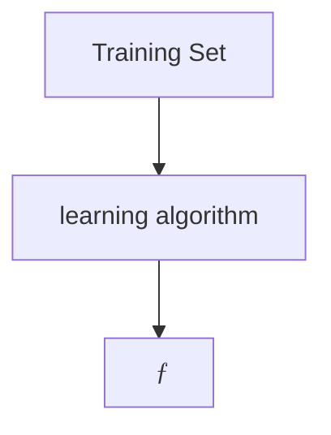

# Machine Learning Overview
## What is machine learning

- Field of study that gives computers the ability to learn without being explicitly programmed (Arthur Samuel 1959).

**Machine learning algorithms**
- Supervised learning
- Unsupervised learning

## Supervised Learning

$$
\underset{\text{input}}{X} \to \underset{\text{output}}{Y}
$$
Learns from being given **"right answers"**
### Regression
Predict a number infinitely many possible outputs

| Input(X)          | Output(Y)              | Application         |
| ----------------- | ---------------------- | ------------------- |
| email             | spam (0/1)             | spam filtering      |
| audio             | text transcritps       | speech recognition  |
| English           | Spanish                | machine translation |
| ad, user info     | click? (0/1)           | online advertising  |
| image, radar info | position of other cars | self-driving car    |
| image of phone    | defect? (0/1)          | visual inspection   |

In all of these applications you will first train your model with examples of inputs $X$ and the right answers that is the labels $Y$. After the model has learned from these input outputs or $X$ and $Y$ pairs, they can then take a brand new input $X$, something that's never seen before and try to produce the appropriate corresponding output $y$.

### Classification
- Classification algorithms predict categories (or classes)
- Classification predicts a small finite limited set of possible output categories  

## Unsupervised Learning
> [!tip] Find something interesting in **unlabeled** data

Data only comes with inputs $x$, but no outputs labels $y$. Algorithm has to find **structure** in the data.
### Clustering
Al clustering algorithm takes data without labels and tries to automatically group them into clusters

- Google news 
- DNA microarray
- Grouping customers

### Anomaly detection
Find unusual data points  
- Fraud detection

### Dimensionality reduction
Compress data using fewer numbers

# Linear Regression with One Variable

## Linear regression model
**Regression** model predicts numbers

**Terminology**
- training set: data that is used to train the model. Include input features and  output targets. 
- $x$: input variable or **feature**
- $y$: output variable or **target variable**
- $m$ number of training examples
- $(x , y)$ : single training example
- $(x^{(i)}, y^{(i)})$ : $i^{th}$ training example

$$
\underset{\text{feaurure}}{x} \to \underset{\text{model}}{f} \to \underset{\text{prediction}}{\hat{y}}
$$

### Univariate Linear regression 
(single feature $x$)
$$
f_{(w, b)}(x) = wx + b
$$

### Cost function
We have
$$
\hat{y}^{(i)} = f_{w,b} \, (\hat{x}^{(i)}) = wx^{(i)} + b
$$

Find $w$, $b$ so $\hat{y}^{(i)}$ is close to $y^{(i)}$ for all $(x^{(i)}, y^{(i)})$.

**Squared error cost function**

$$
J(w, b) = \frac{1}{2m} \sum_{i=1}^{m} \left(\hat{y}^{(i)} - y^{(i)}\right)^2
$$

$$
J(w, b) = \frac{1}{2m} \sum_{i=1}^{m} \left(f_{w,b} \, (\hat{x}^{(i)}) - y^{(i)}\right)^2
$$

$$
J(w, b) = \frac{1}{2m} \sum_{i=1}^{m} \left(\hat{y}^{(i)} - y^{(i)}\right)^2
$$

**Goal of linear regression**

$$
\underset{w, b}{\text{minimize}} \ J(w, b)
$$

![[Pasted image 20250213185732.png]]

Contour plot
![[Pasted image 20250213185931.png]]

# Training Linear Regression

## Gradient Descent Algorithm

Repeat until converge {
$$
w = w - \alpha \, \dfrac{\partial}{\partial \,  w} J(w, b)
$$

$$
b = b - \alpha \, \dfrac{\partial}{\partial \, b} J(w, b)
$$
}

where parameters $w, b$ are updated simultaneously.

>[!info]
>$$
>\begin{align*}
>\dfrac{\partial}{\partial \,  w} J(w, b) &= \frac{1}{m} \sum_{i=1}^{m} \left(f_{w,b} \, (x^{(i)}) - y^{(i)}\right) x^{(i)} \\ \\
>\dfrac{\partial}{\partial \,  b} J(w, b) &= \frac{1}{m} \sum_{i=1}^{m} \left(f_{w,b} \, (x^{(i)}) - y^{(i)}\right)
> \end{align*}
$$

### Simultaneous update (correct way)

$$
\begin{align*}
tmp\_w &= w - \alpha \, \dfrac{\partial}{\partial w} J(w, b) \\
tmp\_b &= b - \alpha \, \dfrac{\partial}{\partial b} J(w, b)
\end{align*}
$$

$$
\begin{align*}
w &= tmp\_w \\ 
b &= tmp\_b
\end{align*}
$$

![[Pasted image 20250213195133.png]]

>[!info] Batch Gradient Descent
>"Batch": Each step of gradient descent uses al l the training examples
## Learning rate

- If $\alpha$ is too small $\to$ Gradient descent may be slow
- If $\alpha$ is too large $\to$
	- Overshoot, never reach minimum
	- Fail to converge, diverge

