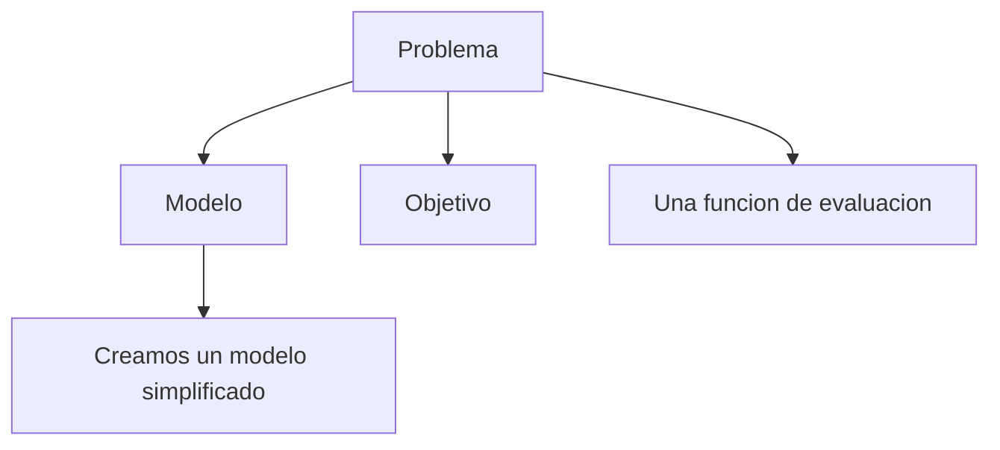
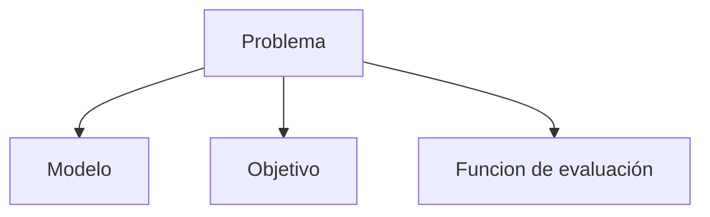

- Acerca del proyecto grupal
	- Semana 7 - Primera entrega
	- Semana 12 - segunda entrega
	- Informe 40%, Expo 30 %, Código 30 %

- **Investigar Simulated annealing:** contexto: ppt semana 4
- Funciones de utilizada para ajedres
- Para el Puzzle 15

# Tasks

## Semana 01
- [x] Clase 1 ✅ 2025-04-16
## Semana 02
- [ ] Clase 2
## Semana 03
- [ ] Clase 3

## Semana 13

- [x] Semana 12 - Complemento de la teoría ⏫ 📅 2025-06-22 ✅ 2025-06-22
- [x] Semana 12 - 2025-I PD ⏫ 📅 2025-06-22 ✅ 2025-06-22
- [ ] Autoencoders🛫 2025-06-22 ⏫ 📅 2025-06-29 

# 26-03-2025

## ¿Por qué el interés en la IA?
- Progresos recientes en los algoritmos.
- La disponibilidad masiva de datos.
- El poder computacional.

## Historia de la IA
- 1901: PCA (K. Pearson) inicio de la IA.
- 1933: PCA se desarrolla por F. Rosemblatt.
- 1945: 
- 
## Tarea
- IA y sus partes
- Ej de Test de Turing
- Sistemas expertos
- Kolmogorov
- Ej de Habitacion China

### Ejemplos del Test de Turing

#### ELIZA (1966)
**ELIZA** fue es uno de los primeros programas de procesamiento de lenguaje natural, desarrollado en la década de 1960 por **Joseph Weizenbaum** en el MIT. Su propósito era simular una conversación con un usuario, imitando el estilo de un psicoterapeuta rogeriano. ELIZA analizaba las entradas del usuario y respondía basandose en reglas predefinidas mediante coincidencias de patrones y sustitución de palabras clave.

El test de ELIZA no pasó el Test de Turing ya que sus respuestas eran mecánicas y no comprendían el significado de las palabras. Solo aplicaba reglas sintácticas sin verdadera capacidad de razonamiento o aprendizaje.

#### Eugene Goostman (2014)
==Eugene Goostman es un chatbot== desarrollado por **Vladimir Veselov**, **Eugene Demchenko** y **Sergey Ulasen**, que ganó notoriedad en 2014 cuando, supuestamente, ==se convirtió en el primer programa en "pasar" el Test de Turing durante un evento en la **Royal Society de Londres**==

==Fue diseñado para simular la personalidad de un niño ucraniano de 13 años. Esta elección estratégica ayudo a ocular sus limitaciones lingüísticas.==

Utilizaba un enfoque basado en **procesamiento de lenguaje natural** con reglas predefinidas, pero con algunas técnicas avanzadas que le permitían manejar preguntas inesperadas mejor que ELIZA.

El 7 de junio de 2014, Eugene participó en una prueba organizada por la Universidad de Reading donde 30 jueces humanos conversaban con distintos participantes (humanos o programas). Si un chatbot lograba engañar al 30% de los jueces durante 5 minutos, se consideraba que había pasado el Test de Turing. **Eugene** logro engañar al 33% de los jueces, lo que fue presentado como un hito en la inteligencia artificial.

Muchos consideran que el logro fue más un truco que una verdadera demostración de inteligencia artificial avanzada ya que: el tiempo de conversación era demasiado corto, un niño de 13 años con ingles no nativo reducía las expectativas de los jueces.

#### LaMDA

#### ChatGPT
En **pruebas informales** ChatGPT ha sido capaz de engañar a algunos usuarios que no sabían que hablaban con una IA. Sin embargo en experimentos más rigurosos, los humanos aún pueden notar diferencias después de una conversación prolongada.

### Sistemas expertos
Son programas informáticos que emulan la toma de decisiones de un humano especialista en un dominio específico, utilizando bases de conocimiento estructurado y reglas lógicas. Se define como

> [!cite] Un programa inteligente que utiliza conocimiento e inferencia para resolver problemas que son lo suficientemente complejos como para requerir una experiencia humana significativa para su solución.

[An overview of expert systems](https://www.govinfo.gov/content/pkg/GOVPUB-C13-317d16eca06b44face3805d30021d02d/pdf/GOVPUB-C13-317d16eca06b44face3805d30021d02d.pdf)

**Características**
- **Especialización**: operan en dominios restringidos (ej. diagnóstico médico).
- **Transparencia**: explican su razonamiento mediante reglas lógicas (glass box).
- **Flexibilidad**: trabajan con datos incompletos usando lógica difusa (aproximaciones probabilísticas).

#### Componentes y arquitectura del sistema experto
Un sistema experto se compone de varios componentes interconectados, cada uno de los cuales desempeña un papel crucial en su funcionalidad. 
##### 1. Knowledge Base
La base de conocimientos es el corazón de un sistema experto. Contiene todos los hechos, reglas y conocimientos expertos relacionados con un dominio específico. 

> En un sistema experto financiero, la base de conocimientos puede incluir reglas para detectar transacciones fraudulentas, como "*Si una transacción supera los 10 mil dólares y se produce en un país extranjero, márquela para su revisión*"

##### 2. Inference engine
Es el cerebro del sistema experto. Procesa la información almacenada en la base de conocimientos para sacar conclusiones o hacer recomendaciones. **El motor de inferencia utiliza estrategias de razonamiento (forward chaining o backward chaining) para analizar datos y aplicar reglas**.
- **Forward Chaining**: comienza con los datos disponibles y avanza hacia una conclusión. Por ejemplo "Si la temperatura es alta y el paciente tiene tos, diagnostique una infección respiratoria".
- **Backward Chaining**: comienza con un objetivo y trabaja hacia atrás para encontrar evidencia de apoyo. Por ejemplo: "Si el objetivo es diagnosticar diabetes, verifique si hay síntomas como micción frecuente y niveles altos de azúcar en la sangre".

##### 3. User Interface
Es el puente que permite a los usuarios interactuar con el sistema experto. Debe ser intuitivo y fácil de usar, lo que garantiza que incluso los no expertos puedan usar el sistema de manera efectiva.

##### 4. Explanation Module
Explica cómo el sistema llegó a una conclusión particular. Este módulo proporciona a los usuarios una explicación clara y paso a paso del razonamiento del sistema. 

##### 5. Knowledge Acquisition Module
Se encarga de actualizar y ampliar la base de conocimientos. Garantiza que el sistema se mantenga actualizado con la información y las tendencias más recientes. Sin actualizaciones periódicas, la base de conocimientos del sistema puede quedar obsoleta.

#### Mecanismo de trabajo
Comienza cuando un usuario no experto envía una consulta a través de la interfaz de usuario
1. El motor de inferencia procesa esta consulta, que aplica reglas lógicas y técnicas de razonamiento para analizar la entrada.
2. El motor de inferencia interactúa con la base de conocimiento, recuperando hechos, reglas y heurísticas relevantes aportados por usuarios expertos.
3. Sobre la base de este conocimiento estructurado, el sistema deriva conclusiones y formula una respuesta adecuada.

#### Tipos de Sistemas Expertos en IA

##### Sistemas expertos basados en reglas
Se basan en reglas `if-else` para procesar información y tomar decisiones. Estas reglas suelen ser elaboradas por expertos en la material y sirven como mecanismo de razonamiento del sistema. (**MYCIN**).

##### Sistemas expertos basados en marcos
Organizan el conocimiento utilizando **marcos** de manera similar a los objetos en la programación. Estos marcos almacenan atributos y valores relacionados con conceptos específicos, lo que los hace útiles en el **NLP** y otras tareas de representación del conocimiento.
##### Sistemas de lógica difusa
Para situaciones que implican incertidumbre el imprecisión, entran en luego los sistemas de lógica difusa. Estos sistemas no operan con valores estrictos de `True/False`, sino que permiten grados de verdad.
##### Sistemas basados en redes neuronales
Se usan ampliamente en aplicaciones como el reconocimiento de imágenes y el procesamiento de voz, donde los enfoques tradicionales basados en reglas pueden tener dificultades.
##### Sistemas expertos neuro-difusos
Fusionan capacidades de aprendizaje de las **redes neuronales*** con fortalezas de manejo de la incertidumbre de la **lógica difusa**. Son particularmente útiles en la previsión financiera y los sistemas de control automatizados.

[Sistemas Expertos en IA | GeeksforGeeks](https://www.geeksforgeeks.org/expert-systems/)

**Aplicaciones**

| Área             | Ejemplo                               |
| ---------------- | ------------------------------------- |
| Medicina         | Diagnóstico de enfermedades (MYCIN)   |
| Finanzas         | Evaluación de riesgos crediticios     |
| Ingeniería       | Mantenimiento predictivo de máquinas  |
| Customer Service | Chatbots para resolución de consultas |

**Ejemplos históricos**
1. **MYCIN (1976)**: diagnosticaba infecciones bacterianas y recomendaba antibióticos.
2. **DENDRAL (1965)**: identificaba estructuras moleculares en química
3. **CADUCEUS (1970)**: Realizaba diagnósticos en medicina interna

[Sistemas Expertos: Fundamentos, Metodologías y Aplicaciones](https://www.palermo.edu/ingenieria/pdf2014/13/CyT_13_24.pdf)

### Kolmogorov

### Ejemplos de la habitación china

1. **Traducción Automática**  
    Un sistema de traducción como Google Translate puede convertir texto de un idioma a otro sin entender el contenido. Por ejemplo, si introduces una frase en chino, el sistema la traduce al español siguiendo reglas y algoritmos, pero no "comprende" el significado de las palabras.
    
2. **Chatbots**  
    Un chatbot avanzado como ChatGPT puede mantener conversaciones fluidas y responder preguntas de manera coherente. Sin embargo, aunque puede generar respuestas convincentes, no "entiende" el contexto o las emociones detrás de las preguntas. Simplemente sigue patrones de lenguaje basados en su entrenamiento.
    
3. **Diagnóstico Médico Automatizado**  
    Un sistema experto en medicina puede analizar síntomas y sugerir diagnósticos basados en reglas predefinidas. Por ejemplo, si un paciente describe ciertos síntomas, el sistema puede sugerir una enfermedad específica. Sin embargo, el sistema no "comprende" la experiencia del paciente ni la naturaleza de la enfermedad; solo aplica reglas lógicas para llegar a una conclusión.

### Estado actual de la IA

**1. Avances Significativos:**

- **IA Generativa:**
    - Modelos como ChatGPT y DALL-E han revolucionado la creación de contenido, generando texto, imágenes, audio y video con una calidad sorprendente.
    - Esta tecnología está transformando industrias como el marketing, el entretenimiento y el diseño.
- **Aprendizaje Profundo:**
    - Las redes neuronales profundas continúan mejorando en tareas como el reconocimiento de imágenes, el procesamiento del lenguaje natural y la toma de decisiones.
    - Esto impulsa avances en áreas como la conducción autónoma, la medicina y la robótica.
- **Aumento de la Adopción:**
    - La adopción de la IA en las empresas está en aumento, con un número creciente de organizaciones que implementan soluciones de IA para mejorar la eficiencia, la productividad y la toma de decisiones.
    - La IA se esta integrando en nuestro día a día, desde los asistentes virtuales en nuestros teléfonos, hasta la personalización de contenidos en plataformas de streaming.

**2. Desafíos y Consideraciones:**

- **Ética y Sesgos:**
    - La IA plantea importantes cuestiones éticas relacionadas con la privacidad, la equidad y la responsabilidad.
    - Es crucial abordar los sesgos en los datos de entrenamiento para garantizar que los sistemas de IA sean justos e imparciales.
- **Regulación:**
    - La necesidad de una regulación adecuada de la IA es cada vez más urgente para mitigar los riesgos y garantizar un desarrollo responsable.
    - La regulación es un reto, ya que la tecnología avanza muy rápido, y se necesita crear leyes que puedan ser aplicadas de manera efectiva.
- **Impacto en el Empleo:**
    - La automatización impulsada por la IA plantea preocupaciones sobre el desplazamiento de empleos y la necesidad de una adaptación de la fuerza laboral.
    - Se requiere una adaptación por parte de la población, y de los gobiernos, para que la población pueda seguir siendo productiva en un ambiente laboral que se esta transformando.
- **Recursos computacionales:**
    - El entrenamiento de los modelos de IA mas punteros, requiere de una enorme cantidad de recursos computacionales, y energéticos.

**3. Tendencias Futuras:**

- **IA Explicable (XAI):**
    - Se está dando cada vez más importancia a la creación de sistemas de IA que puedan explicar sus decisiones, lo que aumenta la transparencia y la confianza.
- **IA Cuántica:**
    - La combinación de la IA con la computación cuántica tiene el potencial de desbloquear nuevas capacidades y resolver problemas complejos.
- **IA en la Salud:**
    - La IA esta revolucionando la salud, con aplicaciones para el diagnostico temprano de enfermedades, la creación de medicamentos personalizados, y la optimización de los tratamientos.

En resumen, la IA está transformando rápidamente nuestro mundo, con avances emocionantes y desafíos importantes. Es fundamental abordar estos desafíos de manera responsable para garantizar que la IA se utilice en beneficio de la humanidad.

## Alternativas modernas al test de Turing

- Pruebas especializadas
	- Winograd Schema
	- Pruebas de razonamiento
- Evaluaciones éticas (complejo)

## ¿Qué es la IA para nosotros?
Conjunto de tecnicas y algoritos para resolver problemas

- Un problema es algo que no tiene solución trivial.

Modelo
Creamos un modelo simplificado (abstraccion del mudno real

Objetivo
Lo que buscamos resolver

Una funcion de evaluacion
Dependiendo de como diseñamos nuestra funcion de evaluacion, nuestra calidad de la solucion sera buena, regular o amal.

# 23-04-2025

- Para que problemas Backtracking es una buena opción para encontrar una solución y para que problemas no lo es

---

## Problemas para los que Backtracking es una buena opción

El backtracking es especialmente adecuado para problemas donde:

- **El espacio de búsqueda es grande pero finito**, y no existe un algoritmo eficiente conocido para encontrar la solución óptima[1](https://docs.jjpeleato.com/algoritmia/backtracking)[2](https://es.wikipedia.org/wiki/Vuelta_atr%C3%A1s)[4](https://elhacker.info/manuales/Hacking%20y%20Seguridad%20informatica/Backtracking\(1\).pdf).
    
- **Los problemas pueden descomponerse en etapas secuenciales**, donde en cada etapa se toma una decisión y, si esa decisión no lleva a una solución válida, se puede retroceder y probar otra opción[1](https://docs.jjpeleato.com/algoritmia/backtracking)[2](https://es.wikipedia.org/wiki/Vuelta_atr%C3%A1s)[5](https://datumdigitalmarketing.com/noticias/que-es-y-para-que-sirven-los-algoritmos-backtracking-o-retroceso).
    
- **Existen restricciones claras** que permiten descartar rápidamente ramas del árbol de búsqueda (poda), evitando así explorar soluciones que no cumplen los requisitos[1](https://docs.jjpeleato.com/algoritmia/backtracking)[2](https://es.wikipedia.org/wiki/Vuelta_atr%C3%A1s)[5](https://datumdigitalmarketing.com/noticias/que-es-y-para-que-sirven-los-algoritmos-backtracking-o-retroceso).
    
- **Se busca una o todas las soluciones** a un problema, no necesariamente la más óptima, aunque también puede usarse para optimización si se compara cada solución encontrada[1](https://docs.jjpeleato.com/algoritmia/backtracking)[4](https://elhacker.info/manuales/Hacking%20y%20Seguridad%20informatica/Backtracking\(1\).pdf)[5](https://datumdigitalmarketing.com/noticias/que-es-y-para-que-sirven-los-algoritmos-backtracking-o-retroceso).
    

**Ejemplos clásicos donde el backtracking es eficaz:**

- Problema de las N reinas
- Problema del laberinto (búsqueda de caminos)
- Problemas de permutaciones y combinaciones (generar todas las posibles configuraciones)
- Problema del Sudoku
- Problema del ciclo hamiltoniano en grafos
- Problema del recorrido del caballo en ajedrez
- Suma de subconjuntos[5](https://datumdigitalmarketing.com/noticias/que-es-y-para-que-sirven-los-algoritmos-backtracking-o-retroceso)
    

Estos problemas suelen compartir la característica de tener un espacio de búsqueda muy grande, pero donde la poda puede reducir significativamente el número de caminos a explorar[1](https://docs.jjpeleato.com/algoritmia/backtracking)[2](https://es.wikipedia.org/wiki/Vuelta_atr%C3%A1s)[5](https://datumdigitalmarketing.com/noticias/que-es-y-para-que-sirven-los-algoritmos-backtracking-o-retroceso).

## Problemas para los que Backtracking NO es una buena opción

El backtracking no es adecuado cuando:

- **El espacio de búsqueda es extremadamente grande o infinito**, ya que el algoritmo puede tardar un tiempo prohibitivo en encontrar una solución o incluso no terminar nunca[3](https://uerick.wordpress.com/2013/06/12/ventajas-y-desventajas-del-algoritmo-backtracking/)[4](https://elhacker.info/manuales/Hacking%20y%20Seguridad%20informatica/Backtracking\(1\).pdf).
    
- **Existen algoritmos más eficientes** (por ejemplo, algoritmos voraces, programación dinámica, o algoritmos polinómicos) para el problema en cuestión[1](https://docs.jjpeleato.com/algoritmia/backtracking)[4](https://elhacker.info/manuales/Hacking%20y%20Seguridad%20informatica/Backtracking\(1\).pdf).
    
- **No se pueden definir restricciones claras** para podar el árbol de búsqueda, lo que obliga a explorar casi todas las combinaciones posibles[1](https://docs.jjpeleato.com/algoritmia/backtracking)[4](https://elhacker.info/manuales/Hacking%20y%20Seguridad%20informatica/Backtracking\(1\).pdf).
    
- **Se requiere eficiencia en tiempo y memoria**, ya que el backtracking suele tener complejidad exponencial y consume mucha memoria debido a la recursividad y almacenamiento de estados intermedios[3](https://uerick.wordpress.com/2013/06/12/ventajas-y-desventajas-del-algoritmo-backtracking/)[4](https://elhacker.info/manuales/Hacking%20y%20Seguridad%20informatica/Backtracking\(1\).pdf).
    

**Ejemplos de problemas donde backtracking no es recomendable:**

- Búsqueda de rutas óptimas en grafos muy grandes donde existen algoritmos como Dijkstra o A*.
- Problemas donde el espacio de búsqueda es infinito o muy difícil de acotar.
- Problemas que pueden resolverse eficientemente con programación dinámica o algoritmos voraces.
    

## Resumen en tabla

|Adecuado para Backtracking|No adecuado para Backtracking|
|---|---|
|Problemas combinatorios con restricciones|Problemas con espacio de búsqueda infinito|
|Búsqueda de todas/una solución válida|Problemas con soluciones eficientes conocidas|
|Problemas de decisión y optimización compleja|Problemas sin restricciones claras|
|Ejemplos: N reinas, Sudoku, laberintos|Ejemplos: rutas óptimas en grafos grandes|

En conclusión, el backtracking es útil para problemas combinatorios y de búsqueda donde no existen algoritmos eficientes y se pueden definir restricciones para podar el espacio de búsqueda, pero no es recomendable cuando el espacio es muy grande, infinito o existen métodos más eficientes[1](https://docs.jjpeleato.com/algoritmia/backtracking)[2](https://es.wikipedia.org/wiki/Vuelta_atr%C3%A1s)[3](https://uerick.wordpress.com/2013/06/12/ventajas-y-desventajas-del-algoritmo-backtracking/)[4](https://elhacker.info/manuales/Hacking%20y%20Seguridad%20informatica/Backtracking\(1\).pdf)[5](https://datumdigitalmarketing.com/noticias/que-es-y-para-que-sirven-los-algoritmos-backtracking-o-retroceso).

### Citations:

1. [https://docs.jjpeleato.com/algoritmia/backtracking](https://docs.jjpeleato.com/algoritmia/backtracking)
2. [https://es.wikipedia.org/wiki/Vuelta_atr%C3%A1s](https://es.wikipedia.org/wiki/Vuelta_atr%C3%A1s)
3. [https://uerick.wordpress.com/2013/06/12/ventajas-y-desventajas-del-algoritmo-backtracking/](https://uerick.wordpress.com/2013/06/12/ventajas-y-desventajas-del-algoritmo-backtracking/)
4. [https://elhacker.info/manuales/Hacking%20y%20Seguridad%20informatica/Backtracking(1).pdf](https://elhacker.info/manuales/Hacking%20y%20Seguridad%20informatica/Backtracking\(1\).pdf)
5. [https://datumdigitalmarketing.com/noticias/que-es-y-para-que-sirven-los-algoritmos-backtracking-o-retroceso](https://datumdigitalmarketing.com/noticias/que-es-y-para-que-sirven-los-algoritmos-backtracking-o-retroceso)
6. [https://www.youtube.com/watch?v=ip2jC_kXGtg](https://www.youtube.com/watch?v=ip2jC_kXGtg)
7. [https://es.linkedin.com/advice/0/what-pros-cons-using-backtracking-csps-skills-problem-solving?lang=es&lang=es](https://es.linkedin.com/advice/0/what-pros-cons-using-backtracking-csps-skills-problem-solving?lang=es&lang=es)
8. [https://piazza.com/class_profile/get_resource/hckmbjsirae5z3/hh9r83ceno8y8](https://piazza.com/class_profile/get_resource/hckmbjsirae5z3/hh9r83ceno8y8)
9. [https://www.reddit.com/r/learnprogramming/comments/xt7y0s/when_to_use_backtracking_over_other_algorithms/?tl=es-es](https://www.reddit.com/r/learnprogramming/comments/xt7y0s/when_to_use_backtracking_over_other_algorithms/?tl=es-es)
10. [https://es.linkedin.com/advice/0/how-can-you-use-backtracking-solve-problems-skills-algorithms?lang=es&lang=es](https://es.linkedin.com/advice/0/how-can-you-use-backtracking-solve-problems-skills-algorithms?lang=es&lang=es)
11. [https://www.youtube.com/watch?v=AYCK3Gq8S3M](https://www.youtube.com/watch?v=AYCK3Gq8S3M)
12. [https://www.youtube.com/watch?v=-bjTb0o6EAQ](https://www.youtube.com/watch?v=-bjTb0o6EAQ)
13. [https://prezi.com/sp8rkijc3t6s/backtracking/](https://prezi.com/sp8rkijc3t6s/backtracking/)
14. [https://webdiis.unizar.es/~jcampos/ab/material/5-Backtracking.pdf](https://webdiis.unizar.es/~jcampos/ab/material/5-Backtracking.pdf)
15. [https://es.linkedin.com/advice/0/what-some-examples-problems-can-solved-both?lang=es](https://es.linkedin.com/advice/0/what-some-examples-problems-can-solved-both?lang=es)
16. [https://www.guru99.com/es/backtracking-algorithm.html](https://www.guru99.com/es/backtracking-algorithm.html)
17. [https://docencia.eafranco.com/materiales/estructurasdedatos/07/Tema07.pdf](https://docencia.eafranco.com/materiales/estructurasdedatos/07/Tema07.pdf)
18. [https://www.datumdigitalmarketing.com/noticias/que-es-y-para-que-sirven-los-algoritmos-backtracking-o-retroceso](https://www.datumdigitalmarketing.com/noticias/que-es-y-para-que-sirven-los-algoritmos-backtracking-o-retroceso)
19. [https://www.udb.edu.sv/udb_files/recursos_guias/informatica-ingenieria/programacion-iv/2019/ii/guia-11.pdf](https://www.udb.edu.sv/udb_files/recursos_guias/informatica-ingenieria/programacion-iv/2019/ii/guia-11.pdf)
20. [https://www.reddit.com/r/leetcode/comments/1acuuac/trouble_solving_backtracking_problems/?tl=es-es](https://www.reddit.com/r/leetcode/comments/1acuuac/trouble_solving_backtracking_problems/?tl=es-es)
21. [https://www.linkedin.com/advice/0/what-pros-cons-using-backtracking-csps-skills-problem-solving?lang=es](https://www.linkedin.com/advice/0/what-pros-cons-using-backtracking-csps-skills-problem-solving?lang=es)
22. [https://www.reddit.com/r/leetcode/comments/103bcuq/anyone_else_hate_backtracking_problems/?tl=es-419](https://www.reddit.com/r/leetcode/comments/103bcuq/anyone_else_hate_backtracking_problems/?tl=es-419)
23. [https://www.swhosting.com/es/comunidad/manual/en-que-consiste-el-algoritmo-de-backtracking-y-como-aplicarlo-en-c](https://www.swhosting.com/es/comunidad/manual/en-que-consiste-el-algoritmo-de-backtracking-y-como-aplicarlo-en-c)
24. [https://elhacker.info/manuales/Hacking%20y%20Seguridad%20informatica/Backtracking(1).pdf](https://elhacker.info/manuales/Hacking%20y%20Seguridad%20informatica/Backtracking\(1\).pdf)
25. [https://peon-pasado.github.io/competitive-programming-classes/web/class-12.html](https://peon-pasado.github.io/competitive-programming-classes/web/class-12.html)
26. [https://www.cs.cornell.edu/gomes/pdf/2003_manya_riia_tecnicas.pdf](https://www.cs.cornell.edu/gomes/pdf/2003_manya_riia_tecnicas.pdf)
27. [https://ccc.inaoep.mx/~emorales/Cursos/Busqueda/node16.html](https://ccc.inaoep.mx/~emorales/Cursos/Busqueda/node16.html)
28. [http://jorgep.blogspot.com/2010/11/problema-de-la-mochila-backtracking.html](http://jorgep.blogspot.com/2010/11/problema-de-la-mochila-backtracking.html)

---

Respuesta de Perplexity: [pplx.ai/share](https://www.perplexity.ai/search/pplx.ai/share)

---

**Un problema de compone de**

---

**Aprender PCA urgente**

---

-----

# Poda alfa beta

![[Pasted image 20250507221406.png]]

# 04/06/2025

Estudiar
- Retropopagación
- Autoencoders
- Maquina de Boltzman
- 