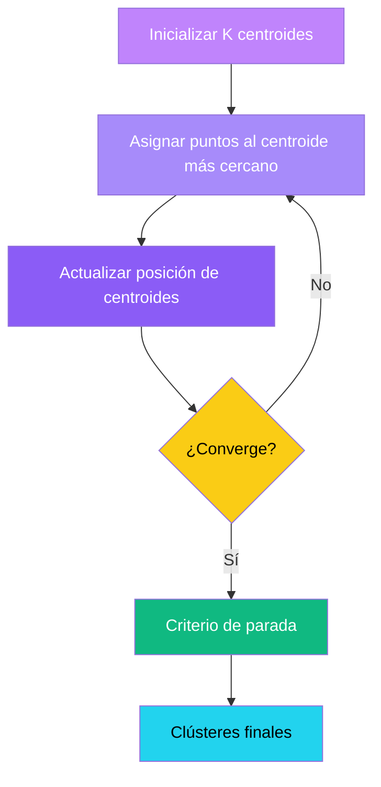

**Aprendizaje Supervisado**

- Regresión
- Clasificación
- Predicción

**Aprendizaje no Supervisado**

- CLustering
- Reducción de dimensionalidad
- Detección de anomalías

# Clustering

El **Clustering** o agrupamiento busca dividir un conjunto de datos en grupos o **clústeres**, de manera que:
- Puntos dentro de un mismo clúster son **muy similares entre sí**
- Puntos en diferentes clústeres son **diferentes unos de otros**

![[Pasted image 20250528120948.png]]

**¿Para qué sirve el Clustering?

**🛒 Segmentación de clientes**
Agrupar clientes con comportamientos de compra similares para marketing personalizado.
> [!tip] 💡 Ejemplo: Estrategias de marketing específicas para cada perfil de cliente en e commerce

**⚠️ Detección de Anomalías**
Identificar puntos que no pertenecen a ningún clúster o forman grupos muy pequeños y aislados.
> [!tip] 💡 Ejemplo: Identificación de transacciones fraudulentas en sistemas bancarios

**🖼️ Análisis de Imágenes**
Segmentación de imágenes, agrupando píxeles o regiones con características similares.
> [!tip] 💡 Ejemplo: Identificación automática de objetos en visión por computadora

**🧬 Bioinformática**
Agrupar genes o proteínas con funciones similares para analizar patrones biológicos.
> [!tip] 💡 Ejemplo: Clasificación de secuencias genéticas para investigación médica

**🗄️ Organización de datos**
Agrupar documentos, archivos multimedia o cualquier tipo de contenido con características similares.
> [!tip] 💡 Ejemplo: Sistemas de recomendación de música basados en preferencias de escucha

# Tipos principales de Algoritmos de Clustering

%% Ampliar esta parte%%

### 🎯 Basados en centroides
**K-means**
Particionan datos asignando puntos al centroide más cercano

- Rápido y eficiente
- Sensible a la inicialización

### Basado en densidad
**DBSCAN**
Definen clústeres como áreas densas separadas por áreas menos densas
- Detecta formas arbitrarias
- Dificultad con densidades variables

### Basado en conectividad
**Jerárquica**
Construyen una jerarquía de clústeres visualizada como dendrograma
- Aglomerativo
- Divisivo
### Basado en modelos
**GMM (EM)**
Asumen que los datos provienen de una distribución subyacente
- Soft clustering (probabilístico)
- Sensible a inicialización

### Basados en cuadrículas
**STING, WaveCluster**
Dividen el espacio de datos en celdas formando una cuadrícula
- Rápido procesamiento
- Limitado por granularidad

# K-means

- Un método de partición que agrupa datos en K-clústeres basados en centroides
- Algoritmo de clustering basado en centroides que agrupa objetos en K grupos predefinidos.

- Divide datos en **K clústeres** predefinidos
- Minimiza la **distancia intra-clúster** entre puntos y su centroide
- Proceso **iterativo**: asignar puntos, recalcular centroides
- Utiliza **distancia Euclidiana** para medir similitud
- **Objetivo**: agrupar puntos similares en el mismo clúster

### Algoritmo K-means

1. **Inicialización**
	Elegir el número de clústeres k y seleccionar k centroides iniciales (generalmente de forma aleatoria).
2. **Asignación**
	A cada punto se le asigna el clúster cuyo centroide es el más cercano, usando la distancia Euclidiana al cuadrado.
3. **Actualización**
	Calcular la nueva posición de cada centroide como la media de todos los puntos asignadas a ese clúster.
4. **Iteración**
	Repetir los pasos de **asignación** y **actualización** hasta que los centroides no cambien significativamente o se alcance un máximo de iteraciones

### Visualización interactiva del proceso K-means

[CS221](https://stanford.edu/~cpiech/cs221/handouts/kmeans.html)

1. Centroides iniciales
2. Asignación de puntos
3. Actualización de centroides
4. Reasignación
5. Estado final

### Método del codo (Elbow method)
Técnica para determinar el número óptimo de clústeres ($k$) calculando la **suma de cuadrados dentro del clúster (wcss)** para diferentes valores de $k$.

El punto donde la disminución de WCSS se ralentiza significativamente, formando un "codo" en la gráfica, sugiere un buen valor para $k$.

$$
	\text{WCSS} = \sum_{i=1}^k \sum_{x \in C_i} \|x - \mu_i \|^2
$$
Donde $\mu_i$ es el centroide del clúster $C_i$

### Otras consideraciones

**El método del codo es una heurística**
No proporciona una respuesta definitiva. Es una guía visual que puede ser ambigua cuando no hay  un "codo" claro en la gráfica.

**Análisis de Silueta**
Técnica alternativa que mide qué  tan similar es un punto a su propio clúster comparado con otros
 clústeres. Un alto valor de silueta indica buena cohesión y separación entre clústeres.

**Criterio de Negocio**
 A veces, la elección de K depende de la interpretabilidad y utilidad práctica de los grupos. Considera los requisitos del problema y el contexto de aplicación.

### Ventajas

 - Simple y fácil de implementar
 - Eficiente computacionalmente
 - **Escalable**. Funciona bien con grandes conjuntos de datos y es
 adaptable a diferentes tamaños

### Limitaciones
- **Sensible a la inicialización**.  Diferentes puntos de partida pueden llevar a diferentes
 resultados finales.
- Requiere especificar $k$
- **Asume clústeres convexos y similares**. No funciona bien con formas irregulares o densidades variables
- Sensible a outliers
- Requiere datos numéricos

# Self-Organizing Maps (SOM)

- Los Self-Organizing Maps (SOM), también conocidos como mapas de Kohonen, son una forma de red neuronal artificial para aprendizaje no supervisado.
	
- Su objetivo principal es mapear datos de alta dimensión a un espacio de baja dimensión (típicamente una cuadrícula 2D). 
	
- La característica más importante es que preservan la topología: puntos cercanos en el espacio original permanecen cercanos en el mapa resultante. 
	
- Se consideran una forma de "K-means restringido" o "cuantización vectorial" y son excelentes para la visualización de datos complejos.

### Estructura

Un Self-Organizing Map (SOM) consta de: 
- **Capa de entrada**: Tiene tantas dimensiones como los datos de entrada. 
- **Cuadrícula de salida 2D**: Un arreglo bidimensional de neuronas (ejemplo: 5x5, 10x10). 
- **Vectores de pesos**: Cada neurona en la cuadrícula tiene un vector de pesos de la misma dimensión que los datos de entrada.
- Inicialmente, estos pesos se asignan de forma aleatoria y se van ajustando durante el entrenamiento.

[Self Organizing Map(SOM) with Practical Implementation | by Amir Ali | Aorb Tech | Medium](https://medium.com/machine-learning-researcher/self-organizing-map-som-c296561e2117)

### Entrenamiento de un SOM

1. **Inicialización**. Los pesos de todas las neuronas en la cuadrícula se inicializan aleatoriamente con valores en el rango de los datos de entrada.
	
2. **Selección de datos**. Se selecciona un punto de dato de entrenamiento aleatoriamente del conjunto de datos.
	
3. **Encontrar la BMU**. Se identifica la Best Matching Unit (BMU), la neurona cuyo vector de pesos es más similar al punto de dato (usando distancia euclideana).
	
4. **Actualización de pesos**. Se ajustan los pesos de la BMU y sus vecinos, moviéndose ligeramente hacia el punto de dato. La tasa de aprendizaje y el radio del vecindario disminuyen con el tiempo.
	
5. **Iteración**. Se repiten los pasos 2-4 miles de veces con diferentes puntos de datos hasta que los pesos converjan a una representación estable.

### Convergencia e Issues de SOM

**Convergencia**
El proceso de entrenamiento de un SOM requiere muchas iteraciones para converger a una representación estable de los datos. A medida que avanza el entrenamiento, tanto la tasa de aprendizaje como el radio del vecindario disminuyen gradualmente.

**Variabilidad en resultados**
Los SOM básicos pueden generar resultados variables (diferentes mapeos) cuando se ejecutan varias veces, debido a la inicialización aleatoria y la naturaleza estocástica del entrenamiento

**Soluciones**
Existen variaciones y extensiones para mitigar estos problemas, como ejecutar el algoritmo varias veces y fusionar los resultados, o usar técnicas de inicialización de pesos más sofisticadas.

### Aplicaciones

**Visualización de datos**
Principal fortaleza de SOM: mapeo de datos de alta dimensión a una representación 2D visual que preserva relaciones topológicas.

**Análisis exploratorio**
Permite descubrir patrones, relaciones y estructuras ocultas en datos complejos sin necesidad de especificar K como en K-means.

>[!tip] Punto clave
>Aunque los SOM pueden usarse indirectamente para clustering (agrupando puntos en la misma neurona o en neuronas cercanas), su mayor valor está en la visualización e interpretación de datos complejos.

### K-means vs SOM

| Característica          | K-means                                                                 | SOM                                                                 |
|-------------------------|-------------------------------------------------------------------------|---------------------------------------------------------------------|
| **Objetivo**            | Minimizar la suma de cuadrados dentro del clúster (WCSS)                | Organizar la cuadrícula preservando la topología de los datos       |
| **Resultado**           | K clústeres discretos con puntos asignados y centroides definidos       | Mapeo de datos a una representación visual en cuadrícula 2D         |
| **Ventaja Principal**   | Agrupamiento directo                                                    | Visualización                                                       |
| **Configuración**       | Rápido y escalable para clustering estándar                             | Ideal para visualización y análisis exploratorio de datos           |
| **Eficiencia**          | Simplicidad                                                             | Interpretabilidad, Exploración                                      |
| **Sensibilidad**        | Requiere especificar K explícitamente                                   | No requiere K explícito, pero sí el tamaño de la cuadrícula         |
| **Limitaciones**        | Alto a formas de clústeres no convexos y densidades variables           | Puede dar resultados variables por inicialización aleatoria         |
|                         | Limitado a formas elípticas                                             | Puede requerir varias ejecuciones                                   |

# Support Vector Machines

Las Máquinas de Soporte Vectorial (SVM) son algoritmos de aprendizaje supervisado utilizados principalmente para clasificación, especialmente binaria.

- Clasificación binaria potente
- Encuentra el hiperplano óptimo separador
- Alta efectividad en espacios de alta dimensión
- Extensible a múltiples clases y regresión

### El hiperplano separador y el margen

---

Perfecto. Te prepararé una clase extensa y detallada sobre Support Vector Machines (SVM), desde sus fundamentos teóricos y matemáticos hasta su implementación en pseudocódigo. Incluiré:

- Una introducción conceptual a SVM.
    
- La formulación matemática (primal y dual) con el uso de Lagrangianos y explicaciones intuitivas accesibles para alguien con tu nivel de formación.
    
- Una sección completa dedicada al SVD (Descomposición en Valores Singulares), explicando cómo funciona, para qué sirve y cómo se relaciona con SVM en ciertos contextos.
    
- Un análisis profundo de los diferentes tipos de _kernel_, su interpretación, formulación matemática y cómo transforman los datos.
    
- Implementación en pseudocódigo paso a paso de SVM tanto para el caso lineal como con _kernel_.
    

Te avisaré cuando el contenido esté listo para tu revisión.

# Máquinas de Vectores de Soporte (SVM)

## 1. Introducción

Las **máquinas de vectores de soporte** (Support Vector Machines, SVM) son algoritmos de aprendizaje supervisado para clasificación (y también para regresión). Una SVM busca un hiperplano que separe dos clases de datos con el **margen máximo**, esto es, maximizando la distancia entre el hiperplano y los puntos más cercanos de cada clase. De forma intuitiva, clasifica nuevos ejemplos ubicándolos de un lado u otro de dicho hiperplano óptimo. Las SVM fueron desarrolladas por Vladimir Vapnik y colaboradores en los años 90. Al manejar un _margen amplio_ entre clases, suelen generalizar bien a nuevos datos. En la práctica las SVM se usan ampliamente en clasificación binaria (y multiclase por extensiones) de datos lineales y no lineales.

En la práctica, cada punto de datos se representa como un vector en ℝ^n. El hiperplano separador es de la forma _w·x + b = 0_, donde **w** es un vector normal al hiperplano y _b_ es el sesgo. Las SVM lineales se usan cuando los datos son separables linealmente, y para datos no separables se aplican las **funciones kernel** que permiten transformar el espacio de forma implícita a alta dimensión. Los puntos de entrenamiento que quedan exactamente sobre el margen óptimo se llaman **vectores de soporte**, y determinan el clasificador final.

## 2. Formulación primal y dual del SVM

### 2.1 Caso de margen duro (primal)

En el caso ideal de datos totalmente separables, el objetivo es encontrar el hiperplano que maximiza el margen entre clases. Se demuestra que esto equivale a resolver el siguiente problema de optimización cuadrática (sin términos de penalización de errores):

- **Problema primal (hard-margin SVM):**
    $$\begin{aligned} & \min_{w,b}\;\; \frac{1}{2}\|w\|^2, \\ & \text{sujeto a } y_i\,(w^T x_i + b) \;\ge\; 1,\quad i=1,\dots,m. \end{aligned}
$$

Aquí $x_i$ es el vector de características de la muestra _i_, $y_i\in{+1,-1}$ su etiqueta, y la condición $y_i(w^T x_i+b)\ge1$ asegura que cada punto se encuentre fuera o sobre el margen de separación. Minimizar $\frac12|w|^2$ equivale a maximizar el margen (la distancia entre las líneas paralelas $w^T x+b=\pm1$). Esta formulación es convexa y puede ser resuelta mediante técnicas de programación cuadrática.

### 2.2 Caso de margen suave (primal)

Cuando los datos no son completamente separables, se permite cierto error usando variables de holgura $\xi_i\ge0$ y un parámetro de penalización $C>0$. El problema primal se modifica para penalizar violaciones del margen:

- **Problema primal (soft-margin SVM):**
    
    min⁡w,b,ξ    12∥w∥2+C∑i=1mξi,sujeto a yi (wTxi+b)  ≥  1−ξi,ξi≥0,  i=1,…,m. \begin{aligned} & \min_{w,b,\xi}\;\; \frac{1}{2}\|w\|^2 + C\sum_{i=1}^m \xi_i, \\ & \text{sujeto a } y_i\,(w^T x_i + b) \;\ge\; 1 - \xi_i,\quad \xi_i \ge 0,\; i=1,\dots,m. \end{aligned}

El término $C\sum\xi_i$ penaliza la suma de errores, donde $C$ controla la rigidez del margen. Si $C$ es grande, se castigan fuertemente las violaciones (margin _casi_ duro); si $C$ es pequeño, se permiten más errores. En este caso, un punto con $\xi_i>0$ está mal clasificado o dentro del margen, reduciendo el ancho máximo factible, pero se equilibra minimizando $|w|^2+C\sum\xi_i$. La formulación sigue siendo convexa y admiten solución por métodos de programación cuadrática.

### 2.3 Formulación dual (Lagrangiana)

Para resolver estos problemas con métodos eficientes, se suelen derivar las **formulaciones duales** mediante multiplicadores de Lagrange. Definimos la función Lagrangiana introduciendo multiplicadores $\alpha_i\ge0$ por cada restricción $y_i(w^Tx_i+b)\ge1-\xi_i$ (y $\mu_i\ge0$ para $\xi_i\ge0$). Por ejemplo, para el caso separable la Lagrangiana es:

L(w,b,α)  =  12∥w∥2+∑i=1mαi(1−yi(wTxi+b)). L(w,b,\alpha) \;=\; \frac{1}{2}\|w\|^2 + \sum_{i=1}^m \alpha_i\big(1 - y_i(w^T x_i + b)\big).

Fijando las derivadas parciales $\partial L/\partial w = 0$ y $\partial L/\partial b = 0$, se obtiene que $w = \sum_i \alpha_i y_i x_i$ y $\sum_i \alpha_i y_i = 0$. Sustituyendo de nuevo y reorganizando, el problema dual resultante (maximización) es:

max⁡α    ∑i=1mαi−12∑i,j=1mαiαj yiyj xiTxj,sujeto a αi≥0,  ∑i=1mαiyi=0. \begin{aligned} & \max_{\alpha}\;\; \sum_{i=1}^m \alpha_i - \frac{1}{2}\sum_{i,j=1}^m \alpha_i\alpha_j\,y_i y_j\,x_i^T x_j,\\ & \text{sujeto a } \alpha_i\ge0,\;\sum_{i=1}^m \alpha_i y_i = 0. \end{aligned}

Este es un problema de maximización cóncava con restricciones lineales. En el caso de margen suave la única diferencia es que aparece la restricción superior $\alpha_i \le C$ en el dual, dando $0\le \alpha_i \le C$. En ambos casos el vector solución es $w=\sum_i \alpha_i y_i x_i$, y la constante $b$ se obtiene de las condiciones de Karush–Kuhn–Tucker (KKT) para los vectores de soporte.

### 2.4 Condiciones de KKT y vectores de soporte

Las condiciones de Karush–Kuhn–Tucker (KKT) aplican a este problema convexo con restricciones. En particular, para cada punto de entrenamiento $i$ deben cumplirse (hard-margin):

αi≥0,yi(wTxi+b)−1≥0,αi(yi(wTxi+b)−1)=0. \alpha_i \ge 0,\quad y_i(w^T x_i + b)-1 \ge 0,\quad \alpha_i\big(y_i(w^T x_i + b)-1\big) = 0.

Esta **condición de complementariedad** implica que si $\alpha_i>0$ entonces $y_i(w^T x_i+b)=1$, lo que significa que el punto está _exactamente sobre el margen_. Tales puntos con $\alpha_i>0$ definen el margen y se conocen como **vectores de soporte**. Si $\alpha_i=0$, entonces $y_i(w^T x_i+b)>1$ (el punto está fuera del margen) y no influye en $w$. De modo similar, en el caso suave la KKT añade condiciones análogas con las variables de holgura. En resumen, sólo los vectores de soporte (pocos puntos) determinan la solución final, y el hiperplano óptimo se expresa como una combinación lineal de ellos.

## 3. Núcleos (_Kernels_)

Las SVM lineales sólo separan datos linealmente separables. Para datos no separables se utiliza el **truco del kernel**: se define una función $K(x,z)$ que calcula el producto escalar en un espacio de características de dimensión alta (incluso infinita) sin mapear explícitamente los datos. Formalmente, un _kernel_ es una función simétrica $K:\mathcal{X}\times\mathcal{X}\to\mathbb{R}$ que cumple la condición de Mercer (la matriz de Gram $K_{ij}=K(x_i,x_j)$ es semidefinida positiva). Gracias a Mercer, existe una transformación $\phi(x)$ tal que $K(x,z)=\langle\phi(x),\phi(z)\rangle$. De esta manera, la SVM resuelve el problema de separación lineal en el espacio de características $\phi(x)$, sin calcular $\phi$ directamente, sólo usando $K(x,z)$ en la formulación dual.

Las funciones kernel más comunes son:

- **Lineal:** $K(x,z)=x^T z$. Corresponde al caso original sin transformación (espacio de características idéntico).
    
- **Polinomial:** $K(x,z)=(x^T z + \gamma)^d$, donde $d$ es el grado del polinomio y $\gamma\ge0$ es un término de sesgo. Permite fronteras de decisión polinomiales de grado $d$.
    
- **Gaussiana RBF (Radial Basis Function):** $K(x,z)=\exp(-\gamma|x-z|^2)$, con $\gamma>0$. Mapea implícitamente a un espacio infinito; produce fronteras muy flexibles basadas en distancia euclídea.
    
- **Sigmoide (tangente hiperbólica):** $K(x,z)=\tanh(\kappa,x^T z + \theta)$, similar a una neurona de red neuronal. No siempre satisface estrictamente las condiciones de Mercer, pero funciona en la práctica.
    

|**Kernel**|**Fórmula**|**Parámetros**|
|---|---|---|
|Lineal|$K(x,z)=x^T z$|–|
|Polinomial|$K(x,z)=(x^Tz+\gamma)^d$|$d$ (grado), $\gamma$|
|Gaussiano (RBF)|$K(x,z)=\exp(-\gamma\|x-z\|^2)$|$\gamma>0$|
|Sigmoide|$K(x,z)=\tanh(\kappa,x^Tz + \theta)$|$\kappa,\theta$|

Las SVM con kernel resultan muy potentes: por ejemplo, usando RBF se pueden separar datos no linealmente separables en el espacio original. Geométricamente, el kernel define una medida de similitud; la SVM encuentra un hiperplano en el espacio de características con máximo margen. Cada kernel induce un espacio de Hilbert distinto. La elección del kernel (y sus parámetros) se basa en la estructura de los datos y se suele hacer por validación cruzada.

## 4. Descomposición en Valores Singulares (SVD)

### 4.1 ¿Qué es la SVD?

La **descomposición en valores singulares** (SVD) es una factorización de una matriz real $A\in\mathbb{R}^{m\times n}$ en tres matrices:

A  =  UΣVT, A \;=\; U \Sigma V^T,

donde $U\in\mathbb{R}^{m\times m}$ y $V\in\mathbb{R}^{n\times n}$ son matrices ortonormales (sus columnas son vectores unitarios ortogonales), y $\Sigma\in\mathbb{R}^{m\times n}$ es diagonal (o bloque-diagonal) con los **valores singulares** $\sigma_1\ge \sigma_2\ge \cdots\ge 0$ de $A$ en la diagonal. Los valores singulares se obtienen de los autovalores de $A^T A$: si $A^T A$ tiene autovalores $\lambda_i$, entonces $\sigma_i=\sqrt{\lambda_i}$. En la SVD, las columnas de $V$ son los autovectores de $A^TA$, y las columnas de $U$ se obtienen normalizando $Av_i=\sigma_i u_i$.

Toda matriz $A$ admite una SVD (teorema garantizado). Los valores singulares reflejan la “energía” o varianza de $A$ en cada dirección. Una forma reducida (económica) de SVD usa sólo los primeros $r$ vectores singulares (rango de $A$).

### 4.2 Aplicaciones en reducción de dimensionalidad y SVM

La SVD tiene muchas aplicaciones en ML y ciencias de datos, especialmente en reducción de dimensionalidad. En PCA (Análisis de Componentes Principales), se usa la SVD de la matriz de datos centrada para obtener nuevas variables (componentes principales) que explican la mayor varianza. Al proyectar los datos originales sobre los primeros componentes principales, se reduce la dimensión preservando la mayor parte de la variación. En palabras sencillas: “la SVD se usa para reducir la dimensionalidad de los datos y proyectarlos a un espacio de menor dimensión”. Por ejemplo, PCA puede combinar variables correlacionadas en una sola componente principal, reduciendo ruido y redundancia. Otras aplicaciones incluyen la pseudoinversa de matrices (resolución de sistemas sobredeterminados) y el Análisis Semántico Latente (LSA) en procesamiento de texto, que emplea SVD para descubrir relaciones semánticas.

En el contexto de SVM, la SVD es relevante como técnica de preprocesamiento. Si el conjunto de datos original tiene alta dimensión, primero se puede aplicar PCA (SVD) para reducir la dimensión efectiva y eliminar ruido antes de entrenar la SVM. Esto acelera el entrenamiento y puede mejorar la generalización. Asimismo, en métodos de SVM no lineal basados en kernels, existe una analogía: el **kernel PCA** obtiene direcciones principales en el espacio de características definido por el kernel. Dicho de otro modo, la matriz de Gram del kernel $K$ es semidefinida positiva y puede descomponerse (autovectores o SVD), revelando las componentes principales en el espacio de Hilbert. Así, la SVD sirve para entender y procesar datos incluso cuando se usan kernels, pues todas las operaciones dependen de productos escalares.

## 5. Pseudocódigo de implementación de SVM

A continuación se esquematizan los pasos básicos para implementar un clasificador SVM binario (en la práctica se usaría una librería o solver). Asumimos etiquetas $y_i\in{+1,-1}$:

1. **Preprocesamiento de los datos:**
    
    - Normalizar o escalar las características (por ejemplo, media cero y varianza unidad) para evitar sesgos en la optimización.
        
    - (Opcional) Transformar etiquetas al formato requerido ($\pm1$).
        
    - Dividir datos en conjunto de entrenamiento y prueba.
        
2. **Construir la matriz de kernel (Gram):**
    
    - Elegir función kernel $K(x,z)$ (lineal, RBF, etc.).
        
    - Calcular $K_{ij} = K(x_i,x_j)$ para todas las parejas de puntos de entrenamiento.
        
3. **Resolver el problema dual:**
    
    - Definir las variables duales ${\alpha_i}$.
        
    - Aplicar un método QP. Por ejemplo, **SMO (Sequential Minimal Optimization)**: iterativamente elegir dos multiplicadores $\alpha_1,\alpha_2$ que violan las condiciones KKT, y optimizar analíticamente ese par. Repetir hasta que todos los $\alpha_i$ satisfagan la KKT (dentro de tolerancia). SMO es ampliamente usado (implementado en LIBSVM, etc.).
        
    - Al final se obtienen las soluciones $\alpha_i^*$. Las que quedan no nulas corresponden a vectores de soporte.
        
4. **Calcular parámetros del modelo:**
    
    - **Vector de pesos:** En el caso lineal, calcular $w = \sum_i \alpha_i^* y_i x_i$. Si se usa kernel, no se calcula $w$ explícito en el espacio original, pero para predecir basta con las $\alpha_i^*$.
        
    - **Término independiente $b$:** Determinar $b$ a partir de cualquier vector de soporte (por ejemplo, promediar $y_i - w^T x_i$ sobre los que $0<\alpha_i<C$).
        
5. **Predicción de nuevas muestras:**
    
    - Dado un nuevo punto $x$, calcular la función de decisión:  
        f(x)  =  ∑iαi∗yi K(xi,x)  +  b.f(x) \;=\; \sum_i \alpha_i^* y_i\,K(x_i,x)\;+\;b.
        
    - Asignar la clase $\operatorname{sign}(f(x))$. Equivalentemente, para SVM lineal $f(x)=w^T x+b$. Un valor positivo indica clase +1, y negativo clase -1.
        

En resumen, el entrenamiento SVM consiste en maximizar el dual sujeto a las restricciones (usando, p.ej., SMO), y luego usar los multiplicadores óptimos para clasificar. La característica clave es que sólo los vectores de soporte ($\alpha_i>0$) influyen en la solución final, lo que hace al modelo eficiente en memoria y cálculo.

**Referencias:** Se ha citado ampliamente la literatura técnica para cada concepto, incluyendo introducciones de IBM, notas de curso y tutoriales sobre SVM, y material sobre kernels y SVD. Estos recursos explican en detalle las fórmulas, condiciones KKT y aplicaciones señaladas en esta clase.

