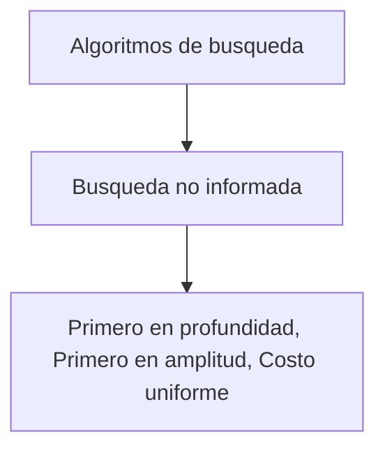
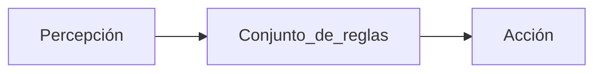
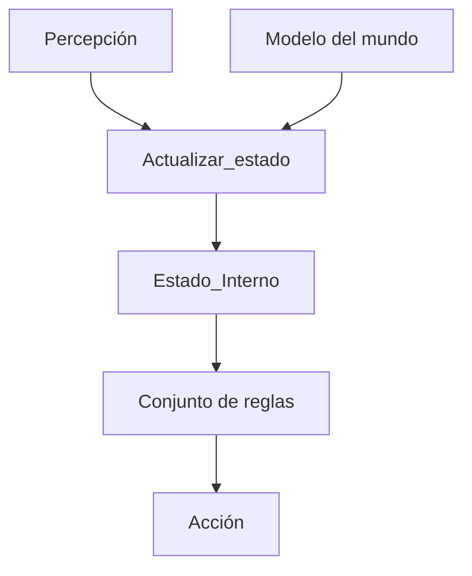
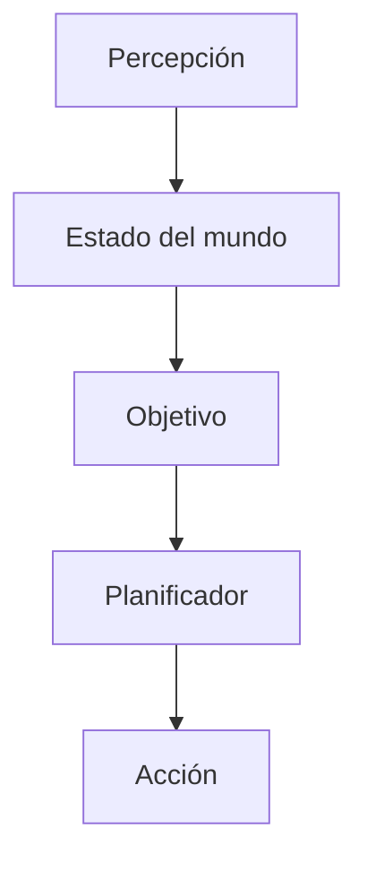

## Estado
- Podemos definir un problema por los elementos que intervienen y sus relaciones.
- En cada instante de la resolución de un problema esos elementos tendrán unas características y relaciones específicas.
- Denominaremos **Estado** a la representación de los elementos que describen el problema en un momento.
- Distinguir dos estados especiales, el **Estado Inicial** (punto de partida) y el estado 

## Operadores
Representan un conjunto finito de acciones básicas que transforman unos estado en otros.
Para poder movernos entre los diferentes estados necesitamos operadores de transformación.


## Descripción del problema
- Definir el conjunto de estados del problema (explícita o implícitamente).
- Especificar el estado inicial.
- Especificar el estado final o las condiciones que cumple.
- Especificar los operadores de cambio de estado (condiciones de aplicabilidad y función de transformación).
- Especificar el tipo de solución:
	- La secuencia de operadores o el estado final.
	- Una solución cualquiera, la mejor (de)


## Solución del problema
- **Solución**: Secuencia de pasos que llevan del estado inicial al fina


## Algoritmos de búsqueda
En IA se estudia **agentes constructores** que actúan de forma racional. La mayoría de las veces, estos agentes realizan algún tipo de búsqueda en segundo plano para lograr sus tareas.

**Un problema de búsqueda consiste en**
- Un espacio de estado: un conjunto de todos los


### Tipos de algoritmos de búsqueda



### Búsqueda no informada
**También conocida como búsqueda a ciegas**
- No tiene en cuenta el coste de la solución en la búsqueda.
- Su funcionamiento es sistemático, siguen un orden de visitas y generación de nodos establecido por la estructura del espacio de búsqueda.

Debe presentar lo siguiente:
- Un grafo del problema, que contiene el nodo inicial $S$ y el nodo objetivo $G$.
- Una estrategia que describe la forma en que se recorrerá el grafo para llegar a $G$.


# Tarea 1
![[Pasted image 20250416135122.png]]


> [!tip] 🤖 Agentes en Inteligencia Artificial
> Un **agente** es cualquier entidad que percibe su entorno mediante sensores y actúa sobre él mediante actuadores. En el contexto de la IA, el objetivo es que el agente actúe de forma **racional**, es decir, que maximice su rendimiento con base en sus percepciones e información disponible.


---

## 1. 🔍 Conceptos clave

### ▪ **Omnisciencia**

- **Definición**: Capacidad de conocer todo lo que ocurre en el entorno.
- ❌ _Los agentes racionales no son necesariamente omniscientes_, ya que solo pueden actuar en función de lo que perciben.

**Ejemplo**:  
Un robot aspiradora no es omnisciente: no sabe si hay polvo detrás del sofá si no ha pasado por ahí.

---

### ▪ **Aprendizaje**

- **Definición**: Proceso por el cual un agente mejora su rendimiento con la experiencia.
- Está presente en **agentes que aprenden**, permitiéndoles adaptarse a entornos dinámicos.

**Ejemplo**:  
Un coche autónomo mejora su conducción en lluvia tras múltiples experiencias de manejo bajo lluvia.

---
### ▪ **Autonomía**

- **Definición**: Capacidad del agente para actuar por sí mismo sin intervención humana directa.
- Un agente con alta autonomía toma decisiones basadas en su conocimiento y aprendizaje.

**Ejemplo**:  
Un dron de entrega que decide la mejor ruta por sí mismo sin instrucciones humanas constantes.

---

## 2. 🌍 Propiedades y tipos de entorno

El entorno de un agente influye directamente en su diseño. Las **propiedades del entorno** son:

|Propiedad|Descripción|Ejemplo|
|---|---|---|
|**Totalmente observable**|El agente percibe todo el estado del entorno.|Ajedrez (todas las piezas visibles)|
|**Parcialmente observable**|El agente tiene acceso limitado a la información.|Juego de póker (no ve cartas rivales)|
|**Agente único**|Solo un agente actúa.|Termostato automático|
|**Multiagente**|Varios agentes interactúan (cooperan o compiten).|Juego de fútbol, tráfico vehicular|
|**Determinista**|El siguiente estado es totalmente predecible.|Laberinto sin trampas|
|**Estocástico**|Hay incertidumbre en la transición de estados.|Bolsa de valores, clima|
|**Episódico**|Las decisiones no dependen de acciones pasadas.|Clasificación de imágenes|
|**Secuencial**|Las acciones afectan futuras decisiones.|Juego de ajedrez, navegación robótica|
|**Estático**|El entorno no cambia mientras el agente decide.|Rompecabezas estático|
|**Dinámico**|El entorno cambia constantemente.|Conducción en carretera|
|**Discreto**|Conjunto finito de percepciones y acciones.|Ajedrez, juego de mesa|
|**Continuo**|Infinitas percepciones y acciones posibles.|Conducción autónoma, robótica real|

---

## 3. 🤖 Tipos de agentes (características, ejemplos y diagramas)

### 🔸 Agente reactivo simple

**Características:**

- Basado en reglas condicionales "si-entonces".
- No tiene memoria ni modelo del entorno.

**Ejemplo:**  
Un sistema de calefacción:  
`si temperatura < 20°C → encender calefacción`

**Ventajas:** rápido, fácil de implementar  
**Limitaciones:** no maneja ambientes parcialmente observables o secuenciales.

**Diagrama:**



---

### 🔸 Agente reactivo basado en modelos

**Características:**

- Usa un modelo interno del mundo para mantener estado.
- Puede manejar entornos parcialmente observables.

**Ejemplo:**  
Un robot que recuerda dónde ha estado para evitar repetir zonas.

**Diagrama:**



---

### 🔸 Agente basado en objetivos (Deliberativo)

**Características:**

- Tiene objetivos definidos y busca cumplirlos.
- Requiere planificación y búsqueda.

**Ejemplo:**  
Un asistente de IA que planifica las tareas del día según metas del usuario.

**Ventajas:** más flexible y adaptativo  
**Limitaciones:** mayor costo computacional

**Diagrama:**



---

### 🔸 Agente basado en utilidad

**Características:**

- Busca no solo alcanzar metas, sino hacerlo de la mejor manera (más rápida, más segura, etc.).
- Usa funciones de utilidad para evaluar acciones.

**Ejemplo:**  
Un coche autónomo que elige la ruta más corta **y** más segura.

**Ventajas:** decisiones más racionales y óptimas  
**Limitaciones:** requiere definición precisa de la función de utilidad

---

### 🔸 Agente híbrido

**Características:**

- Combina elementos de varios tipos anteriores.
- Mezcla reacción rápida y razonamiento profundo.

**Ejemplo:**  
Un robot aspiradora que reacciona a obstáculos, pero planea la limpieza por zonas.

---

### 🔸 Agente que aprende

**Características:**

- Mejora su desempeño con el tiempo mediante datos.
- Integra componentes de aprendizaje supervisado, no supervisado o por refuerzo.

**Ejemplo:**  
Un chatbot que mejora sus respuestas conversacionales al observar conversaciones previas.

**Componentes:**

- Elemento de aprendizaje
- Elemento de rendimiento
- Crítica (feedback del entorno)
- Generador de problemas (para explorar nuevas estrategias)

**Diagrama:**

```
[ Agente ]
  ├── [ Elemento de rendimiento ]
  ├── [ Elemento de aprendizaje ]
  ├── [ Crítica ]
  └── [ Generador de problemas ]
```

---

## ✅ Resumen gráfico

|Tipo de agente|Memoria|Planificación|Utilidad|Aprendizaje|
|---|---|---|---|---|
|Reactivo simple|❌|❌|❌|❌|
|Reactivo basado en modelos|✔️|❌|❌|❌|
|Basado en objetivos|✔️|✔️|❌|❌|
|Basado en utilidad|✔️|✔️|✔️|❌|
|Híbrido|✔️|✔️|✔️|❌|
|Que aprende|✔️|✔️|✔️|✔️|

---

# Tarea 2

![[Pasted image 20250416151037.png]]


## 🔍 Comparación: Búsqueda en Profundidad vs. Búsqueda en Amplitud

| Característica     | Búsqueda en profundidad (DFS)                     | Búsqueda en amplitud (BFS)                        |
| ------------------ | ------------------------------------------------- | ------------------------------------------------- |
| Estructura usada   | Pila (stack)                                      | Cola (queue)                                      |
| Estrategia         | Explora un camino hasta el final                  | Explora primero los vecinos directos              |
| Completa           | ❌ (no garantiza encontrar solución si hay bucles) | ✔️ (siempre que el espacio de estados sea finito) |
| Óptima             | ❌                                                 | ✔️ (si todos los pasos tienen el mismo costo)     |
| Uso de memoria     | Baja ($\mathcal{O}(d)$)                           | Alta $\mathcal{O}(b^d)$                           |
| Tiempo de búsqueda | Variable, depende del orden                       | Exponencial en la profundidad                     |

Donde:

- $b$ = factor de ramificación (número de sucesores por nodo)
- $d$ = profundidad de la solución más cercana

---

### ✅ ¿Cuándo la **búsqueda en profundidad** supera a la de amplitud?

- **Cuando la solución está ubicada en un nodo muy profundo** del árbol o grafo.
- **Cuando el árbol tiene gran amplitud (alto factor de ramificación)** y se quiere ahorrar memoria.
- **Cuando no importa la optimalidad** de la solución.
- **Cuando se puede limitar la profundidad (DFS limitada)** para evitar ciclos infinitos.
- Ideal para **espacios grandes donde no es posible almacenar muchos nodos en memoria**.

**Ejemplo**:

- Resolver un rompecabezas donde las soluciones posibles están lejos y hay muchas opciones por nivel. DFS puede encontrar soluciones más rápidamente si explora el camino correcto temprano.

---

### ✅ ¿Cuándo la **búsqueda en amplitud** supera a la de profundidad?

- **Cuando la solución está cerca de la raíz** (es decir, con baja profundidad).
- **Cuando es importante garantizar una solución óptima**, especialmente en problemas de costo uniforme.
- **Cuando el espacio de búsqueda es finito y no muy grande**, lo que permite manejar el uso de memoria.
- Ideal para **problemas en los que la primera solución encontrada debe ser la más corta (menor número de pasos)**.

**Ejemplo**:

- Buscar la ruta más corta en un laberinto pequeño. BFS encontrará siempre el camino más corto primero.

---

## 🎯 Conclusión resumida

|¿Cuál usar?|Situación recomendada|
|---|---|
|**Profundidad (DFS)**|Cuando la solución está profunda, la memoria es limitada o se necesita velocidad|
|**Amplitud (BFS)**|Cuando se necesita una solución óptima y el espacio de búsqueda es pequeño/medio|
