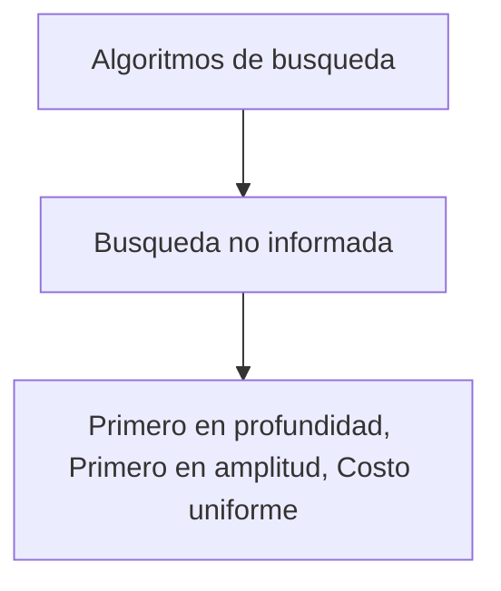

## Estado
- Podemos definir un problema por los elementos que intervienen y sus relaciones.
- En cada instante de la resolución de un problema esos elementos tendrán unas características y relaciones específicas.
- Denominaremos **Estado** a la representación de los elementos que describen el problema en un momento.
- Distinguir dos estados especiales, el **Estado Inicial** (punto de partida) y el estado 

## Operadores
Representan un conjunto finito de acciones básicas que transforman unos estado en otros.
Para poder movernos entre los diferentes estados necesitamos operadores de transformación.

## Descripción del problema
- Definir el conjunto de estados del problema (explícita o implícitamente).
- Especificar el estado inicial.
- Especificar el estado final o las condiciones que cumple.
- Especificar los operadores de cambio de estado (condiciones de aplicabilidad y función de transformación).
- Especificar el tipo de solución:
	- La secuencia de operadores o el estado final.
	- Una solución cualquiera, la mejor (de)

## Solución del problema
- **Solución**: Secuencia de pasos que llevan del estado inicial al fina

## Algoritmos de búsqueda
En IA se estudia **agentes constructores** que actúan de forma racional. La mayoría de las veces, estos agentes realizan algún tipo de búsqueda en segundo plano para lograr sus tareas.

**Un problema de búsqueda consiste en**
- Un espacio de estado: un conjunto de todos los

### Tipos de algoritmos de búsqueda

```mermaid
graph TD
A[Algoritmos de busqueda] --> B[Busqueda no informada]
B --> C["Primero en profundidad, Primero en amplitud, Costo uniforme"]
```

### Búsqueda no informada
**También conocida como búsqueda a ciegas**
- No tiene en cuenta el coste de la solución en la búsqueda.
- Su funcionamiento es sistemático, siguen un orden de visitas y generación de nodos establecido por la estructura del espacio de búsqueda.

Debe presentar lo siguiente:
- Un grafo del problema, que contiene el nodo inicial $S$ y el nodo objetivo $G$.
- Una estrategia que describe la forma en que se recorrerá el grafo para llegar a $G$.
