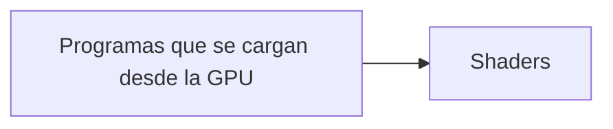

# Semana 02

- [ ] Repaso y aplicaciones de Computación GráficaURL
- [ ] 1.5 AsistenciaURL
- [ ] Experiencia con el formato de color RGBURL
- [ ] Notebook - HistogramasURL
- [ ] Notebook - LUT y ecualizaciónURL
- [ ] Notebook - ThresholdingURL
- [ ] Notebook - **más técnicas de thresholdingURL**
- [ ] Template MatchingURL
- [ ] Actividad de Template MatchingURL
- [ ] Notebook - FiltrosURL
- [ ] Ejemplo - Detección de Conteo de Espacios - Demo

# Semana 03

- [ ] Dominio de la frecuencia Archivo
- [ ] Práctica Calificada 
- [ ] Semana 3.4. Filtro Espacial de Imágenes 
- [ ] Semana 3.5. Filtro Espacial de Imágenes - Parte 2 
- [ ] Semana 3.6 - Ejercicio - Thresholding
- [ ] Semana 3.9. Filtros para remover ruido
- [ ] Carpeta compartida - Actividad

# Semana 04

- [ ] Búsqueda por similitud de histograma
- [ ] Ejemplos de Filtros de Gabor
- [ ] Aplicaciones de filtros gaussianos
- [ ] Segmentación Archivo
- [ ] Union Find - Laberintos
- [ ] Componentes Conectados
- [ ] 5.1 Ejemplo de componentes conectados
- [ ] Conteo de dinero
- [ ] Actividad de conteo de dinero

# Semana 07

- [ ] Enlaces equipos PC1URL
- [ ] PC1 - HuellasTarea
- [ ] Morfología Matemática Archivo
- [ ] Descriptores Archivo
- [ ] Introducción a Redes Neuronales Archiv
- [ ] Redes Neuronales Convolucionales Archivo
- [ ] Práctica Calificada # 2Tarea
- [ ] Link EquiposURL
- [ ] Clasificación de Imágenes con una red pre-entrenadaURL
- [ ] Clasificación de ImágenesURL
- [ ] Repositorio - Letras UNI para despliegue
- [ ] Obtención de letras

# 09-05-2025

**Estudiar para le parcial**
- Tarea investigar: Distancia de chebyshev, minkowski, p=1, p=2, p=infetc
- Estudiar los descriptores de imagenes
- Estudiar los espacios de colores
- Dominio de la frecuencia, operaciones de Fourier, bidimensional, bidimensional discreta
- Filtros pasa baja, pasa ancha, rechaza banda, pasa banda (¿imagen ideal, gaussiano y ...?)

# Semana 11

YOLO usa una grilla de 7x7

- [ ] 🛫 2025-06-10 ⏫ - Mediapipe. Estudiar por completo, ya que sera base para la PC3

Estudiar Estadistica Bayesiana para prox clase

# Para examen
- Frame buffer
- Distancia Weins

# Semana 13 - 20-06-2025

**Por estudiar**
- [ ] Distancia _Kullback-Leiber_
- [ ] Binary Cross Entropy Loss
- [ ] Distancia de Wasserstein Gan
- [ ] Pixel shuffle
- [ ] Parametrized ReLU

---

# Semana 14 - 27-06-2025

**Por estudiar**
- [ ] Teselación de Penrose
- [ ] Operaciones rotación, traslación, escala, escala en objetos 3D OpenGL
- [ ] Modelo de Phong, como funciona bajo iluminación.

**VRAM** (***Video Random Access Memory***) es un tipo de memoria especializada utilizada en tarjetas gráficas (**GPU**) para almacenar y gestionar los datos necesarios para renderizar imágenes en pantalla. A diferencia de la RAM del sistema (que usa la CPU), la VRAM está optimizada para manejar grandes cantidades de datos gráficos de manera rápida y eficiente.

### **Características clave de la VRAM:**
1. **Alta velocidad**: Diseñada para operaciones gráficas intensivas, con un ancho de banda elevado.
2. **Dedicada a la GPU**: Solo la tarjeta gráfica la utiliza, lo que acelera el procesamiento de texturas, shaders, frames, etc.
3. **Tipos comunes**: 
   - **GDDR6/GDDR6X**: Usada en tarjetas modernas (NVIDIA RTX, AMD RX).
   - **HBM (High Bandwidth Memory)**: Más rápida y eficiente, pero costosa (ejemplo: algunas GPUs profesionales).
   - **GDDR5**: Antigua, pero aún presente en hardware de gama media/baja.

### **¿Para qué sirve?**
- Almacena **texturas**, modelos 3D, buffers de imagen (como el *frame buffer*).
- Mejora el rendimiento en juegos, edición de video, renderizado 3D y aplicaciones de IA.
- Permite mayores resoluciones (4K/8K) y ajustes gráficos altos.

### **¿Cuánta VRAM necesito?**
- **1080p gaming**: 6GB–8GB (suficiente para la mayoría de juegos).
- **1440p/4K gaming**: 8GB–12GB o más (para texturas ultra y RTX).
- **Edición profesional/IA**: 12GB+ (ejemplo: NVIDIA RTX 4090 con 24GB).

### **VRAM vs RAM normal**
- **RAM del sistema (DDR4/DDR5)**: Gestiona aplicaciones generales y el sistema operativo.
- **VRAM**: Exclusiva para gráficos; no se comparte con la CPU (a menos que uses gráficos integrados, que usan RAM del sistema).

Si eliges una tarjeta gráfica, la VRAM es un factor crucial, especialmente para gaming o trabajo creativo. ¡Espero que te ayude! 😊

---

Frame buffer
Espacio de memoria que se utiliza para hacer los cálculos de la siguiente imágen.

Rendering Pipeline

Es una serie de escenarios que comprender

### Shader

### Fases del proceso de renderizado

Operaciones
- Escala (x, y, z)
- Traslación (x, y, z)
- Rotación (x, y, z) y sentido horario y antihorario

>[!important] Revisar Semana 10 SystemasL / 3. Dibujar poligono-triangles.py

#### Tarea

- Operaciones de rotación, traslación, escala en objetos 3D - OpenGL.
- Modelo de de iluminación de Phong bajo objetos de 3 dimensiones.

- Comentar linea 19 y descomentar 19 en main.js
- Instalar Flask
- Ejecutar

#### PC5
- Desarrollar un juego de 1 escenario (hipercasual)
- Asociado a ODS-Educación
- Debe hacer uso de R.A (Realidad Aumentada)

Youtube Guinxu para Graficas