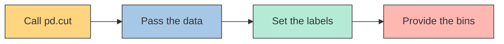

# Exploratory Data Analysis in Python


## Getting to know a Dataset


### Initial exploration

**Exploratory Data Analysis** is the process of reviewing and cleaning data to ...
- derive insights
- generate hypotheses

Given a DataFrame `df`:

- `df.head()` : Displays the first rows of the DataFrame.
- `df.info()` : Summarizes structure, columns, data types, and null values.
- `df.value_counts('some_column')` : Counts the frequency of each value in a column.
- `df.describe()` : Provides descriptive statistics (mean, std, percentiles, etc.).


To create a #scatter_plot in seaborn

We have a `books` DataFrame and a `rating` column
```python
import seaborn as sns
import matplotlib.pyplot as plt
sns.histplot(data=books, x='rating', binwidth=.1)
plt.show()
```

### Data validation

From out `books` DataFrame
- `books.dtypes` : Shows the data types of each column.


```lua
name       object 
author     object
rating    float64 
year      float64 
genre      object 
dtype: object 
```

<h5>Updating data types</h5>

```python
books['year'] = books['year'].astype(int)
```

Output:
```lua
name       object 
author     object
rating    float64 
year        int64 
genre      object 
dtype: object 
```


#data_types_pandas

| Type       | Python Name |
| ---------- | ----------- |
| String     | `str`       |
| Integer    | `int`       |
| Float      | `float`     |
| Dictionary | `dict`      |
| List       | `list`      |
| Boolean    | `bool`      |

<h5>Validaring numerical data</h5>

```python
books.select_dtypes('number').head()
```

Output:

```lua
|   | rating | year | 
|---|--------|------| 
| 0 |    4.7 | 2016 | 
| 1 |    4.6 | 2011 | 
| 2 |    4.7 | 2018 | 
| 3 |    4.7 | 2017 | 
| 4 |    4.8 | 2019 | 
```


>[!Tip] Also
>- We can verify the **min** and **max** value for each column.
>- We can plot a *boxplot*


## Data Cleaning and Imputation


### Addressing missing data

**Missing data**:
- Affects distributions
- Less representative of the population
	- Certain groups disproportionately represented
- Can result in drawing incorrect conclusions


<h5>Data professionals' job data</h5>

DataFrame: `salaries`

| Column              | Description                                      | Data type |
|---------------------|--------------------------------------------------|-----------|
| Working_Year        | Year the data was obtained                       | Float     |
| Designation         | Job title                                        | String    |
| Experience          | Experience level e.g., "Mid", "Senior"           | String    |
| Employment_Status   | Type of employment contract e.g., "FT", "PT"     | String    |
| Employee_Location   | Country of employment                            | String    |
| Company_Size        | Labels for company size e.g., "S", "M", "L"      | String    |
| Remote_Working_Ratio| Percentage of time working remotely              | Integer   |
| Salary_USD          | Salary in US dollars                             | Float     |


<h5>Checking for missing values</h5>
#missing_values

```python
print(salaries.isna().sum())
```

Output:

```lua
Working_Year            12 
Designation             27
Experience              33 
Employment_Status       31 
Employee_Location       28 
Company_Size            40
Remote_Working_Ratio    24
Salary_USD              60 
dtype: int64 
```


<h5>Strategies for addressing missing data</h5>

- **Drop missing values** : 5% or less of total values
- **Impute mean, median, mode** : Depends on distribution and context
- **Impute by sub-group** : Different experience levels have different median salary


#### Dropping missing values

```python
threshold = len(salaries) * 0.05 # 30

cols_to_drop = salaries.columns[salaries.isna().sum() <= threshold]
print(cols_to_drop)
```

Output:

```
Index(['Working_Year', 'Designation', 'Employee_Location', 
'Remote_Working_Ratio'], 
dtype='object') 
```

```python
salaries.dropna(subset=cols_to_drop, inplace=True)
```


>[!tip] `dropna()`
>Removes missing values (NaN) from a DataFrame or Series, either by dropping rows or columns that containt them


#### Imputing a summary statistic

```python
cols_with_missing_values = salaries.columns[salaries.isna().sum() > 0]
# Index(['Experience', 'Employment_Status', 'Company_Size', 'Salary_USD'], # dtype='object')

for col in cols_with_missing_values[:-1]:
	salaries[col].fillna(salaries[col].mode()[0])
	
print(salaries.isna().sum())
```


Output:

```lua
Working_Year             0
Designation              0
Experience               0
Employment_Status        0
Employee_Location        0
Company_Size             0
Remote_Working_Ratio     0
Salary_USD              41
```


#### Imputing by sub-group

```python
salaries_dict = salaries.groupby('Experience')['Salary_USD'].median().to_dict()
# {'Entry': 55380.0, 'Executive': 135439.0, 'Mid': 74173.5, 'Senior': 128903.0}

salaries['Salary_USD'] = salaries['Salary_USD'].fillna(salaries['Experience'].map(salaries_dict))
```


**1. What `map` does (precisely)**

```python
mapped = salaries['Experience'].map(salaries_dict)
```

* `map` takes each **label** in `Experience` (e.g., `"Entry"`, `"Mid"`) and **replaces it with** the dictionary value (the median salary for that label).
* The result, `mapped`, is a **Pandas Series aligned by row index** (same length as the DataFrame), where each row now holds “the median salary for this row’s experience level”.


**2. Why `fillna` changes only NaNs in `Salary_USD`**

```python
salaries['Salary_USD'] = salaries['Salary_USD'].fillna(mapped)
```

* `fillna(series_B)` looks **row by row**:

  * If `Salary_USD` at that row is **NaN**, it uses the value from `series_B` (here, `mapped`) for that same row.
  * If `Salary_USD` at that row is **not NaN**, **it leaves it unchanged**.
* That’s the key: `fillna` **never overwrites** existing (non-missing) values—only fills the gaps.


### Converting and analyzing categorical data


```python
print(salaries.select_dtypes('object').head())
```

| Designation                 | Experience | Employment_Status | Employee_Location | Company_Size |
|-----------------------------|------------|------------------|-------------------|--------------|
| Data Scientist              | Mid        | FT               | DE                | L            |
| Machine Learning Scientist  | Senior     | FT               | JP                | S            |
| Big Data Engineer           |            | Senior           | GB                | M            |
| Product Data Analyst        | Mid        | FT               | HN                | S            |
| Machine Learning Engineer   | Senior     | FT               | US                | L            |


**How many job titles are in our DataFrame?**

```python
print(salaries['Designation'].value_counts())
```


```lua
Data Scientist               143               
Data Engineer                132               
Data Analyst                  97               
Machine Learning Engineer     41               
Research Scientist            16               
Data Science Manager          12               
Data Architect                11              
Big Data Engineer              8               
Machine Learning Scientist     8               
```


```python
print(salaries['Designation'].nunique())

# Output : 50
```

So much categories from 'Designation' columns

<h5>Extracting value from categories</h5>
- Current formato limits out ability to generate insights
- `pandas.Series.str.contains()` : Search a column for a specific string or multiple strings. Returns a Series of booleans

**For example**

Words of interest: Machine Learning or AI
```python
salaries['Designation'].str.contains('Machine Learning|AI')
```

```lua
0      False 
1       True 
2      False
3      False
       ...
604    False
605    False 
606     True 
Name: Designation, Length: 607, dtype: bool 
```

Words of interest: Any that start with Data

```python
salaries['Designation'].str.contains('^Data')
```


```python
 job_categories = ["Data Science", "Data Analytics",  
                   "Data Engineering", "Machine Learning", 
                   "Managerial", "Consultant"] 
                   
data_science = "Data Scientist|NLP" 
data_analyst = "Analyst|Analytics" 
data_engineer = "Data Engineer|ETL|Architect|Infrastructure" 
ml_engineer = "Machine Learning|ML|Big Data|AI" 
manager = "Manager|Head|Director|Lead|Principal|Staff" 
consultant = "Consultant|Freelance" 

conditions = [ 
	(salaries["Designation"].str.contains(data_science)), 
	(salaries["Designation"].str.contains(data_analyst)), 
	(salaries["Designation"].str.contains(data_engineer)), 
	(salaries["Designation"].str.contains(ml_engineer)), 
	(salaries["Designation"].str.contains(manager)), 
	(salaries["Designation"].str.contains(consultant)) 
]


salaries['Job_category'] = np.select(conditions, job_categories, default='Other')

print(salaries[['Designation', 'Job_Category']].head())
```
 
| Index | Designation                | Job_Category     |
| ----- | -------------------------- | ---------------- |
| 0     | Data Scientist             | Data Science     |
| 1     | Machine Learning Scientist | Machine Learning |
| 2     | Big Data Engineer          | Data Engineering |
| 3     | Product Data Analyst       | Data Analytics   |
| 4     | Machine Learning Engineer  | Machine Learning |


## Relationships in Data

<h4>Imporing DateTime data </h4>
`DateTime` data need to be explicitly declared to Pandas

```python
# divorce is a pandas DataFrame
divorce.dtypes
# marriage_date         object 
# marriage_duration     float64    
# dtype: object 
```

```python
divorce = pd.read_csv("divorce.csv", parse_dates=["marriage_dae"])
divorce.dtypes
# marriage_date         datetime64[ns] 
# marriage_duration     float64    
# dtype: object
```


<h4>Converting to DateTime data</h4>
`pd.to_datetime()` converts arguments to `DateTime` data

```python
divorce["marriage_date"] = pd.to_datetime(divorce["marriage_date"])
```

If we have

|     | month | day | year | marriage_duration |
| --- | ----- | --- | ---- | ----------------- |
| 0   | 6     | 26  | 2000 | 5.0               |
| 1   | 2     | 2   | 2    | 2.0               |

We can do

```python
divorce["marriage_date"] = pd.to_datetime(divorce[['month', 'day', 'year']])
```

|     | month | day | year | marriage_duration | marriage_date |
| --- | ----- | --- | ---- | ----------------- | ------------- |
| 0   | 6     | 26  | 2000 | 5.0               | 2000-06-26    |
| 1   | 2     | 2   | 2    | 2.0               | 2000-02-02    |

We can also extract parts of a full date using `dt.month`, `dt.day` and `dt.year` attributes


Another example:

---

- **`DATE OCC`** → a date as a string `"YYYY-MM-DD"`
- **`TIME OCC`** → a time in military format `"HHMM"` as a string

You can combine them into a **real timestamp (`datetime64[ns]`)** in pandas.


```python
import pandas as pd

df = pd.DataFrame({
    "DATE OCC": ["2025-08-11", "2025-08-12", "2025-08-13"],
    "TIME OCC": ["0001", "0815", "2359"]
})

# Combine both columns into a single string and convert to datetime
df["DATETIME OCC"] = pd.to_datetime(
    df["DATE OCC"] + " " + df["TIME OCC"], 
    format="%Y-%m-%d %H%M"
)

print(df)
print(df.dtypes)
```

**Output:**

```
    DATE OCC TIME OCC        DATETIME OCC
0  2025-08-11     0001 2025-08-11 00:01:00
1  2025-08-12     0815 2025-08-12 08:15:00
2  2025-08-13     2359 2025-08-13 23:59:00

DATE OCC                object
TIME OCC                object
DATETIME OCC    datetime64[ns]
dtype: object
```

---


### Correlation
[[Correlación]]

In pandas we have the method `corr`
- Describe direction and strength of relationship between two variables
- Set `numeric_only=True` to prevent errors with *non-numeric* columns

```python
# DataFrame divorce
divorce.corr(numeric_only=True)
```

Output:

| | income_man | income_woman | marriage_duration | num_kids | marriage_year |
| :--- | :--- | :--- | :--- | :--- | :--- |
| **income_man** | 1.000 | 0.318 | 0.085 | 0.041 | 0.019 |
| **income_woman** | 0.318 | 1.000 | 0.079 | -0.018 | 0.026 |
| **marriage_duration** | 0.085 | 0.079 | 1.000 | 0.447 | -0.812 |
| **num_kids** | 0.041 | -0.018 | 0.447 | 1.000 | -0.461 |
| **marriage_year** | 0.019 | 0.026 | -0.812 | -0.461 | 1.000 |


<h4>Correlation heatmaps</h4>

`sns.heatmap` is  used to visualize data as a heatmap. It is ideal for displaying the correlation between variables in a matrix.

It is used to represent data matrices, such as correlation matrices, where values are mapped to a color spectrum. This facilitates the quick identification of patterns, such as strong (positive or negative) correlations between variables.

**Main parameters**

* **`data`**: The data matrix to be represented. This is typically a pandas DataFrame or a numpy array.
* **`vmin` and `vmax`**: Define the minimum and maximum values for the color map.
* **`cmap`**: Specifies the color map to use (e.g., `'viridis'`, `'plasma'`, `'coolwarm'`).
* **`annot`**: If `True`, the value of each cell is annotated on the heatmap.
* **`cbar`**: If `True`, it displays the color bar.

```python
seaborn.heatmap(data, vmin=None, vmax=None, cmap=None, annot=False, cbar=True)
```

**Example**

```python
sns.heatmap(divorce.corr(numeric_only=True), annot=True)
```


<h4>Pairplots</h4>

<div style="text-align:center">

</div>


```python
# divorce is a pandas DataFrame
sns.pairplot(data=divorce)
```

Creates a grid of scatter plots for each pair of variables in a dataset. It's a great tool for visualizing relationships and distributions.

`pairplot` generates a matrix of plots. For each pair of variables, it creates a **scatter plot** to show their relationship. This helps identify correlations and clusters. The plots along the main diagonal are different; they show the **univariate distribution** of each variable, typically using a **histogram** or a **Kernel Density Estimate (KDE)** plot.

Here's a simplified signature with the main parameters:


```python
seaborn.pairplot(data, vars=None, hue=None, diag_kind='auto')
```

- **`data`**: The DataFrame containing the variables to plot.
- **`vars`**: A list of variable names (strings) to plot. By default, it uses all numerical columns.
- **`hue`**: A variable to use for coloring the plots, which helps visualize groups within the data.
- **`diag_kind`**: Specifies the type of plot for the diagonal. Options include `'hist'` for a histogram or `'kde'` for a Kernel Density Estimate plot.


### Factor relationships and distributions

<h5>Kernel Density Estimate (KDE) plots </h5>
```python
sns.kdeplot(data=divorce, x="marriage_duration", hue="education_man")
```

A Kernel Density Estimate (**KDE**) plot is used to visualize the probability density of a continuous variable. It's a non-parametric way to estimate the probability density function of a random variable, essentially a smoothed histogram.


<div style="text-align:center">

</div>


`sns.kdeplot` generates a KDE plot in Seaborn. It's used to show the distribution of a single variable or the joint distribution of two variables.

**Main parameters**

```python
seaborn.kdeplot(data=None, x=None, y=None, hue=None, cut=2, cumulative=False)
```

- **`data`**: The DataFrame or data structure containing the variables.
    
- **`x`**, **`y`**: The variables to plot on the x and y axes. Using only `x` creates a univariate plot, while using both `x` and `y` creates a bivariate plot.
    
- **`hue`**: The variable to use for coloring the plot, allowing you to compare distributions across different categories.
    
- **`cut`**: Multiplies the distance by which the plot will extend past the extreme data points. A larger value will show more of the tails of the distribution. Set in `cut=0` the KDE plot will not extend beyond the minimum and maximum data points
     
- **`cumulative`**: If `True`, the plot will be a cumulative distribution function (CDF) instead of a probability density function.


---
## Turning Exploratory Analysis into Action

**Why perform EDA**
- Detecting patterns and relationships
- Generating questions, or **hypotheses**
- Preparing data for machine learning

### Cross-tabulation

**`pd.crosstab`** in **pandas** is used to create **contingency tables** (cross-tabulations) showing the frequency of combinations between two or more categorical variables.  
It’s like a simple pivot table for counts (or aggregations if you provide numeric values).


```python
pd.crosstab(index, columns, values=None, aggfunc=None)
```

**Key parameters**

- **`index`** → categories for the rows (Series or list of Series).
- **`columns`** → categories for the columns.
- **`values`** → optional numeric data to aggregate instead of just counting.
- **`aggfunc`** → aggregation function if `values` is given (e.g., `np.sum`, `np.mean`).


**Example**

```python
# planes is a DataFrame
pd.crosstab(planes['Source'], planes['Destination'], values=planes['Price'], aggfunc='median')
```

Output:

|              | Banglore | Cochin  | Delhi  | Hyderabad | Kolkata | New Delhi |
| :----------- | :------- | :------ | :----- | :-------- | :------ | :-------- |
| **Banglore** | NaN      | NaN     | 4823.0 | NaN       | NaN     | 10976.5   |
| **Chennai**  | NaN      | NaN     | NaN    | NaN       | 3850.0  | NaN       |
| **Delhi**    | NaN      | 10262.0 | NaN    | NaN       | NaN     | NaN       |
| **Kolkata**  | 9345.0   | NaN     | NaN    | NaN       | NaN     | NaN       |
| **Mumbai**   | NaN      | NaN     | NaN    | 3342.0    | NaN     | 0         |


### Creating categories

We have a `planes` DataFrame with a `Price` column. And we want


| Range           | Ticket Type     |
| --------------- | --------------- |
| <= 5228         | Economy         |
| > 5228 <= 8355  | Premium Economy |
| > 8335 <= 12373 | Business Class  |
| > 12373         | First Class     |


```python
twenty_fifth = planes['Price'].quantile(0.25)
median = planes['Price'].median()
seventy_fifth = planes['Price'].quantile(0.75)
maximum = planes['Price'].max()

labels = ['Economy', 'Premium Economy', 'Business Class', 'First Class']
bins = [0, twenty_fifth, median, seventy_fifth, maximum]
```


With `pd.cut`




```python
planes['Price_Category'] = pd.cut(planes['Price'], labels=labels, bins=bins)
print(planes[['Price', 'Price_Category']].head())
```

| Price   | Price_Category  |
| ------- | --------------- |
| 13882.0 | First Class     |
| 6218.0  | Premium Economy |
| 13302.0 | First Class     |
| 3873.0  | Economy         |
| 11087.0 | Business Class  |


**`pd.cut`** in **pandas** is used to **segment continuous data into intervals (bins)**, turning numeric values into categorical ranges.  
It’s handy for grouping numbers (like ages, prices, or scores) into discrete categories.


```python
pd.cut(x, bins, right=True, labels=None, include_lowest=False, duplicates='raise')
```

**Main parameters**

- **`x`** → 1D array-like (Series, list, NumPy array) of numeric data.
- **`bins`** →
    - Integer: number of equal-width bins.
    - Sequence: explicit bin edges.
- **`right`** (`True` by default) → whether bins include the right edge.
- **`labels`** → list or `False` to label bins; `False` returns bin codes instead of labels.
- **`include_lowest`** → if `True`, includes the lowest value in the first bin.
- **`duplicates`** → `'raise'` (default) or `'drop'` for handling duplicate edges.

---

