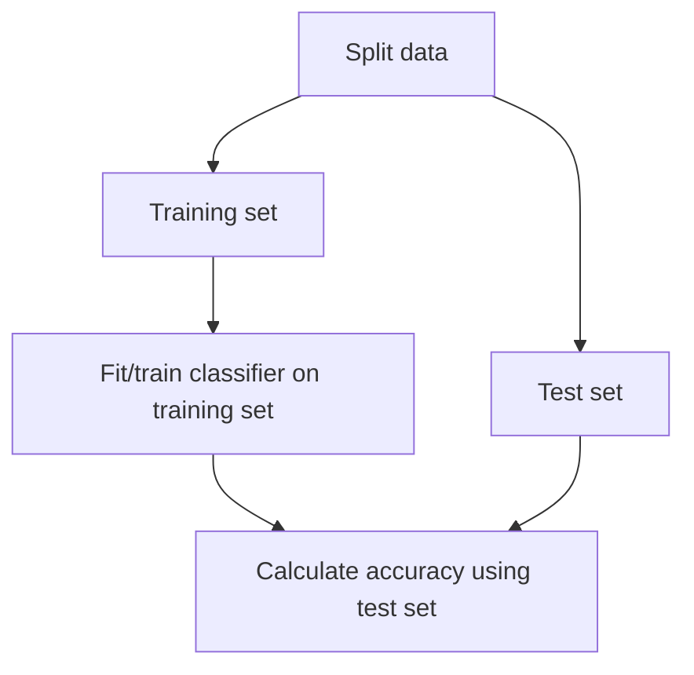

# Supervised Learning with scikit-learn

**Machine learning is the process whereby**:
- Computers are given the ability to learn to make decisions from data
- without being explicitly programmed

**Before you use supervised learning**

Requirements:
- No missing values
- Data in numeric format
- Data stored in pandas DataFrame or NumPy array


Perform Exploratory Data Analysis (EDA) first


<h5>scikit-learn syntax</h5>
```python
from sklearn.module import Model
model = Model()
model.fit(X, y)
predictions = model.predict(X_new)
print(predictions)
# array([0, 0, 0, 0, 1, 0])
```


## Classification

<h5>Classifying labels of unseen data</h5>

1. Build a model
2. Model learns from the labeled data we pass to it
3. Pass unlabeled data to the model as input
4. Model predicts the labels of the unseen data

- **Labeled data = training data**


	### K-Nearest Neighbors

**Predict the label of data point by**
- Looking at the `k` closest labeled data points
- Taking a majority vote


<div style="text-align:center">

</div>


<h5>Using scikit-learn to fit a classifier</h5>

[[#`sklearn.neighbors.KNeighborsClassifier`]]


```python
from sklearn.neighbors import KNeighborsClassifier
X = churn_df[['total_day_charge', 'total_eve_charge']].values
y = churn_df['churn'].values
print(X.shape, y.shape)
# (3333, 2), (3333,)

knn = KNeighborsClassifier(n_neighbors=15)
knn.fit(X, y)
```


<h5>Predicting on unlabeled data</h5>

```python
import numpy as np

X_new = np.array([[56.8, 17.5],
                  [24.4, 24.1],
                  [50.1, 10.9]])
				  
print(X_new.shape)
# (3, 2)

predictions = knn.predict(X_new)
print('Predictions: {}'.format(predictions))
# Predictions: [1 0 0]
```


### Measuring model performance

In classification, accuracy is a commonly used metric

$$
\text{accuracy} = \dfrac{\text{correct predictions}}{\text{total observations}}
$$


**Measuring model performance**
- How do we measure accuracy?
- Could compute accuracy on the data used to fit the classifier
- NOT indicative of ability to generalize





<h5>Train/test split</h5>

[[#`sklearn.model_selection.train_test_split`]]

```python
from sklearn.model_selection import train_test_split
X_train, X_test, y_train, y_test = train_test_split(
								X, y,
								test_size=0.3,
								random_state=21,
								stratify=y
)

knn = KNeighborsClassifier(n_neighbors=6)
knn.fit(X_train, y_train)
print(knn.score(X_test, y_test))
```


<h5>Model complexity</h5>
- Larger `k` = less complex model = can cause underfiting
- Smaller `k` = more complex model = can lead to overfitting


<div style="text-align:center">

</div>


```python
train_accuracies = {}
test_accuracies = {}
neighbors = np.arange(1, 26)

for neighbor in neihbors:
	knn = KNeighborsClassifier(n_neighbors=neighbor)
	knn.fit(X_train, y_train)
	train_accuracies[neighbor] = knn.score(X_train, y_train)
	test_accuracies[neighbor] = knn.score(X_test, y_test)
```

**Plotting out results**

```python
plt.figure(figsize=(8, 6)) 
plt.title("KNN: Varying Number of Neighbors") 
plt.plot(neighbors, train_accuracies.values(), label="Training Accuracy") 
plt.plot(neighbors, test_accuracies.values(), label="Testing Accuracy") 
plt.legend() 
plt.xlabel("Number of Neighbors") 
plt.ylabel("Accuracy") 
plt.show() 
```

**Model complexity curve**

<div style="text-align:center">

</div>


## Regression


	### Predicting blood glucose levels

```python
import pandas as pd 
diabetes_df = pd.read_csv("diabetes.csv") 
print(diabetes_df.head()) 
```

|pregnancies|glucose|diastolic|triceps|insulin|bmi|dpf|age|diabetes|
|---|---|---|---|---|---|---|---|---|
|0|6|148|72|35|0|33.6|0.627|50|1|
|1|1|85|66|29|0|26.6|0.351|31|0|
|2|8|183|64|0|0|23.3|0.672|32|1|
|3|1|89|66|23|94|28.1|0.167|21|0|
|4|0|137|40|35|168|43.1|2.288|33|1|


**Creating feature and target arrays**

```python
X = diabetes_df.drop('glucose', axis=1).values
y = diabetes_df['glucose'].values
print(type(X), type(y))
# <class 'numpy.ndarray'> <class 'numpy.ndarray'>
```


**Making predictions from a single feature**

```python
X_bmi = X[:, 3]
print(y.shape, X_bmi.shape)
# (768,) (768,)
X_bmi = X_bmi.reshape(-1, 1)
print(X_bmi.shape)
# (768, 1)
```


**Plotting glucose vs. body mass index**

```python
import matplotlib.pyplot as plt
plt.scatter(X_bmi, y)
plt.ylabel('Blood Glucose (mg/dL)')
plt.xlabel('Body Mass Index')
plt.show()
```

<div style="text-align:center">

</div>


**Fitting a regression model**


```python
from sklearn.linear_model import LinearRegression

reg = LinearRegression()
reg.fit(X_bmi, y)
predictions = reg.predict(X_bmi)
plt.scatter(X_bmi, y)
plt.plot(X_bmi, predictions)
plt.ylabel('Blood Glucose (mg/dL)')
plt.xlabel('Body Mass Index')
plt.show()
```


### Linear regression using all features


```python
from sklearn.model_selection import train_test_split
from sklearn.linear_model import LinearRegression

X_train, X_test, y_train, y_test = train_test_split(
    X, y, test_size=0.3, random_state=42
)

reg_all = LinearRegression()
reg_all.fit(X_train, y_train)
y_pred = reg_all.predict(X_test)
```


<h5>R-squared in scikit-learn</h5>

```python
reg_all.score(X_test, y_test)
# Example output
# 0.356302876407827
```


<div style="text-align:center">

</div>


## Fine-tuning your model


## Preprocessing and Pipelines


# Scikit-learn Reference Sheet


## `sklearn.linear_model.LinearRegression`

`LinearRegression` is a linear model that fits a line (or hyperplane in higher dimensions) to minimize the **Residual Sum of Squares (RSS)** between predicted values and actual values. It assumes a linear relationship between input features (`X`) and the target (`y`).

```python
from sklearn.linear_model import LinearRegression

LinearRegression(
    fit_intercept=True,     # Whether to calculate the intercept (bias term)
    copy_X=True,            # If True, X is copied; otherwise, it may be overwritten
    n_jobs=None,            # Number of jobs for parallel computation
    positive=False          # If True, forces coefficients to be non-negative
)
```

**Main parameters**

* `fit_intercept` → If `True`, adds an intercept term (bias).
* `copy_X` → Avoids modifying the input data.
* `n_jobs` → Number of CPU cores used for fitting (only impacts large datasets).
* `positive` → Constrains coefficients to be positive (useful for some problems).

**Attributes after fitting**

* `coef_` → array of shape `(n_features,)`, the learned coefficients (slopes).
* `intercept_` → the bias term (if `fit_intercept=True`).
* `rank_` → rank of the feature matrix `X`.
* `singular_` → singular values of `X`.

**Common methods**

* `.fit(X, y)` → Fits the model using training data.
* `.predict(X)` → Predicts target values for given inputs.
* `.score(X, y)` → Returns the coefficient of determination $R^2$.

**Example usage**

```python
from sklearn.linear_model import LinearRegression
import numpy as np

# Sample data
X = np.array([[1], [2], [3], [4], [5]])
y = np.array([1, 2, 3, 4, 5])

# Create and train model
model = LinearRegression()
model.fit(X, y)

# Inspect parameters
print("Coefficient:", model.coef_)      # slope
print("Intercept:", model.intercept_)  # bias

# Make predictions
predictions = model.predict([[6], [7]])
print("Predictions:", predictions)
```


## `sklearn.model_selection.train_test_split`

`train_test_split` is a utility function that splits arrays or matrices into **random train and test subsets**. It is commonly used to evaluate model performance by holding out part of the dataset for testing.

```python
from sklearn.model_selection import train_test_split

train_test_split(
    *arrays,                  # Input arrays (X, y, etc.)
    test_size=None,           # Size of the test set
    train_size=None,          # Size of the training set
    random_state=None,        # Seed for reproducibility
    shuffle=True,             # Whether to shuffle before splitting
    stratify=None             # Preserve class distribution (for classification)
)
```

**Main parameters**

* `*arrays` → Input data to split (features `X`, labels `y`, etc.).
* `test_size` → Proportion (float between 0.0 and 1.0) or absolute number of samples for the test set.
* `train_size` → Same as above, for the training set. If `None`, it is inferred from `test_size`.
* `random_state` → Controls shuffling for reproducibility. Use an integer for consistent splits.
* `shuffle` → If `True`, shuffles data before splitting.
* `stratify` → If not `None`, data is split in a way that preserves the class distribution of `y` (useful in classification).

**Return values**

Splits input arrays into training and testing subsets:

```python
X_train, X_test, y_train, y_test
```

**Example usage**

```python
from sklearn.model_selection import train_test_split
import numpy as np

# Sample dataset
X = np.arange(10).reshape((5, 2))  # 5 samples, 2 features each
y = np.array([0, 1, 0, 1, 0])      # labels

# Split into 80% train and 20% test
X_train, X_test, y_train, y_test = train_test_split(
    X, y, test_size=0.2, random_state=42
)

print("X_train:\n", X_train)
print("X_test:\n", X_test)
print("y_train:", y_train)
print("y_test:", y_test)
```

**Typical workflow**

1. Load dataset (`X`, `y`).
2. Use `train_test_split` to divide into training and testing sets.
3. Fit model on `(X_train, y_train)`.
4. Evaluate on `(X_test, y_test)` to estimate generalization performance.


## `sklearn.model_selection.RandomizedSearchCV`

`RandomizedSearchCV` is a **hyperparameter optimization tool** that searches across a specified parameter space by sampling a fixed number of random combinations.
Unlike `GridSearchCV`, which exhaustively tries all possible parameter combinations, `RandomizedSearchCV` randomly selects a subset, making it more efficient when the parameter space is large.


```python
from sklearn.model_selection import RandomizedSearchCV

RandomizedSearchCV(
    estimator,                # The model/estimator (e.g. KNeighborsClassifier, RandomForest)
    param_distributions,      # Dictionary or distributions for parameters to try
    n_iter=10,                # Number of random parameter settings sampled
    scoring=None,             # Metric to optimize (e.g. "accuracy", "f1")
    n_jobs=None,              # Number of parallel jobs
    cv=None,                  # Cross-validation strategy (int or CV splitter)
    verbose=0,                # Controls verbosity of output
    random_state=None,        # Seed for reproducibility
    return_train_score=False  # Whether to store training scores
)
```


**Main parameters**

* `estimator` → The model or pipeline to optimize (e.g., `LogisticRegression()`, `KNeighborsClassifier()`).
* `param_distributions` → Dictionary with parameters to search over. Values can be:
	* A **list** of discrete options.
	* A **distribution** from `scipy.stats` (e.g. `uniform`, `randint`) for continuous ranges.
* `n_iter` → Number of random parameter combinations to test.
* `scoring` → Performance metric to maximize/minimize (`"accuracy"`, `"precision"`, `"recall"`, etc.).
* `cv` → Cross-validation folds (default = 5).
* `n_jobs` → Number of CPU cores for parallelization (`-1` = all cores).


**Important methods**

- `.fit(X, y)` →
  Runs the randomized search:
  1. Randomly samples `n_iter` sets of parameters.
  2. Fits the `estimator` with each sampled parameter set using cross-validation.
  3. Evaluates performance using the specified `scoring` metric.
  4. Stores results and identifies the **best-performing parameter set**.
* `.predict(X)` →
  Makes predictions using the **best found estimator** (after `.fit()`).


**Important attributes (after `.fit()`)**

* `best_params_` → The parameter combination that achieved the **best cross-validation score**.
* `best_score_` → The **highest mean cross-validation score** achieved during the search.
* `best_estimator_` → The estimator trained with `best_params_`.
* `cv_results_` → Detailed results for all sampled parameter combinations (dictionary).

**Example usage**

```python
from sklearn.datasets import load_iris
from sklearn.neighbors import KNeighborsClassifier
from sklearn.model_selection import RandomizedSearchCV
from scipy.stats import randint

# Load dataset
X, y = load_iris(return_X_y=True)

# Define model
knn = KNeighborsClassifier()

# Define parameter distributions
param_dist = {
    "n_neighbors": randint(1, 20),     # Randomly sample k between 1 and 20
    "weights": ["uniform", "distance"],
    "p": [1, 2]                        # Manhattan or Euclidean distance
}

# Create RandomizedSearchCV
random_search = RandomizedSearchCV(
    estimator=knn,
    param_distributions=param_dist,
    n_iter=10,
    scoring="accuracy",
    cv=5,
    random_state=42,
    n_jobs=-1
)

# Fit the search
random_search.fit(X, y)

# Inspect results
print("Best Parameters:", random_search.best_params_)  
print("Best CV Score:", random_search.best_score_)    
print("Best Estimator:", random_search.best_estimator_)
```


 **Typical workflow**

1. Define your base model (e.g., `KNeighborsClassifier`).
2. Define `param_distributions` with ranges/lists/distributions of hyperparameters.
3. Run `RandomizedSearchCV.fit(X, y)` to sample random combinations and evaluate them.
4. Retrieve the **best parameters** with `.best_params_`.
5. Use `.best_estimator_` for final training and predictions.


## `sklearn.neighbors.KNeighborsClassifier`

`KNeighborsClassifier` is a **supervised classification algorithm** based on the **k-Nearest Neighbors (k-NN)** method.
It predicts the label of a sample by looking at the **`k` closest training samples** in the feature space and choosing the majority class among them.

```python
from sklearn.neighbors import KNeighborsClassifier

KNeighborsClassifier(
    n_neighbors=5,            # Number of neighbors (k)
    weights="uniform",        
    algorithm="auto",         # Algorithm to compute nearest neighbors
    leaf_size=30,             # Leaf size for BallTree/KDTree
    p=2,                      # Power parameter for Minkowski distance (p=2 → Euclidean, p=1 → Manhattan)
    metric="minkowski",       # Distance metric
    metric_params=None,       # Extra arguments for the metric
    n_jobs=None               # Number of parallel jobs for neighbor search
)
```

**Main parameters**

* `n_neighbors` → Number of neighbors used to classify (default = 5).
* `weights` → How to weight neighbors:
	* `"uniform"` → all neighbors have equal weight.
	  * `"distance"` → closer neighbors influence more.
	  * custom function → user-defined.
* `algorithm` → Method for nearest neighbor search:
	  * `"auto"` (default, picks best).
	  * `"ball_tree"`
	  * `"kd_tree"`
	  * `"brute"` (exhaustive search).
* `p` → Distance metric parameter:
	  * `p=1` → Manhattan distance.
	  * `p=2` → Euclidean distance.
	  * General Minkowski distance if `p > 2`.
* `metric` → Distance metric (default = `"minkowski"`).
* `n_jobs` → Number of parallel jobs for computations (use `-1` for all cores).

**Attributes after fitting**

* `classes_` → Class labels seen during fitting.
* `n_classes_` → Number of distinct classes.
* `effective_metric_` → Metric actually used.
* `effective_metric_params_` → Parameters of the metric.

**Common methods**

* `.fit(X, y)` → Train classifier on dataset.
* `.predict(X)` → Predict class labels for samples.
* `.predict_proba(X)` → Return probability estimates for each class.
* `.score(X, y)` → Return accuracy score of predictions.

**Example usage**

```python
from sklearn.neighbors import KNeighborsClassifier
import numpy as np

# Sample dataset
X = np.array([[0], [1], [2], [3]])   # features
y = np.array([0, 0, 1, 1])           # labels

# Create and train classifier with k=3
knn = KNeighborsClassifier(n_neighbors=3)
knn.fit(X, y)

# Predict new samples
print("Prediction for [[1.5]]:", knn.predict([[1.5]]))  

# Probability distribution of classes
print("Probabilities:", knn.predict_proba([[1.5]]))
```

