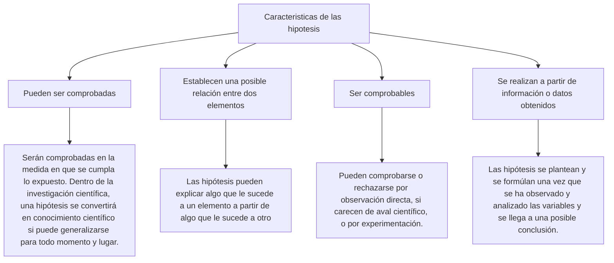
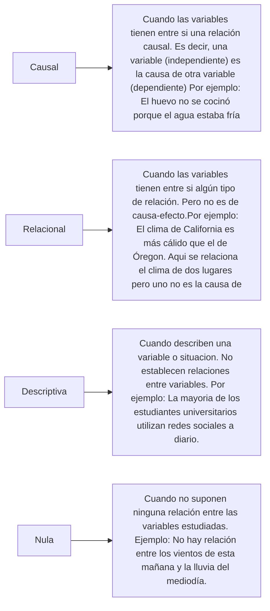

- Es una predicción o **explicación provisional** de una relación entre dos o más variables, la cual es **susceptible de someterse a pruebas**.
- Son **enunciados teóricos supuestos**, no verificables; pero **probables** referentes a variables o a la relación entre variables.
- Son **soluciones probables** previamente seleccionadas, al **problema planteado** que se proponen para que durante el proceso de la investigación, **sean confirmadas o no por los hechos**.

# Tipos de hipótesis

## Ejemplos de hipótesis

1. **Hipótesis Causal**
Ejemplo: "Una mejora en la planificación logística de la carga sobredimensionada reduce significativamente los costos de transporte."
 
 2. **Hipótesis Relacional**
Ejemplo: "Existe una relación positiva entre la eficiencia en la planificación logística y la satisfacción del cliente en el transporte de carga sobredimensionada."

3. **Hipótesis Descriptiva**
Ejemplo: "La mayoría de las empresas de transporte en Perú enfrentan desafíos en la gestión de carga sobredimensionada, incluyendo problemas de infraestructura y costos elevados."

4. **Hipótesis Nula**
Ejemplo: "No hay diferencia significativa en los costos de transporte de carga sobredimensionada entre las empresas que utilizan software de gestión logística y aquellas que no lo utiliza."
