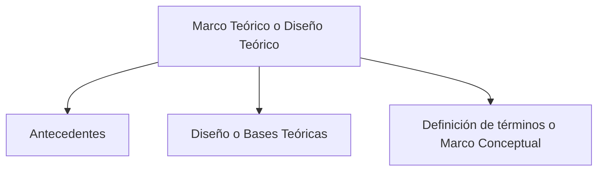
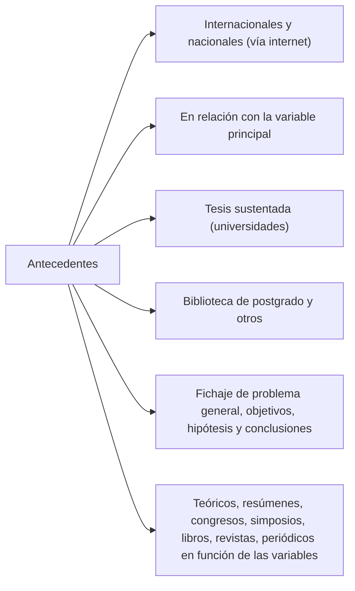

# Marco teórico
- Son investigaciones que se han hecho sobre el objeto de investigación.
- Consiste básicamente en efectuar una revisión bibliográfica sobre el problema en cuestión y en consultar a expertos en la temática.

# Aspectos teóricos
![[marco teorico esquema.png]]

# Antecedentes
Se denomina antecedentes teóricos de una tesis, a **todo estudio anterior que ha ofrecido un aporte relacionado** tanto con el tema como con el problema de investigación, para no investigar lo ya investigado.

Es la parte en la que se menciona el problema y todos los estudios previos que se han hecho al respecto.
De esta forma, se pueden comprender mejor los abordajes y establecer una guía con respecto a la información y procedimientos disponibles para llevar a cabo la investigación.

![[Pasted image 20250210174316.png]]

>[!info] Consiste básicamente en efectuar una revisión bibliográfica sobre el problema en cuestión y en consultar a expertos en la temática.

### Ejemplo de antecedentes
Por ejemplo, dada la tesis

---
**Título escogido**
"Implementación del **control de calidad** como factor determinante de **optimización de recursos** en una empresa metalmecánica"

**Problema**
"¿**Qué efectos** produciría la implementación del control de calidad en la **optimización de recursos** en el proceso productivo de una metalmecánica en el distrito de Ate en el año 2019"

---

Titulo: En la tesis doctoral "Relación entre el enfoque de Gestión de Calidad y el desempeño organizativo", Universidad de Valencia en España.

Fuente: [[[http://www.tdx.cat/TDX-0312104-142106/](https://www.google.com/search?q=http://www.tdx.cat/TDX-0312104-142106/)|[http://www.tdx.cat/TDX-0312104-142106/](https://www.google.com/search?q=http://www.tdx.cat/TDX-0312104-142106/)]], 2001).

Resumen:
En la presente tesis se abordan situaciones relacionadas a la calidad en las organizaciones. La línea de investigación se basa en los recursos y capacidades como fuentes de ventajas competitivas para el logro de la calidad. En este trabajo de investigación se pretendió determinar si existen diferencias entre los dos principales enfoques actuales de la gestión de la calidad, el aseguramiento de la calidad y la gestión de la calidad total, analizando los principios y las practicas o técnicas de cada uno.

---

Titulo: Tesis doctoral "De la calidad de vida laboral a la gestión de la calidad. Una aproximación psicosocial a la calidad como práctica de sujeción y dominación"1 de la Universidad Autónoma de Barcelona,

Fuente: [[[http://ddd.uab.cat/pub/tesis/2003/tdx-0503104-143747/jna1de1.pdf](http://ddd.uab.cat/pub/tesis/2003/tdx-0503104-143747/jna1de1.pdf)|[http://ddd.uab.cat/pub/tesis/2003/tdx-0503104-143747/jna1de1.pdf](http://ddd.uab.cat/pub/tesis/2003/tdx-0503104-143747/jna1de1.pdf)]], 2003).

Resumen: Analiza los programas de calidad en la vida laboral; como están conformados los programas colaborativos dentro de las organizaciones y su vinculación como antecedentes de los círculos de calidad. También se analiza la gestión de la calidad como una herramienta poderosa y con la suficiente capacidad para sujetar y envolver a las personas en las organizaciones para poder cumplir con los requisitos y estándares necesarios que permitan ofrecer productos y servicios de calidad.

---

Titulo:

Sistema de gestión de calidad implantado por el Instituto Tecnológico de Morelia.

Fuente: [[www.itorizaba.edu.mx|www.itorizaba.edu.mx]], 2002).

Resumen El sistema de gestión de calidad esta orientado a lograr que la organización pueda analizar los requisitos de los clientes, contar con personal motivado y mejor preparado, definir los procesos para la2 producción y prestación de3 sus servicios y mantenerlos bajo control. En el manual se establecen la política y objetivos de calidad, administración e innovación de la calidad. Los beneficios que se han obtenido con la aplicación son: cumplir con los requisitos del cliente, mantener bajo control los procesos, estandarizar los métodos y4 procedimientos, reducir costos, crear una cultura de servicio y capacitación del personal.

---

![[antecedentes.png]]

# Bases teóricas
Es toda teoría que sustenta el tema o problema planteado. Si se tratara de un asunto del que aún no existe al menos una teoría previa, entonces esta es la parte en la que se expondrá una teoría propia.

En las bases teóricas también se describen conceptos clave sobre el problema a investigar, de manera que sea posible dilucidar mejor el asunto tratado.

- Fundamentación teórica dentro del cual se enmarca la investigación.
- Presentación de los principales enfoques o teorías existentes.

>[!tip] **Como fundamento teórico** es el conjunto de conocimientos relacionados con las variables del problema de investigación.

### Definición
Presentación de las **principales escuelas, enfoques o teorías existentes sobre el tema objeto de estudio**. Principales debates, resultados, instrumentos utilizados y demás aspectos pertinentes relevantes.

## Elementos que debe tener un diseño o base teórica

- Citas bibliográficas o referencias bibliográficas
- Citas textuales o directas
- Notas de pie de páginas
- Citas contextuales o directas
- Organigramas
- Otros

# Marco conceptual o definición de términos
La definición de términos se refiere a aquellos términos que no se definen en el marco teórico pero que sigue siendo importante su definición para comprender el cuadro completo de la teoría que se expone.

Es un glosario de los conceptos principales involucrados en las variables de investigación. Los términos básicos que se definen deben ser los que a juicio del investigador posibilitará a que otros investigadores puedan conocer términos nuevos en la especialidad.

- Su función es **definir el significado de los términos** (lenguajes técnicos) que van a ser empleados con mayor frecuencia.
- **El número de términos a definir queda al criterio del investigador**, lo importante es no manejar conceptos en la investigación que den lugar a interpretaciones equívocas.

### ¿Cómo elaborar un marco conceptual?
- Elaborar un marco conceptual no es hacer una lista de término relacionados con el tema, **sino definir lo que por su significado particular necesitan precisarse en su definición.**
- En otras palabras se entiende como el **glosario de términos claves utilizados en la investigación.**

![[Pasted image 20250210210019.png]]
![[Pasted image 20250210210225.png]]
![[Pasted image 20250210210236.png]]
