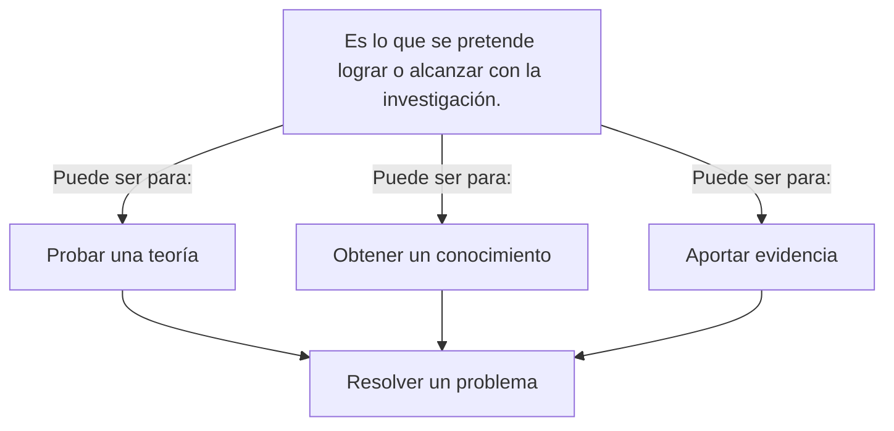

Según Sampieri

**Exploratorio**
Examina un tema novedoso o poco estudiado, investiga nuevos problemas.

**Descriptivo**
Investiga fenómenos y cómo se manifiestan, ==describe propiedades==.

**Correlacional**
Busca conocer la relación o asociación entre dos o más variables, en un contexto.

**Explicativo**
Indaga sobre las causas de eventos y fenómenos. Busca explicar por qué ocurren.

# Tipos de enfoques

### Cualitativa

- **Entrevistas a profundidad sobre experiencias de pacientes** : Investigar cómo las personas han sobrevivido a una enfermedad grave describen su proceso de recuperación y cómo afecta su vida cotidiana.

- **Análisis de contenido de redes sociales** : Estudiar publicaciones en plataformas como Instagram o Twitter para entender cómo se construye la identidad de género entre jóvenes.

### Cuantitativa

- **Psicología** : Una investigación que examina el efecto de un programa de intervención en la reducción de la ansiedad. Se pueden medir niveles de ansiedad antes y después de la intervención utilizando escalas estandarizadas.

- **Educación** : Una investigación que evalúa el rendimiento académico de estudiantes en relación con el uso de tecnologías en el aula. Se pueden comparar las calificaciones de grupos que utilizan tecnología con las de aquellos que no lo hacen.

## Enfoque cuantitativo

- El enfoque cuantitativo es secuencial y probatorio.

- Cada etapa precede a la siguiente, siendo el orden de cada una de las fases riguroso.

- Parte de una idea que va acotándose y una vez delimitada se derivan objetivos y preguntas de investigación, se revisa la literatura y se construye un marco o una perspectiva teórica.

- De las preguntas se establecen hipótesis y determinan variables. Se desarrolla un plan para probarlas (diseño), se miden las variables en un determinado contexto, se analizan las mediciones obtenidas (con frecuencia utilizando métodos estadísticos), y se establece una serie de conclusiones respecto de las hipótesis.

**Proceso Cuantitativo**
![[Pasted image 20250305134743.png]]

## Enfoque cualitativo

- Se refiere a **caracteres, atributos, esencia, totalidad o propiedades no cuantificables**, que podían describir, comprender y explicar mejor los fenómenos, acontecimientos y acciones del grupo social o del ser humano.

- ==Se utiliza principalmente en investigaciones exploratorias.==

- El **método de investigación cualitativo** ha demostrado su importancia para comprender los "porqués" detrás de los comportamientos y elecciones de las personas, ya sea para una investigación de mercado en la que se explora el consumo, o una investigación social en la que se buscan los significados.

**Proceso cualitativo**
![[Pasted image 20250305134758.png]]

# Técnicas en la obtención de datos en la investigación cualitativa

# Técnicas en la obtención de datos en la investigación cuantitativa

### Entrevistas
Son las técnicas de investigación cuantitativa más populares, gracias a su implementación eficaz, ya que son herramientas estructuradas y estandarizadas.

### Encuestas y cuestionarios
Son técnicas de investigación cuantitativa efectivas para la recolección de datos.

# Formulación del problema
La formulación del problema de investigación es la etapa donde se **estructura formalmente** la idea de investigación.

Una buena formulación del problema implica necesariamente la **delimitación del campo de investigación**, establece claramente los límites dentro de los cuales se desarrollara el proyecto.

>[!important] Mientras que el planteamiento es exponer, proponer el problema, la formulación es expresar en términos precisos y claros.

La formulación de un problema consiste en la presentación oracional del mismo, es decir, **reducción del problema a términos concretos, explícitos, claros y precisos**, y es la "concreción del planteamiento en una pregunta precisa y delimitada en cuanto a espacio, tiempo y población (si fuera el caso)".

## Tipos de formulación del problema

### Forma interrogativa

- ¿Cuál es el impacto de la satisfacción en la lealtad de los clientes en la agencia de transporte ACOINSA del Cusco en el 2022?
- ¿Cómo la alta rotación del personal incide en la productividad de la empresa CAMPOSOL de Piura en el 2022?
- ¿Cuáles son los factores que inciden en la motivación de los estudiantes de la facultad de Ciencias de la UNI con respecto al curso de metodología de la investigación durante el periodo 2022-2023?

### Forma declarativa

- Determinación del impacto de la satisfacción en la lealtad de los clientes en la agencia de transporte ACOINSA del Cusco en el 2022.
- Evaluación de la alta rotación del personal y su incidencia en la productividad de la empresa CAMPOSOL de Piura en el 2022
- Identificación de los factores que inciden en la motivación de los estudiantes de la facultad de Ciencias de la UNI con respecto al curso de Metodología de la Investigación durante el periodo 2022-2023.

# Objetivos de la Investigación

## Estructura de un objetivo general

**Objetivo general**

Propósito + Enlace o relacionante + Variable "x" +Variable "y" + Unidad de estudio + Ámbito específico + Ámbito geográfico +  Tiempo 

**Por ejemplo**

Determinar  la relación existente entre   la calidad del servicio  y la fidelidad  de los clientes  en los restaurantes  de Lima Metropolitano   en el año 2019 

## Coherencia entre el título, el problema general y el objetivo general

A continuación, se comprueba la coherencia existente entre el título de la tesis, el problema general y el objetivo general:

| TITULO                                                                                                          | PROBLEMA GENERAL                                                                                                                      | OBJETIVO GENERAL                                                                                                                                       |
| --------------------------------------------------------------------------------------------------------------- | ------------------------------------------------------------------------------------------------------------------------------------- | ------------------------------------------------------------------------------------------------------------------------------------------------------ |
| La calidad del servicio y la fidelidad de los clientes en los restaurantes de Lima Métropolitana en el año 2019 | Existe relación entre la calidad del servicio y la fidelidad de los clientes en los restaurantes de Lima Metropolitana en el año 2019 | Determinar la relación existente entre la calidad del servicio y la fidelidad de los clientes en los restaurantes de Lima Metropolitana en el año 2019 |

![[Pasted image 20250305224413.png]]

