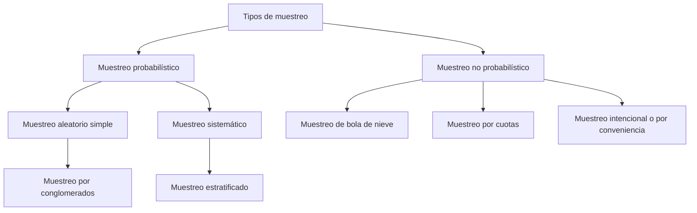

Es el plan que guía el proceso de realización de la investigación. Se trata de un **capítulo** esencial de la investigación y sirve de modelo para determinar cómo se llevará a cabo un estudio, incluidos los métodos y técnicas que se utilizarán para recopilar y analizar los datos.

>[!important] Un **Diseño de Investigación** bien diseñado es esencial para garantizar que se cumplan los objetivos de la investigación y que los resultados sean válidos y fiables.

**Propósito**
1. Responder preguntas de investigación
2. Cumplir objetivos del estudio
3. Someter hipótesis a prueba

# Tipos de diseño de investigación

## Experimental
Se utiliza para establecer una relación entre la causa y el efecto de una situación. Es un diseño donde se observa el efecto causado por la variable independiente sobre la variable dependiente.

## No experimental
Son los estudios que se realizan sin la manipulación deliberada de variables y en los que sólo se observan los fenómenos en su ambiente natural para después analizarlos.
# Estructura de un diseño experimental

1. Planeación
2. Realización
3. Análisis
4. Interpretación
5. Conclusiones

![[pasos elaboración diseño experimental.png]]

## Tipos de diseño experimental

### Pre experimental
==Se caracteriza por un tener un grado de control mínimo== y utilizar algunos atributos experimentales básicos.

- Diseños de un caso único.
	- Un maestro que usa un nuevo método de instrucción para su clase.

### Cuasi experimental
Se refiere a diseños de investigación en los cuales ==los sujetos o grupos de sujetos de estudio, no están asignados aleatoriamente==.

- Diseño de un grupo con medición antes y después
- Diseño con series de tiempo interrumpidos.
###  Experimental puro
Se analiza efectos en el mediano y largo plazo, cuando supone que la influencia de la variable independiente sobre la dependiente tarda en manifestarse.

- Métodos educativos
- Modelos de entrenamiento
- Estrategias psicoterapeutas
---
- **Pre-experimental:** El diseño más básico, con poco o ningún control sobre las variables. ==Útil para exploraciones iniciales==, pero no permite establecer relaciones causa-efecto sólidas.
- **Cuasi-experimental:** Un punto intermedio. ==Se manipulan variables, pero no hay un control total sobre la asignación de los participantes a los grupos==. Permite un mayor acercamiento a la realidad, pero la validez interna puede ser menor.
- **Experimental puro:** El estándar de oro.== Se manipulan variables y se asignan aleatoriamente los participantes a los grupos. Esto asegura un mayor control y permite establecer relaciones causa-efecto robustas==.

**Explicación detallada y ejemplos comparativos:**

**1. Diseño pre-experimental:**

- **¿Qué es?** El diseño más simple y menos riguroso. Generalmente, involucra un solo grupo y una medición antes y después de una intervención. No hay un grupo de comparación o control.
- **Características:**
    - Mínimo control de variables.
    - No hay asignación aleatoria de participantes.
    - No se puede establecer una relación causal sólida.
- **Ejemplo:**
    - **Investigación:** Un profesor quiere probar un nuevo método de enseñanza en su clase.
    - **Proceso:** Mide el rendimiento de los estudiantes antes de la intervención, aplica el nuevo método durante un semestre y luego mide el rendimiento nuevamente.
    - **Problema:** Si el rendimiento mejora, no se puede asegurar que sea solo por el nuevo método. Podría deberse a otros factores (motivación de los estudiantes, eventos externos, etc.).

**2. Diseño cuasi-experimental:**

- **¿Qué es?** Se parece al diseño experimental puro, pero los grupos no se forman por asignación aleatoria. En cambio, se utilizan grupos ya existentes (por ejemplo, clases escolares, grupos de trabajo).
- **Características:**
    - Se manipulan variables.
    - No hay asignación aleatoria de participantes.
    - Mayor control que un diseño pre-experimental.
    - Se pueden establecer relaciones causales más sólidas, pero la validez interna puede ser menor.
- **Ejemplo:**
    - **Investigación:** Un investigador quiere comparar la efectividad de dos programas de capacitación diferentes en dos empresas.
    - **Proceso:** Elige dos empresas similares. Una recibe el programa A y la otra el programa B. Mide el desempeño de los empleados antes y después de la capacitación.
    - **Ventaja:** Es más práctico que un experimento puro, ya que no requiere crear grupos artificiales.
    - **Desventaja:** Puede haber diferencias entre las empresas que influyan en los resultados (cultura organizacional, tipo de empleados, etc.).

**3. Diseño experimental puro:**

- **¿Qué es?** El diseño más riguroso y el que permite establecer relaciones causa-efecto más sólidas. Se manipulan variables y se asignan aleatoriamente los participantes a los grupos experimental (recibe la intervención) y de control (no la recibe).
- **Características:**
    - Máximo control de variables.
    - Asignación aleatoria de participantes.
    - Se pueden establecer relaciones causales robustas.
- **Ejemplo:**
    - **Investigación:** Un investigador quiere probar la efectividad de un nuevo fármaco para la depresión.
    - **Proceso:** Selecciona un grupo de personas con depresión y las asigna aleatoriamente a dos grupos. Uno recibe el fármaco y el otro un placebo.
    - **Ventaja:** La asignación aleatoria asegura que los grupos sean lo más similares posible, lo que reduce la influencia de otros factores.
    - **Resultado:** Si el grupo que recibió el fármaco muestra una mejoría significativamente mayor que el grupo placebo, se puede concluir que el fármaco es efectivo.
----

# Diseño de investigación no experimental

![[diseño no experimental - caracteristicas.png]]

**Características**
1. Se basa en la observación, el análisis y la interpretación.
2. El investigador no interviene en el contexto del fenómeno de estudio.
3. No se realizan experimentos ni muestras de estudio.
4. No manipulan las variables independientes.
5. Suelen centrarse en fenómenos ya ocurridos.

## Tipos de diseño no experimental

### Diseño transeccional o transversal

**Característica**: Recolección de datos en un único momento.
**Tipos**
	- Exploratorio
	- Descriptivo
	- Correlacional

### Evolutivos o longitudinales

**Propósito**: Analizar cambios a través del tiempo.

**Tipos**
	- Diseño de tendencia
	- Diseño de análisis evolutivos de grupos
	- Diseño panel

# Técnicas de investigación 
Es un método utilizado para obtener información relevante que se necesita para realizar un análisis o investigación. Estas técnicas permiten reunir datos de diferentes fuentes, ya sea de manera cuantitativa o cualitativa.

## Experimental

**Encuestas**
Un instrumento que suele incluir preguntas cerradas y escalas de actitudes.

**Observación**
Una técnica que permite conocer el comportamiento del objeto de estudio de manera directa

**Simulación de computadora**
Se puede considerar un experimento ya sea de modelos de computadora, estadísticas, vectoriales, escalares, graficas 2D/3D.

**Experimentos**
Una forma de recopilar datos primarios en una investigación científica.

**Focus Group**
Consiste en reunir a un grupo de personas para que respondan preguntas sobre un tema específico. El objetivo es obtener un feedback natural y matizado sobre un producto, servicio o campaña de marketing.

**Muestras biológicas**
Son materiales que se extraen de organismos vivos, como seres humanos, animales o plantas, y que se pueden analizar en un laboratorio. Pueden ser tejidos, células, fluidos corporales, ADN, ARN, o proteínas.

## No experimental

**Entrevista**
Un instrumento que suele incluir preguntas cerradas y escalas de actitudes.

**Observación**
Una técnica que permite conocer el comportamiento del objeto de estudio de manera directa

**Documentos y registros**
Se puede considerar un experimento ya sea de modelos de computadora, estadísticas, vectoriales, escalares, graficas 2D/3D.

**Investigaciones formales**
Como estudios correlacionales de teoremas matemáticos

**Mediciones estadísticas**
Son investigaciones en las que se consulta la opinión pública respecto a un asunto para poder determinar una postura conjunta. Un sondeo de opinión preelectoral-

**Evaluaciones fisiológicas**
Son mediciones que registran las características físicas de un participante, como su presión arterial, ritmo cardiaco o fortaleza física.

# Instrumentos de investigación
- Un instrumento adecuado es aquel que registra datos observables que representan verdaderamente los conceptos o las variables que el investigador tiene en mente. (Sampieri 2014)
- Un instrumento de recolección de datos es cualquier recurso que el investigador utiliza para **acercarse** a los fenómenos y extraer información de ellos.

# Técnicas e instrumentos
- Técnicas: Son los **procedimientos** o ==**estrategias** que se utilizan para obtener información==.
- Instrumentos: Son las **==herramientas==** físicas o virtuales ==que se utilizan para implementar las técnicas==.

| Técnicas              | Instrumentos         |
| --------------------- | -------------------- |
| Entrevista a Expertos | Guía de entrevista   |
| Observación           | Grabaciones          |
| Observación           | Registro fotográfico |
| Encuesta              | Cuestionario         |
| Focus Group           | Guía de indagación   |

---

- **Entrevista a Expertos:**
    - **Técnica:** Se busca la opinión y conocimiento de personas con experiencia en el tema de investigación.
    - **Instrumento:** Se utiliza una **guía de entrevista** que contiene preguntas estructuradas o semiestructuradas.
- **Observación:**
    - **Técnica:** Se examinan directamente los fenómenos o situaciones de interés.
    - **Instrumentos:** Se utilizan **grabaciones** (de audio o video) y **registros fotográficos** para documentar lo observado.
- **Encuesta:**
    - **Técnica:** Se obtiene información a través de preguntas estandarizadas a una muestra de personas.
    - **Instrumento:** Se utiliza un **cuestionario** con preguntas cerradas o abiertas.
- **Focus Group (Grupo de Enfoque):**
    - **Técnica:** Se reúne a un pequeño grupo de personas para discutir sobre un tema específico.
    - **Instrumento:** Se utiliza una **guía de indagación** que contiene preguntas y temas para orientar la discusión.

---
# Población y muestra

## Población
Se trata de un conjunto de técnicas y métodos que escoge un investigador para llegar a realizar un experimento o un proyecto de investigación. 

El diseño de investigación es un plan estructurado y específico de acción, dirigido al diseño e implementación de un experimento. Engloba un conjunto de reglas o pasos concretos que permiten llegar al objetivo del investigador, en este caso, desarrollar un experimento (ya sea observacional, experimental, cuasi-experimental)

## Muestra
Herramienta fundamental que permite conocer el comportamiento de una población infinita a partir de un subconjunto obteniendo mayor precisión en los resultados. 

## Muestra probabilística

### Muestreo aleatorio simple
Este tipo de muestreo elige al azar cada individuo que hará parte de la muestra y todos tienen las mismas oportunidades de ser seleccionados

**Ejemplo**
Si hay 400 universidades, eligen 20 aleatoriamente que cumplan ciertas características, tales como edificios con árboles, banderas, entrada de vidrio y grandes ventanas.

### Muestreo sistemático
Este muestreo selecciona de forma aleatoria al primer individuo de la población que hará parte del estudio y luego, define un intervalo para completar la muestra.

**Ejemplo**
En un grupo de 1000 personas desean obtener una muestra de 100 personas. El primer seleccionado es el número 2. A partir de este y, mediante un **intervalo de 4 personas decidido por el investigador**, se seleccionarán los siguientes individuos. De esta manera serán los números: 6, 10, 14, 18, 22, etc., hasta completar la muestra de **100 individuos**.

### Muestreo por conglomerado
Se utiliza cuando no se pueden estudiar todos los individuos de una población porque es muy grande o se encuentra dispersa en un área geográfica muy extensa, lo que aumenta el costo de la investigación.

**Ejemplo**
Si se necesita realizar una investigación sobre la población de tu país se puede aprovechar la división por estados o ciudades. Entonces, eliges 100 personas o 50 por cada zona de manera aleatoria para conformar la muestra

![[ejemplo muestra por conglomerado.png]]

### Muestreo estratificado
El muestreo estratificado divide la población en subgrupos o estratos que comparten cierta características. Luego, utilizando el método del muestreo aleatorio simple, se eligen individuos de cada estrato para conformar la muestra.

**Ejemplo de muestreo estratificado**

¿Cuántas personas consumen jugo de naranja?

| Estrato   | Rango de edades | Individuo en mm | %         | Muestra     |
| --------- | --------------- | --------------- | --------- | ----------- |
| 1         | < 18            | 2.5             | 41.67 %   | 41 667      |
| 2         | \[18, 35\]      | 2               | 33.33 %   | 33 333      |
| 3         | > 35            | 1.5             | 25.00 %   | 25 000      |
| **Total** |                 | **6**           | **100 %** | **100 000** |

## Muestra no probabilística

### Muestreo de bola de nieve
Esta técnica ayuda a los investigadores a encontrar muestras cuando son difíciles de localizar. Es útil si el tamaño de la muestra es pequeño y no esta disponible fácilmente.

**Ejemplo**
Si eres un investigador y estás buscando personas con cierta enfermedad, lo que haces es contactar a uno o dos individuos que presenten dicha condición médica y que ellos mismos sean quienes te recomienden a otros individuos con una historia médica parecida.

### Muestreo por cuotas
Este método permite dividir a la población en grupos o estratos que comparten características como el sexo, la edad, los estudios, etc., y de ellos se selecciona una muestra proporcional y representativa.

**Ejemplo**
Hobbies preferidos en una empresa. Se divide en dos estratos, hombres y mujeres. Las mujeres representan el 40 % y los hombres el 60 %, por tanto la muestra escogida tendrá 400 mujeres y 600 hombres. Así, se asegura que la participación de cada género es proporcional a la población que representan. ==A estos porcentajes elegidos se les llama cuotas==

![[grafica muestreo por cuotas.png]]

### Muestreo intencional o por conveniencia
Las muestras se seleccionan basándose únicamente en el conocimiento y la credibilidad del investigador. Los investigadores eligen solo a aquellas personas que ellos creen que son los adecuados para participar en un estudio de investigación, ya sea porque son fáciles de reclutar o porque los consideran buenos representantes de la población.

# Fuentes de información

## Fuentes primarias
Son aquellas que incluyen información de primera mano, original y sin abreviaciones.
- Monografías
- Tesis
- Fotografías
- Artículos científicos
- Ensayos

## Fuentes secundarias
Son aquellas que se componen de información sintetizada o re-elaborada.
- Directorios
- Libros
- Informes de investigación
- Compendios
- Artículos de revistas

