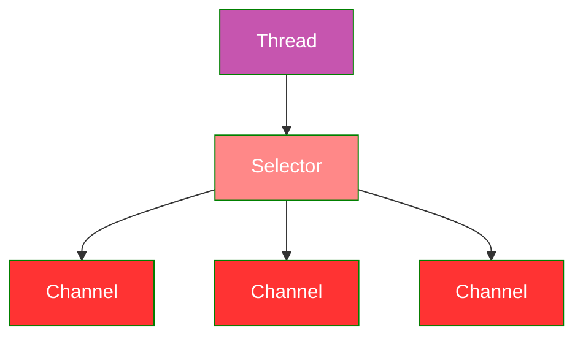

- Exposiciones en ingles
- Parcial y final sera en grupo, teoria 6 ptos


# 15-04-2025


- Un protocolo de red es un término utilizado en el mundo de la informática para dar nombre a una serie de normas y criterios que son utilizados para mantener una comunicación entre los ordenadores que forman parte de una red informática, es decir, entre los ordenadores que se encuentran conectados entre sí por cualquier sistema de comunicación, sea alámbrico o inalámbrico.
    
- Estos protocolos de red fijan cómo deben hacerse las comunicaciones entre los dispositivos que se encuentran en la red, lo que en palabras simples quiere decir que marca las pautas para que los equipos que forman parte de dicha red puedan intercambiar datos.

## Tipos de protocolos de red


- Número de participantes en la comunicación.
- Modo


# Progreso

## Semana 01

Hilos
Código Hilos
Código suma todos


## Semana 02


## Semana 03


## Semana 04


## Semana 05


# Semana 06

- [ ] Hilos Callable
- [ ] Resolución de la Practica 02 251
- [ ] 20 de abril
- [ ] Pregunta Adicional de la Resolución del Laboratorio 02 251 (Michi)

# Semana 07

- [ ] DFS
- [ ] Diseño de Máquinas

# Semana 09

- [ ] Android01
- [ ] Transacciones
- [ ] [[Middleware]]
- [x] Móvil [[Introduction to Kotlin]] ✅ 2025-05-26
- [ ] Android Ini
- [ ] Maquina Virtual


# Semana 10

## 27-05-20285


## Algoritmos de Consenso

- Los algoritmos de consenso permiten a una colección de máquinas trabajar como un grupo coherente capaz de sobrevivir a la falla de algunos de sus miembros.
- Estos algoritmos juegan un rol clave en la construcción de sistemas de software confiables de gran escala.

Algunos algoritmos conocidos:
- Paxos (difícil de entender)
- Raft (algoritmo a presentar)

Los algoritmos de consenso por lo general se destacan en el contexto de **máquinas de estado replicado**.

## Máquinas de Estado Replicado

 * Las máquinas de estado de una colección de servidores computan copias idénticas de un mismo estado y pueden operar incluso si alguno de los servidores se cae.
 * Las máquinas de estado replicado son usadas para resolver una variedad de problemas de tolerancia a fallos en sistemas distribuidos.
 * La implementación por lo general se lleva a cabo usando un **registro replicado**: cada servidor almacena un registro con la misma serie de comandos que ejecutan el mismo orden.


[Algoritmo Paxos - Nat Apuntes](https://www.natapuntes.es/algoritmo-paxos/)

- Mantener el registro replicado es trabajo del algoritmo de consenso.


1. El módulo de consenso del servidor recibe los comandos del cliente.
2. Los comandos recibidos son agregados al registro y el módulo de consenso se comunica con los módulos de otros servidores para asegurarse que todos tengas los mismos comandos y en el mismo orden incluso si algunos servidores fallan.
3. Cada servidor procesa los comandos en el orden de registro.
4. Se retorna el output al cliente.


### Propiedades de los algoritmos de consenso

 - Aseguran **seguridad** (nunca retornan un resultado incorrecto) bajo todas las *condiciones no Bizantinas* (retrasos de red, particiones, pérdida de paquetes, duplicación y reordenamiento).
 - Son **completamente funcionales** (disponibles) siempre y cuando la mayoría de los servidores este operativo.
 - No dependen del timing para asegurar la consistencia de los registros: relojes fallidos y retrasos extremos en los mensajes a lo mucho causan problemas de disponibilidad.
 - El comando se puede completar siempre y cuando la mayoría del clúster ha respondido a una sola ronda de llamadas remotas de procedimientos.


### Acerca del Algoritmo de Paxos

- Anteriormente el protocolo de Paxos era sinónimo de consenso.
- Paxos define un protocolo capaz de conseguir el acuerdo sobre una sola decisión, como una sola entrada de registro replicada. Esto se conoce como **decreto único de Paxos**.
- Paxos combina múltiples instancias de su protocolo para facilitar una serie de decisiones como registros (**muti-Paxos**).
- Paxos asegura la seguridad y vivacidad, y soporta cambios en los miembros del clúster.


### ¿Qué tiene de malo Paxos?

- Paxos es excepcionalmente difícil de entender. Su explicación completa es opaca y muy pocas personas han logrado entenderlo.
	
- Paxos no provee una buena fundación para construir implementaciones prácticas. No existe un algoritmo ampliamente acordado para multi-Paxos.
	
- La arquitectura de Paxos es pobre para construir sistemas prácticos. Escoger una colección de entradas de registro independiente y luego funcionarlas es un registro secuencial incrementa la complejidad.
	
- Paxos usa un enfoque peer-to-peer simétrico como su núcleo, esto tiene sentido en un mundo simplificado donde se hace una sola decisión, pero pocos sistemas prácticas utilizan este enfoque.


### El Algoritmo de Consenso Raft

- Raft es un algoritmo para manejar un registro replicado como se explico en el entorno de las máquinas de estado replicado.
- Raft implementa el consenso eligiendo un **líder** distinguido al que le da la completa responsabilidad de administrar el registro replicado.
- El líder acepta las entradas de registro de los clientes, las replica en los otros servidores y les dice cuando es seguro aplicar estas entradas a su estado de máquina.
- El líder puede decidir donde colocar las nuevas entradas en el registro sin consultarle a los otros servidores.
- En caso el líder falle o es desconectado de los otros servidores, se escoge un nuevo líder.

Raft divide el problema del consenso en **tres subproblemas** relativamente independientes:

- **Elección del líder**: un nuevo líder debe ser elegido cuando el líder existente falla.
- **Replicación de registro**: el líder debe aceptar las entradas de registro de los clientes y replicarlos por todo el clúster.
- **Seguridad**: si algún servidor ha aplicado alguna entrada de registro en particular a su estado máquina, entonces ningún servidor puede aplicar un comando diferente para el mismo índice de registro.


### Propiedades del Algoritmo Raft

- **Election safety**: a lo mucho un líder puede ser elegido en un periodo dado.
- **Leader append-only**: un líder nunca borra o modifica entradas en su registro, sólo agrega (append) nuevas entradas.
- **Log matching**: si dos registros contienen una entrada con el mismo índice y periodo, entonces los registros son idénticos en todas las entradas a través del índice dado.
- **Leader completeness**: si una entrada de registro se comete en un plazo dado, entonces dicha entrada estará en el registro de los líderes para cualquier periodo de mayor numeración.
- **State machine safety**: si algún servidor ha aplicado una entrada de registro a su estado máquina en un índice dado, entonces ningún servidor aplicará una entrada de registro distinto al mismo índice.


### Lo Esencial de Raft

- En cualquier tiempo dado, cada servidor se encuentra en uno de los 3 siguientes estados: **líder**, **seguidor** o **candidato**.
- En una operación normal, hay exactamente un líder y los otros servidores son seguidores.
- Los seguidores son pasivos: simplemente responden a las consultas de los líderes y canditatos.
- Si un cliente contacta un seguidor, este lo redirige al líder.

[The Consensus Algorithm: Raft (I) - Leader Election | Of Shaders & Triangles](https://blog.42yeah.is/distributed/2023/04/29/raft-leader-election.html)

### Periodos (terms)


- Raft divide el tiempo en periodos de longitud arbitraria.
- Cada periodo inicial con una elección. Algunas elecciones pueden fallar, lo que causa que el periodo termine sin la elección de un líder.
- La transición entre periodos puede observarse en diferentes tiempos y en diferentes servidores. Se puede dar que un servidor no observe una elección o incluso un periodo completo.
- Los periodos actúan como un reloj lógico en Raft.
- Cada servidor almacena el número del periodo actual (**current term**). Los current term se intercambian cuando se comunican los servidores, si el current term de uno de los servidores es menor que el del otro, actualiza su current term al mayor valor.
- Si el líder o un candidato descubre su current term desactualizado, se vuelve un seguidor.
- Si un seguidor recibe un pedido de un periodo pasado, rechaza el pedido.


### Sobre la comunicación

- Los servidores utilizan dos tipos de llamadas remotas (RPC) para comunicarse: `RequestVote RPC` y `AppendEntries RPC`. La llamada se reintenta en caso no se reciba una respuesta en cierto tiempo.


### Transición entre estados
- Si un seguidor no recibe comunicación, se vuelve un candidato y se comienza una elección.
- El candidato que recibe los votos de la mayoría del clúster (más de la mitad) se vuelve el nuevo líder.
- Los líderes por lo  general operan hasta que fallan


### Elección del Líder

- Raft utiliza el mecanismo **heartbeat** para provocar una elección de líder.
- El líder envía **heartbeats** a todos los servidores para mantener su autoridad.
- Cuando un seguidor no recibe comunicación durante un periodo de tiempo llamado *timeout de elección*, asume que no hay un líder viable e inicia una elección para un nuevo líder.


---
# 29-05-2025

[01 ¿Qué es Java NIO/IO? ¿Cuáles son sus diferencias? | Sistema de Archivos con Java NIO/NIO.2](https://www.youtube.com/watch?v=YWvR7kizhhc)


## Programación en Red: Canales y Selectores

### Canales
Un **canal** representa una conexión abierta hacia una entidad como un dispositivo de hardware, un archivo, un socket de red o un componente del programa capaz de realizar una o más operaciones I/O distintas.

Java implementa la interfaz **Channel** del paquete `java.nio` para representar los canales. Se tienen únicamente dos métodos.

- `void close()`
- `boolean isOpen()`

Todo canal se encuentra abierto al ser creado, y debe ser cerrado haciendo uso del método `close()`. Una vez cerrado, todo intento de invocar operaciones I/O arrojaran una `ClosedChannelException`.

### Server Socket Channel
Clase del paquete `java.nio.channels`

Un `ServerSocketChannel` es un canal seleccionable para sockets escuchando streams.

Para instanciar esta clase es necesario invocar  a su método estático `open()`, el cual retorna un objeto `ServerSocketChannel`.

```java
ServerSocketChannel serverChannel;
serverChannel = ServerSocketChannel.open();
```

Un canal de `server-socket` recién creado se encuentra abierto más no vinculado aún. Cualquier intento para invocar al método `accept()` sobre un `server-socket` arrojará un `NotYetBoundException`.


### Socket Address
Clase del paquete `java.net`

Un `SocketAddress` es una clase que representa una dirección IP de socket (IP Address + port o hostname  + port). Proporciona un objeto inmutable usado por los sockets para vincularse (binding), conectarse o como valores de retorno.

Para instanciar esta clase se puede cualquiera de los tres siguientes constructores:

- `InetSocketAddress(InetAddress addr, int port)`
- `InetSocketAddress(int port)`
- `InetSocketAddress(String hostname, int port)`

### Vinculando Server Socket Channels

Para poder aceptar conexiones a través de un canal de socket es necesario vincular el canal creado a una dirección de socket (dirección IP y puerto) haciendo uso de su método bind.

- `ServerSocketChannel bind(SocketAddress endport)`
	- El canal de retorno es simplemente una referencia a este mismo canal.
	- Si el canal ya se encuentra vinculado, arrojará un `AlreadyBoundException`

Luego, se podrá invocar al método `accept` para aceptar conexiones entrantes.

- `SocketChannel accept()`


> [!note] aceptar una conexión a través de un canal de socket de servidor nos genera un canal de socket de cliente


### Generando Sockets

Se puede hacer uso de los canales de sockets para generar sockets asociados a dicho canal. Para ello, tantos los `ServerSocketChannel` como los `SocketChannel` cuentan con un método socket que retorna un socket asociado.

- `abstract ServerSocket socket()`

Y en el caso de `SocketChannel`

- `abstract Socket socket()`

Si el canal se encontraba vinculado a alguna dirección, los sockets retornados también lo estarán. Caso contrario se puede vincular un socket llamado al método bind del mismo socket.


### Modo de bloqueo de un canal

Los `ServerSocketChannel` y `SocketChannel` son una subclase de un canal seleccionable (`AbstractSelectableChannel`), por ende hereda todos los métodos de dicha clase abstracta y con ello el modo de bloqueo de un canal seleccionable.

Un **canal en modo de bloqueo** bloqueará toda operaciones I/O hasta que se complete (e.g. se bloquea el hilo al llamar a una operación de lectura). Por defecto, todo canal creado se encuentra en modo de bloqueo.

Para modificar el modo de bloqueo de un canal seleccionable se puede hacer uso del siguiente método:

- `final SelectableChannel configureBlocking(boolean block)`
	- El argumento indica si el canal se encontrará en modo de bloque o no.
	- Se retorna una referenia a dicho canal seleccionable.
	- Puede arrojar una `IOException` o una `ClosedChannelException`.


### Mutliplexación e IO No bloqueada

El uso de canales seleccionable permite implementar multiplexación además del modo no bloqueado para las operaciones IO.

> Supongamos que se tiene un mesero atendiendo a una mesa en un restaurante. Si el administrador tuviera que asignar un mesero por mesa entonces el restaurante se iría fácilmente a la quiebra. En lugar de ello, un mesero atiende varias mesas (multiplexación) y no espera permanentemente en cada mesa a recibir la orden (IO no bloqueada).


De forma análoga, veremos que haciendo uso de canales seleccionables y un **selector** podremos manejar varios canales en un solo hilo sin la necesitad de instanciar un hilo por cada socket abierto.

Haciendo uso de un selector es posible manejar múltiples canales a través de un solo hilo, con lo que se pueden asignar más hilos a otras tareas distintas.





### Selector

Un **selector** es un componente de Java NIO capaz de examinar uno o más canales seleccionables NIO y determinar cual de ellos se encuentra listo para leer escribir

Creando un selector

Un selector puede ser creado invocando el método estático open de la clase `Selector`

```java
try {
	Selector s = Selector.open();
} catch (IOException e) {

}
```

Todo selector se mantiene abierto desde su creación hasta que se llame al método `close()` de su instancia.


### Selection Key

Un selection key es un token que representa la registración de un canal seleccionable (`SelectableChannel`) con un selector.

**Métodos básicos**

- `boolean isAcceptable()`
	- Verifica si el canal se encuentra listo para aceptar una nueva conexión de socket.
- `boolean isConnectable()`
	- Verifica si el canal ha finalizado o fallado en finalizar su operación de conexión de socket.
- `boolean isReadable()`
	- Verifica si el canal se encuentra listo para leer.
- `boolean isWritable()`
	- Verifica si el canal se encuentra listo para escribir.

**Observaciones**
- Una `key` permanece válida hasta que sea cancelada haciendo uso del método `cancel()`, cerrando el canal, o cerrando el selector.
- Al cancelar una `key`, esta no es removida inmediatamente del selector, en lugar de ello es agregado a un conjunto `cancelled-key` para eliminarlos durante la siguiente operación `selection`.


### Registrando Canales

Para poder usar un canal con un selector, debe registrarse el canal en *modo no bloqueado* con el selector haciendo uso del siguiente método del canal seleccionable.

```java
SelectionKey register(Selector set, int ops)
```

El segundo parámetro indicará qué eventos se escuchará haciendo uso del selector. Para ello se deben utilizar las siguientes constantes estáticas de la clase `SelectionKey`:

1. `SelectionKey.OP_CONNECT`
2. `SelectionKey.OP_ACCEPT`
3. `SelectionKey.OP_READ`
4. `SelectionKey.OP_WRITE`

Para conocer qué indica cada evento se puede usar de referencia los método recién presentados para `SelectionKey`


---

Ayudante: Expo Sistemas basados en actores

---


# 03-06-2025

[Algoritmos de consenso](https://www.youtube.com/watch?v=SheMoOHIPXk)
