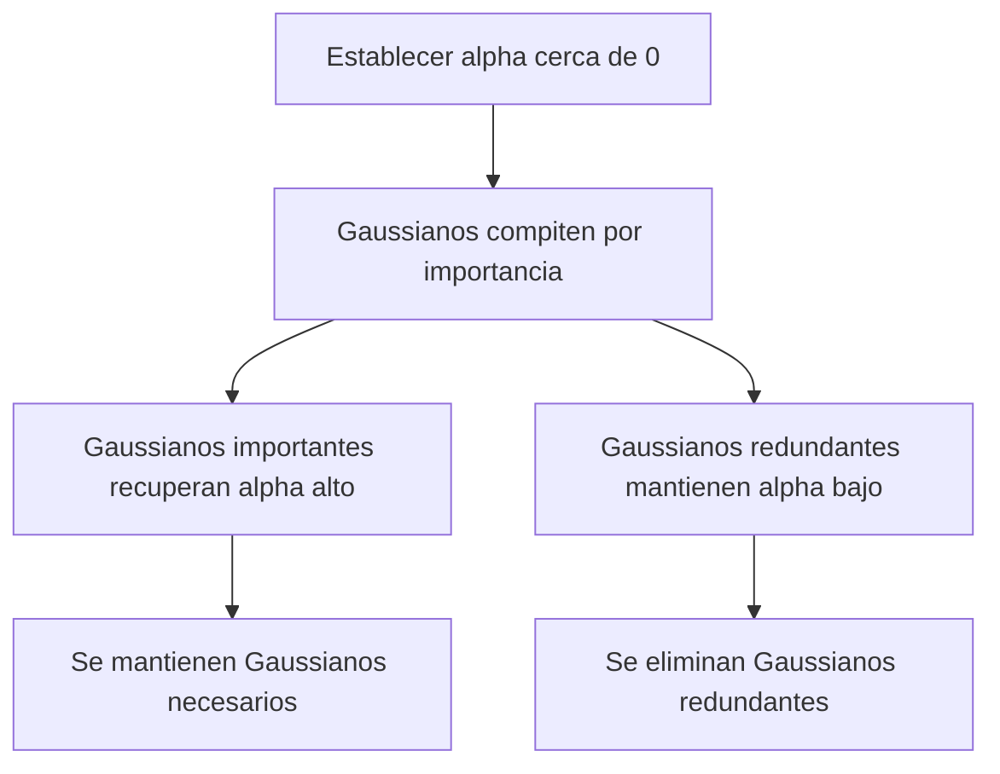
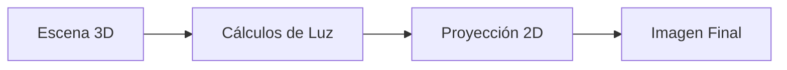

- [The Structure from Motion Pipeline](https://www.youtube.com/watch?v=i7ierVkXYa8&t=71s)
- [Overview | Structure from Motion - YouTube](https://www.youtube.com/watch?v=oIvg7sbJRIA&t=65s)
- 
# NeRF enable direct mapping of spatial

NeRF (Neural Radiance Fields) permitió crear una forma de "traducir" o "convertir" directamente:
- Las coordenadas espaciales (es decir, puntos en el espacio 3D representados por coordenadas x, y, z)
- En información sobre:
  1. Color (qué color tiene ese punto en el espacio)
  2. Densidad (qué tan "sólido" o "transparente" es ese punto)

Para entenderlo mejor, imagina que:
- Tienes un punto cualquiera en el espacio 3D
- NeRF puede decirte inmediatamente:
  - Qué color debería verse en ese punto exacto
  - Qué tan "denso" o "sólido" es ese punto (si es aire vacío, si es parte de un objeto sólido, etc.)

Esta capacidad fue revolucionaria porque permitió representar escenas 3D de una manera mucho más precisa y realista, ya que podía determinar exactamente cómo debería verse cada punto en el espacio.
# Radiancia
Un **valor de radiancia no negativo** es una medida cuantitativa de la luz que se emite o viaja desde un punto en una dirección específica en el espacio tridimensional. **En términos más simples, describe la cantidad de luz que se observa desde un punto en una dirección dada**, sin permitir valores negativos, ya que físicamente no tiene sentido tener "luz negativa".

### Conceptos clave:

1. **Radiancia**: Es una magnitud física que mide la cantidad de energía luminosa que pasa por una unidad de área en una dirección específica. Se expresa en unidades como W/m2⋅sr\text{W}/\text{m}^2\cdot\text{sr} (watts por metro cuadrado por estereorradián).
2. **No negativa**: Significa que el valor siempre es mayor o igual a cero. Esto refleja el hecho de que no puede haber emisión o propagación de "luz negativa"; si no hay luz, el valor será simplemente cero.

### Importancia:

En el contexto de los campos de radiancia, este valor no negativo garantiza que las simulaciones y las representaciones sean físicamente realistas. Por ejemplo:

- **Radiancia cero**: Indica que un punto no emite ni refleja luz en esa dirección.
- **Radiancia positiva**: Representa la cantidad de luz que un punto emite o refleja en una dirección específica.

Este principio asegura que los cálculos relacionados con iluminación y renderizado sigan las leyes físicas de la óptica, como la conservación de la energía luminosa.

# Structure-from-Motion (SfM)

La Structure from Motion (SfM) es una técnica de visión por computadora que reconstruye escenas 3D a partir de una secuencia de imágenes 2D en movimiento. 

## Principio Básico
La idea central es que cuando tienes varias imágenes de una escena tomadas desde diferentes puntos de vista, puedes:
- **Reconstruir la estructura 3D de la escena**
- **Determinar el movimiento de la cámara (o las posiciones desde donde se tomaron las fotos)**

## Cómo Funciona

| Paso | Descripción | Analogía |
|------|-------------|----------|
| 1. Detección de Puntos | Identifica puntos característicos en cada imagen | Como marcar puntos de referencia en el edificio |
| 2. Correspondencia | Encuentra los mismos puntos en diferentes imágenes | Reconocer que es el mismo punto desde diferentes ángulos |
| 3. Triangulación | Calcula la posición 3D de estos puntos | Como usar dos ojos para percibir profundidad |
| 4. Optimización | Refina la reconstrucción 3D y las posiciones de cámara | Ajustar nuestra percepción al ver más detalles |


# Overview | Structure from Motion

Digamos que quieres cubrir la estructura tridimensional de esta estatua. Lo que haces es simplemente sacar tu celular y capturar un video de esta escultura simplemente caminando al rededor de ella. Esto se le conoce como un **video no controlado**. Es decir, no se conoce el movimiento de la cámara durante la captura del video. A partir de ese video se puede extraer tanto la estructura tridimensional de la escena como también el movimiento de la cámara a través del espacio. Esto es el problema **Structure-from-Motion**.


# $\alpha$-blending

El alpha-blending (o mezcla alfa) es una técnica fundamental en computación gráfica que permite combinar imágenes o colores con transparencia. 

El alpha-blending permite mezclar un color "fuente" con un color "destino" usando un valor alfa (α) que determina la transparencia. El valor α va de 0 (completamente transparente) a 1 (completamente opaco).

## Fórmula del paper
La fórmula que vemos en el paper:

$$C = \sum_{n=1}^{|N|} c_n \alpha'_n \prod_{j=1}^{n-1} (1-\alpha'_j)$$

Es una implementación específica de alpha-blending donde:
- $c_n$ es el color del Gaussiano actual
- $α'_n$ es su opacidad
- $\Pi(1-\alpha'_j)$ representa cuánto se ve a través de los Gaussianos anteriores

**Ejemplo**
Imagina dos Gaussianos superpuestos:
1. Gaussiano frontal: color rojo, α = 0.5
2. Gaussiano trasero: color azul, α = 1.0

El color final sería:
- Rojo × 0.5 + (Azul × 1.0 × (1-0.5))
- Es decir: 50% rojo + (50% del azul)

**Importancia**
1. **Transparencia Natural**: Permite representar objetos semitransparentes
2. **Suavidad**: Ayuda a crear transiciones suaves entre Gaussianos
3. **Profundidad**: Junto con el depth-sorting, crea una representación correcta de la profundidad.

# Rasterization
Rasterization is a process fundamental to digital graphics that converts vectors (such as lines and shapes defined by mathematical formulas) into a grid of pixels or dots


# Voxel
In computer graphics, a **voxel,** also known as a 3D pixel, is a 3D cube located on a three-dimensional grid used to create 3D models. Similar to a pixel in a 2D image, a voxel can contain a specific location inside a 3D grid and has a color value assigned to it.


# D-SSIM
Te explico ambos conceptos:

# Ground Truth
El "ground truth" (verdad fundamental o verdad de referencia) en este contexto se refiere a las imágenes reales o de referencia que se usan para entrenar el modelo. 

Por ejemplo:
- Si estás reconstruyendo una escena 3D de una habitación
- El "ground truth" serían las fotografías reales que tomaste de esa habitación
- El modelo intenta generar imágenes que se parezcan lo más posible a estas fotos originales

# D-SSIM (Structural Dissimilarity)
Es una función de pérdida basada en SSIM (Structural Similarity Index):

1. **¿Qué es SSIM?**
   - Mide la similitud estructural entre dos imágenes
   - Considera patrones de intensidad de píxeles
   - Evalúa aspectos como:
     - Luminancia
     - Contraste
     - Estructura

2. **D-SSIM**
   - Es el complemento de SSIM: `D-SSIM = 1 - SSIM`
   - Mientras mayor es D-SSIM, más diferentes son las imágenes
   - Se usa como función de pérdida porque:
     - Es más sensible a diferencias estructurales que pérdidas simples como L1 o L2
     - Correlaciona mejor con la percepción visual humana

3. **En el contexto de 3D GS**
   - Se combina con la pérdida L1:
     `L = (1-λ)L1 + λLD-SSIM`
   - L1 captura diferencias absolutas de color
   - D-SSIM captura diferencias estructurales
   - λ balancea la importancia de cada término

La combinación de estas funciones de pérdida ayuda al modelo a generar imágenes que son tanto numéricamente precisas (L1) como visualmente similares (D-SSIM) a las imágenes de referencia (ground truth).


# Under-reconstructed Areas
Son áreas de la escena donde:

- No hay suficientes Gaussianos para representar los detalles
- La representación es demasiado dispersa o escasa
- Faltan detalles geométricos importantes

**Ejemplo**: Imagina una pared con textura compleja pero con pocos Gaussianos para representarla. Esto resultaría en una representación borrosa o con falta de detalles.

# Over-reconstructed Regions
Son áreas donde:

- Hay demasiados Gaussianos concentrados
- La representación es redundante
- Los Gaussianos son más grandes de lo necesario

**Ejemplo**: Imagine una superficie plana simple representada por muchos Gaussianos grandes superpuestos. Esto sería ineficiente y podría causar artefactos visuales.


# Gradientes posicionales
Los gradientes posicionales ==son una medida de cuánto cambia la posición o la geometría en una región específica. Un "gradiente posicional grande" indica un cambio significativo o abrupto en la geometría o características de la escena==.

1. **Gradiente Posicional Pequeño**:
- Una pared lisa
- Una superficie plana
- Un área con cambios suaves en la geometría

2. **Gradiente Posicional Grande**:
- El borde de una mesa
- La esquina de una habitación
- Un cambio abrupto en la profundidad
- Detalles arquitectónicos como molduras

En el contexto de 3D Gaussian Splatting:
- Los gradientes posicionales grandes indican áreas donde la geometría cambia significativamente
- Estas áreas generalmente necesitan más Gaussianos para representar adecuadamente los detalles
- El sistema identifica estas áreas y aplica la densificación (añade más Gaussianos) para mejorar la calidad de la reconstrucción

Es similar a cómo un artista necesitaría más pinceladas para detallar un área compleja de un cuadro, mientras que podría usar menos para un área uniforme.


# Regularization
Es una técnica para evitar el sobreajuste (overfitting) y mantener el modelo más simple y eficiente:

- Elimina elementos innecesarios
- Reduce la complejidad del modelo
- Mejora la generalización

# World-space
- Es el espacio 3D absoluto de la escena
- Las coordenadas son independientes de la cámara
- Es donde "viven" realmente los objetos

# View-space
- Es el espacio relativo a la cámara
- Las coordenadas dependen de la posición y orientación de la cámara
- Es cómo "ve" la cámara la escena


# Input camera
Se refiere a las cámaras usadas para capturar las imágenes originales:

- Son las posiciones desde donde se tomaron las fotos originales
- Proporcionan las imágenes de entrenamiento
- Son los puntos de vista conocidos de la escena


# Alpha cerca de cero
El establecimiento del valor alpha cerca de cero después de cierto número de iteraciones es una estrategia importante de optimización. Te lo explico detalladamente:

1. **Control de Densidad**
- **En las zonas cercanas a las cámaras de entrada, los Gaussianos tienden a acumularse naturalmente**
- **Esto ocurre porque estas áreas tienen más información detallada en las imágenes originales**
- **Sin control, podría haber una sobrepoblación de Gaussianos en estas regiones**

2. **Proceso de Selección Natural**
- Al establecer alpha cerca de cero, se fuerza una especie de "competencia" entre Gaussianos
- Solo los Gaussianos que son realmente necesarios para la representación de la escena recuperarán valores alpha más altos
- Los Gaussianos redundantes o menos importantes permanecerán con alpha bajo y serán eliminados

3. **Optimización Automática**


4. **Beneficios**
- Distribución más uniforme de Gaussianos
- Mejor eficiencia computacional
- Representación más precisa de la escena
- Evita el sobreajuste en áreas cercanas a las cámaras

5. **Resultado Final**
- Los Gaussianos que sobreviven son los más efectivos para representar la escena
- Se logra un balance entre calidad de representación y eficiencia
- Se evita la acumulación innecesaria de Gaussianos

Es como un proceso de "supervivencia del más apto" donde solo los Gaussianos más importantes para la representación de la escena mantienen su influencia.


# Artifacts
==Son imperfecciones o anomalías visuales no deseadas que aparecen en la imagen renderizada==. En áreas con datos observacionales insuficientes (pocas fotografías o ángulos de vista limitados), estos artefactos pueden manifestarse de varias formas:

## Tipos Comunes de Artefactos

1. **Vacíos o Huecos**
   - Áreas donde faltan Gaussianos
   - Aparecen como agujeros en la escena reconstruida
   - Son especialmente comunes en áreas ocultas en las imágenes originales

2. **Distorsiones Geométricas**
   - Formas incorrectas o deformadas
   - Superficies que deberían ser planas aparecen onduladas
   - Bordes que deberían ser rectos aparecen distorsionados

3. **Problemas de Textura**
   - Manchas o patrones irregulares
   - Borrosidad en áreas que deberían ser nítidas
   - Texturas inconsistentes entre diferentes vistas

4. **Ghosting**
   - Aparición de "fantasmas" o duplicados semitransparentes
   - Objetos que parecen estar en múltiples posiciones
   - Bordes dobles o difuminados

## Causas Principales
1. **Datos Insuficientes**
   - Pocas imágenes de referencia
   - Ángulos de vista limitados
   - Oclusiones en las imágenes originales

2. **Problemas de Optimización**
   - Convergencia incorrecta de los Gaussianos
   - Distribución subóptima de los Gaussianos
   - Problemas en la estimación de profundidad

Por esto es importante tener:
- Suficientes vistas de la escena
- Buena cobertura angular
- Técnicas de regularización apropiadas
- Estrategias de optimización robustas

# Rendering
==El rendering es el proceso de generar una imagen 2D a partir de una descripción 3D de una escena==. Es similar a tomar una fotografía digital de un mundo virtual.

## Componentes Principales
1. **Geometría**
   - Modelos 3D (objetos, personajes, escenarios)
   - Posición y orientación de objetos

2. **Materiales y Texturas**
   - Propiedades de superficie (color, brillo, rugosidad)
   - Imágenes aplicadas a superficies

3. **Iluminación**
   - Fuentes de luz
   - Sombras
   - Reflejos

4. **Cámara Virtual**
   - Posición y orientación
   - Campo de visión
   - Proyección

## Proceso Básico


## Tipos Principales
1. **Tiempo Real**
   - Usado en videojuegos
   - Prioriza velocidad sobre calidad
   - 30-60+ imágenes por segundo

2. **Pre-renderizado**
   - Usado en películas/animación
   - Alta calidad
   - Puede tomar horas por imagen

# Gaussiano Anisotrópico

Imagina una "nube" 3D que:
- Puede estirarse diferentemente en cada dirección (X, Y, Z)
- No tiene que ser esférica perfecta
- Se puede orientar en cualquier dirección

Por ejemplo:
- Un Gaussiano **isotrópico** sería como una esfera perfecta
- Un Gaussiano **anisotrópico** puede ser como un huevo o una elipse estirada

```
Isotrópico:      Anisotrópico:
   ○             ⬭  
(Esfera)         (Elipse)
```

# Ray-Marching

Es como "caminar" a lo largo de un rayo de luz para ver qué encuentra:

1. Imagina que disparas un rayo desde la cámara
2. El rayo avanza paso a paso por la escena
3. En cada paso, verifica si hay algo (objetos, materiales)
4. Acumula información sobre color, transparencia, etc.

Es como si:
```
Cámara →  ·  ·  ·  ·  ·  Objeto
          ^ ^ ^ ^ ^
          Puntos de muestreo
```

- Ventaja: Puede capturar efectos complejos (niebla, transparencia)
- Desventaja: Es lento porque necesita muchos puntos de muestreo

NeRF usa ray-marching, mientras que 3D Gaussian Splatting evita esto usando Gaussianos anisotrópicos que se proyectan directamente a la imagen.