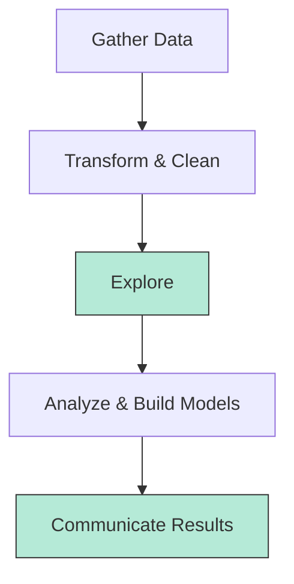

- Python data visualization library
- Easily create the most common types of plots

Useful to
- Explore
- Communicate Results





<h4>Getting started</h4>

```python
import seaborn as sns
impor matplotlib.pyplot as plt
```


# Scatter plot

```python
sns.scatterplot(data, x, y, hue, size, style, ...)
plt.show()
```


# Count plot


```python
sns.countplot(x, data, hue, size, style, ...)
plt.show()
```


# Relational plots `relplot()`


```python
sns.relplot(x, y, data, kind, col, row, col_wrap, col_order)
plt.show()
```

- `kind`: Accepts a `scatter` plot (`kind='scatter'`) or a `line` plot (`kind=line`)
- `col`: Splits the dataset into multiple subplots placed in columns, based on unique values of a **categorical variable**
- `row`: Similar to `col`, but creates subplots arranged in rows
- `col_wrap`: When `col` produces many plots, this wraps then into multiple rows after a set number of columns
- `col_order`: Controls the display order of the categories in `col`
- `row_order`: Same `col_order`

**Appearance**
- `markers` : Set specific marker styles. Works in both scatter and line plots. (`'o'`, `'s'`, `'^'`)
- `dashes` : Control line dashing styles (lineplot only). (`''`, `'--'`, `'-.'`)
- `ci`: Confidente interval for line plots. (`ci=95`, `ci='sd'`, `ci=None`)


# Categorical plots `catplot()`

```python
sns.catplot(x, y, data, kind, order, col, row, hue, ci, height, aspect, estimator, errobar, ...)
```


- `kind`: Type of categorical plot. (`'bar', 'count', 'box', 'point'`, etc.)
- `col`: Divides the plot into subplots based on unique values of a variable (in columns).
- `row`: Similar to `col`, but in rows.
- `col_wrap`-: Adjusts how many columns are shown before wrapping to the next row.
- `col_order`, `row_order`-: The order of categories in `col` or `row`.
- `estimator`: A statistical function to use for each category's central tendency. The default is `np.mean`. (`estimador=np.sum`, etc.)
- `errorbar`: Specifies how to compute and show the error bars. It replaces the deprecated `ci` parameter. (`errobar='ci'`, `errorbar='sd'`, etc.)
- `height`-: The height of each subplot (in inches).
- `aspect`-: The aspect ratio (width/height) of the subplot.

**Appearance**

- `palette`-: Controls the color palette ("deep", "muted", "Set2", or a list of custom colors).
- `dodge`-: Adjusts the separation between categories with the same `hue` (`True`/`False`).
- `orient`-: The plot's orientation (`"v"` for vertical, `"h"` for horizontal).
- `capsize`-: For `point` and `bar` plots, controls the length of the error bar caps (`capsize=0.2`).
- `markers`-: For `point` or `strip` plots, defines the marker ('o', 's', '^').


## box plots

- Shows the distribution of quantitative data
- See median, spread, skewness, and outliers
- Facilitates comparison between groups

```python
g = sns.catplot(x, y, data, kind='box', order, sym, whis)
plt.show()
```

- `order`: A list that explicitly sets the order of the categories on the axis, overriding the default alphabetical sorting. 
- `sym`: Controls the marker for outliers. 
	- `sym='d'`: diamond shapes
	- `sym=''`: None
- `whis`: Defines the length of the whiskers. The default is `1.5` times the IQR, but you can set it to a different float (`whis=2.0`) or a list of percentiles (`whis=[5, 95]`)


## point plots

- Points show mean of quantitative variable
- Vertical lines show 95% confidence intervals


<div style="text-align:center">

</div>

**Differences with line plots**

Both show:
- Mean of quantitative variable
- 95% confidence intervals for the mean

Differences:
- Line plot has **quantitative** variable (usually time) on x-asis
- Point plot has **categorical** variable on x-axis

```python
sns.catplot(x, y, data, hue, kind='point', join, estimator, capsize, ci)
```

- `join`: A boolean value that determines whether to connect the points with a line.
- `estimator`: A statistical function to use for each category's central tendency
	- `estimator=np.mean` (Default)
	- `estimator=np.median`
	- `estimator=np.sum`, etc.
- `ci`: The size of the confidence interval. Default is 95. (`ci=68`, `ci='sd'`, `ci=None`)
- `capsize`: The width of the horizontal caps on the errors bars. (`capsize=0.2`)


# Plot style and color

<h5>Changing the figure style</h5>
- Figure "style" includes background and axes
- Present options: `'white'` (default option), `'dark'`, `'whitegrid'`, `'darkgrid'`, `'ticks'`

Example

```python
import matplotlib.pyplot as plt
import seaborn as sns

sns.set_style('whitegrid')
# ---
plt.show()
```


<h5>Changing the palette</h5>

- Figure "palette" changes the color of the main elements of the plot
- `sns.set_palette()`

**Diverging palettes**
- `'RdBu'`
- `'PRGn'`
- `'RdBu_r'`
- `'PRGn_r'`

```python
sns.set_palette('RdBu')
# ---
plt.show()
```


**Sequential palettes**

- `'Greys'`
- `'Blues'`
- `'PuRd'`
- `'GnBu'`

**Custom palettes**

```python
custom_palette = ['red', 'green', 'orange', 'blue', 'yellow', 'purple']

sns.set_palette(custom_palette)
```

```python
custom_palette = ['#FBB4AE', '#B3CDE3', '#CCEBC5',  
				  '#DECBE4', '#FED9A6', '#FFFFCC',  
			      '#E5D8BD', '#FDDAEC', '#F2F2F2'] 

sns.set_palette(custom_palette)
```


<h5>Changing the scale</h5>
- Figure "context" changes the scale of the plot elements and labels
- `sns.set_context()`
- Smallest to largest: `'paper'` (default), `'notebook'`, `'talk'`, `'poster'`

Example

```python
sns.set_context('talk')
# ---
plt.show()
```


# Adding titles and labels

Seaborn plots crete two different types of objects: `FacetGrid` and `AxesSubplot`

```python
g = sns.scatterplot(x, y, data)
type(g)
# Output
# matplotlib.axes._subplots.AxesSubplot
```


| Object Type   | Plot Types                           | Characteristics            |
| ------------- | ------------------------------------ | -------------------------- |
| `FacetGrid`   | `relplot()`, `catplot()`             | Can create subplots        |
| `AxesSubplot` | `scatterplot()`, `countplot()`, etc. | Only creates a single plot |

## Adding titles

<h5>Adding a title to a FacetGrid</h5>

```python
g = sns.catplot(x, y, data, kind)
g.fig.suptitle('New title', y)
plt.show()
```


<h5>Adding a title to a AxesSubplot</h5>

```python
g = sns.boxplot(x, y, data)
g.set_title('New title', y)
plt.show()
```


<h5>Titles for subplots</h5>
```python
g = sns.catplot(x, y, data, kind, col)
g.fig.suptitle('New title', y)
g.set_titles('This is {col_name}')
```


## Adding labels

<h5>Adding axis labels</h5>

```python
g = sns.catplot(x, y, data, kind)
g.set(xlabel='X label', ylabel='Y label')
plt.xticks(rotation=90)
plt.show()
```


# Parameters

## `palette`

Palette sets the color map for a plot. It can be a list of colors, a dictionary, or a string referencing a built-in Seaborn palette. Palettes are categorized into several types to help you choose the right colors for your data.

* **Sequential**: Ideal for numerical data, where color intensity changes with value. Use for bar plots, heatmaps, and count plots.
    * `'viridis'`
    * `'plasma'`
    * `'mako'`
    * `'rocket'`

* **Diverging**: Suitable for data with a meaningful midpoint, like a correlation matrix. Colors diverge from a neutral central value to two extremes.
    * `'coolwarm'`
    * `'RdBu'`
    * `'seismic'`

* **Qualitative**: Best for distinguishing between discrete categories. Each color is distinct to avoid implying a numerical relationship.
    * `'deep'` (default)
    * `'muted'`
    * `'Set2'`
    * `'Paired'`

* **Custom**: You can also pass a list of color codes (e.g., `['#FF5733', '#C70039']`) for a fully customized palette.