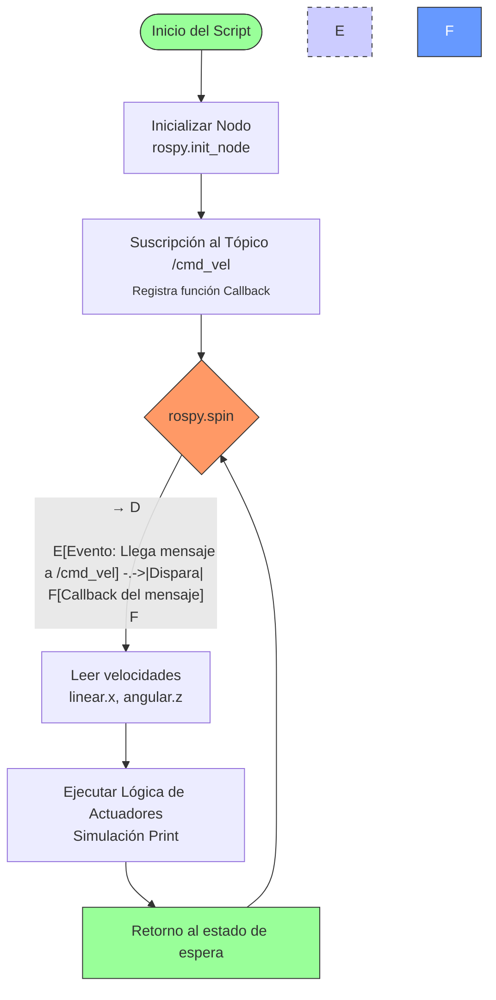

¡Excelente iniciativa! Tomaré el mando como el "Cuarto Integrante Experto". Dado que tenemos poco tiempo y necesitamos un informe profesional en LaTeX con código funcional, he diseñado un flujo de trabajo lineal para maximizar la eficiencia.

Como solicitaste, he dividido este proyecto masivo en dos partes.

Parte 1 (Esta respuesta): Plan de Trabajo, Marco Teórico (A), Diseño del Sistema (A) y Desarrollo del Nodo Receptor (B).

Parte 2 (Siguiente respuesta): Desarrollo del Nodo Controlador (C), Instrucciones de Ejecución y Conclusiones.

Aquí tienes el plan de batalla y la ejecución de la primera mitad.

---

### 📅 Plan de Trabajo Integrado (Secuencial)

Para evitar choques, ejecutaremos las tareas en este orden lógico:

1. **[A - Tarea 1] Redacción del Marco Teórico:** Explicar qué es ROS y la arquitectura Pub/Sub. (Necesario para el inicio del informe).
    
2. **[A - Tarea 2] Diseño de la Arquitectura del Grupo 3:** Definir formalmente quiénes son nuestros nodos y qué mensajes usarán.
    
3. **[B - Tarea 1] Implementación del Nodo "Driver":** Escribir el código que simula el carrito (Suscriptor).
    
4. **[C - Tarea 1] Implementación del Nodo "Controlador":** Escribir el código que envía órdenes (Publicador). _[Se hará en la Parte 2]_
    
5. **[A - Tarea 3] Manual de Ejecución y Pruebas:** Redactar cómo se corren los comandos y qué se espera ver. _[Se hará en la Parte 2]_
    

---

### 📄 Contenido del Informe (Formato LaTeX)

A continuación, presento el contenido listo para copiar y pegar en tu editor LaTeX (como Overleaf o TeXShop). He omitido el preámbulo (`\documentclass`, `\usepackage`, etc.) para ir directo al **cuerpo del documento**.

#### \section{Introducción}

El presente informe detalla el diseño e implementación de un sistema de control distribuido para un robot móvil diferencial utilizando el sistema operativo robótico ROS (Robot Operating System). El objetivo principal del Grupo 3 es demostrar la capacidad de desacoplar la lógica de control (software de alto nivel) del hardware del robot (actuadores), permitiendo una comunicación asíncrona y modular.

Para cumplir con este objetivo, se ha diseñado una arquitectura basada en nodos independientes que se comunican mediante el paso de mensajes sobre tópicos específicos, simulando el comportamiento de un "carrito robot" genérico que recibe comandos de velocidad lineal y angular.

#### \section{Marco Teórico: Fundamentos de ROS}

ROS no es un sistema operativo en el sentido tradicional, sino un \textit{middleware} o capa de software que provee servicios estándar para facilitar el desarrollo de software robótico. Para el desarrollo de esta práctica, es fundamental entender tres conceptos clave:

\begin{itemize}

\item \textbf{Nodos:} Son procesos ejecutables independientes. En nuestro contexto, tendremos un proceso que representa al robot y otro que representa al mando de control.

\item \textbf{Tópicos (Topics):} Son canales de comunicación con nombre (ej. \texttt{/cmd_vel}). Los nodos pueden publicar información en un tópico o suscribirse a él para recibirla.

\item \textbf{Mensajes:} Es la estructura de datos que viaja por los tópicos. Para robots móviles, el estándar industrial es el mensaje \texttt{Twist}, que contiene vectores de velocidad lineal y angular.

\end{itemize}

El paradigma utilizado es el de \textbf{Publicador/Suscriptor}. Un nodo publica un mensaje sin saber quién lo leerá, y otro nodo se suscribe sin saber quién lo envió. Esta abstracción es lo que permite que nuestro código de control funcione igual en un simulador que en un robot físico real.

#### \section{Diseño de la Solución (Grupo 3)}

Para el manejo del carrito robot, hemos planteado una arquitectura de dos nodos principales conectados a través del \textit{ROS Master}.

\subsection{Arquitectura del Sistema}

El sistema se compone de los siguientes elementos:

\begin{enumerate}

\item \textbf{Nodo \texttt{driver_carrito} (Suscriptor):} Este nodo actúa como la interfaz con el hardware simulado. Su función es escuchar continuamente el tópico de velocidad. Al recibir un dato, interpreta los valores y (en simulación) reporta el estado de los motores en la consola.

\item \textbf{Nodo \texttt{teleop_control} (Publicador):} Este nodo es el cerebro de la operación. Se encarga de generar los comandos de movimiento y enviarlos a la red.

\item \textbf{Tópico \texttt{/cmd_vel}:} Es el canal de comunicación. Utiliza mensajes de tipo \texttt{geometry_msgs/Twist}.

\end{enumerate}

\subsection{Estructura del Mensaje Twist}

El mensaje elegido (\texttt{Twist}) se compone de dos vectores 3D:

\begin{verbatim}

Vector3 linear (x, y, z) -> Usaremos 'x' para avance/retroceso

Vector3 angular (x, y, z) -> Usaremos 'z' para giro izquierda/derecha

\end{verbatim}

\section{Implementación del Software}

A continuación, se detalla la lógica de programación utilizada para cada nodo. Se ha utilizado el lenguaje Python (biblioteca \texttt{rospy}) debido a su facilidad de prototipado y manejo nativo en ROS Noetic.

\subsection{Desarrollo del Nodo Driver (Receptor)}

El nodo driver implementa una función de \textit{callback}. Esta función es "reactiva": permanece dormida hasta que llega un mensaje nuevo al tópico.

\begin{itemize}

\item \textbf{Inicialización:} Se registra el nodo ante el Master con el nombre \texttt{nodo_driver_carrito}.

\item \textbf{Suscripción:} Se indica a ROS que queremos recibir copias de todo mensaje enviado a \texttt{/cmd_vel}.

\item \textbf{Procesamiento:} Se extraen las componentes lineal X y angular Z para simular la actuación de los motores.

\end{itemize}

% Aquí inserta el Bloque de Código 1 (ver final de la respuesta) %

---

### 💻 Bloques de Código (Para Anexos o Cuerpo del Informe)

Aquí tienes el código correspondiente a la **Tarea B1 (Nodo Driver)**, listo para ser insertado donde dice "Bloque de Código 1" o en los anexos del informe.

#### Bloque de Código 1: Driver del Carrito (`driver_carrito.py`)

Python

```
#!/usr/bin/env python3
"""
Autor: Grupo 3 - Integrante B
Descripción: Este nodo simula el hardware del carrito.
Se suscribe a comandos de velocidad y muestra la respuesta de los 'motores'.
"""

import rospy
from geometry_msgs.msg import Twist

def callback_motores(mensaje):
    """
    Esta función se ejecuta automáticamente cada vez que llega un mensaje
    al tópico /cmd_vel.
    """
    # Extraemos las velocidades del mensaje recibido
    velocidad_lineal = mensaje.linear.x
    velocidad_angular = mensaje.angular.z
    
    # Simulación de actuación de hardware
    # En un robot real, aquí se enviarían señales PWM a los drivers de motor.
    rospy.loginfo(f"----------------------------------------")
    rospy.loginfo(f"🚙 ACTUADORES ACTIVADOS")
    rospy.loginfo(f"   -> Velocidad Avance: {velocidad_lineal:.2f} m/s")
    rospy.loginfo(f"   -> Velocidad Giro:   {velocidad_angular:.2f} rad/s")

def iniciar_nodo_driver():
    # 1. Inicializamos el nodo con un nombre único
    rospy.init_node('nodo_driver_carrito', anonymous=True)
    
    # 2. Nos suscribimos al tópico '/cmd_vel'
    #    Tipo de mensaje: Twist
    #    Callback: La función que maneja los datos
    rospy.Subscriber("/cmd_vel", Twist, callback_motores)
    
    print("Estado: Nodo Driver ESCUCHANDO. Esperando comandos...")
    
    # 3. rospy.spin() mantiene el programa ejecutándose y evita que se cierre
    rospy.spin()

if __name__ == '__main__':
    try:
        iniciar_nodo_driver()
    except rospy.ROSInterruptException:
        pass
```

---

Fin de la Parte 1.

He cubierto la teoría (A), el diseño (A) y el código del receptor (B).

¿Procedo con la Parte 2? (Incluirá el código del Controlador (C), las instrucciones para compilar/ejecutar todo y la conclusión para el informe).


-----


Entendido totalmente. Tienes toda la razón: la calidad requiere enfoque. Al separar las tareas, podemos elaborar un diseño de arquitectura mucho más robusto y detallado, que es justo lo que da puntos en este tipo de informes técnicos.

Aquí tienes exclusivamente el desarrollo de **[A - Tarea 2]: Diseño de la Arquitectura del Grupo 3**, redactado con profundidad técnica y listo para tu informe en LaTeX.

---

### 📄 Contenido para el Informe (Sección: Diseño de la Arquitectura)

Copia y pega este bloque en tu editor LaTeX. He profundizado en la justificación técnica de la arquitectura y el modelo de datos.

#### \section{Diseño de la Arquitectura del Sistema (Grupo 3)}

Para cumplir con el requerimiento de controlar un robot móvil de manera modular y escalable, el Grupo 3 ha diseñado una arquitectura de software distribuida basada en el estándar ROS. Este diseño desacopla la lógica de toma de decisiones (Controlador) de la ejecución física o simulada de los comandos (Driver).

\subsection{Topología de la Red ROS}

El sistema se ha modelado como un grafo dirigido de computación (\textit{Computation Graph}), compuesto por dos nodos principales interconectados mediante un canal de comunicación asíncrono. La estructura topológica se define de la siguiente manera:

\begin{itemize}

\item \textbf{Nodo Publicador (\texttt{/nodo_controlador}):} Es el componente activo del sistema encargado de la generación de trayectorias. Este nodo abstrae la fuente de los comandos, permitiendo que en el futuro sea reemplazado por un joystick, un teclado o un planificador de rutas autónomo sin afectar al resto del sistema.

\item \textbf{Nodo Suscriptor (\texttt{/nodo_driver_carrito}):} Es el componente reactivo que actúa como interfaz de hardware. Su responsabilidad es traducir los mensajes de alto nivel recibidos en señales específicas para los actuadores del robot (o logs de simulación).

\item \textbf{ROS Master (\texttt{roscore}):} Actúa como el servidor de nombres y registro, permitiendo que ambos nodos se localicen en la red sin conocer sus direcciones IP previamente.

\end{itemize}

El flujo de información es unidireccional y continuo, fluyendo desde el controlador hacia el driver, como se representa en el siguiente esquema lógico:

\begin{equation}

\text{[Controlador]} \xrightarrow{\text{Publica: Twist}} \text{Tópico: /cmd_vel} \xrightarrow{\text{Suscribe: Twist}} \text{[Driver]}

\end{equation}

\subsection{Interfaz de Comunicación: El Tópico /cmd_vel}

Para la comunicación entre nodos se ha seleccionado el tópico estándar \texttt{/cmd_vel} (Command Velocity). La elección de este nombre y estructura no es arbitraria; responde a la convención REP-103 de ROS, lo que garantiza que nuestro nodo controlador sea compatible con cualquier robot móvil comercial (como Turtlebot, Husky o plataformas personalizadas) que acepte comandos de velocidad.

\subsection{Estructura del Mensaje (Geometry_msgs/Twist)}

El tipo de mensaje utilizado es \texttt{geometry_msgs/Twist}. Este mensaje descompone el movimiento en dos vectores tridimensionales independientes, permitiendo controlar los 6 grados de libertad de un cuerpo rígido, aunque para un robot de tierra solo utilizaremos un subconjunto.

La estructura interna del mensaje es la siguiente:

\begin{verbatim}

geometry_msgs/Twist:

|-- Vector3 linear

| |-- x (float64): Velocidad lineal longitudinal (Avance/Retroceso)

| |-- y (float64): Velocidad lateral (No usada en robots diferenciales)

| |-- z (float64): Velocidad vertical (No usada)

|-- Vector3 angular

|-- x (float64): Roll (No usado)

|-- y (float64): Pitch (No usado)

|-- z (float64): Velocidad angular de rotación (Yaw - Giro)

\end{verbatim}

\subsection{Modelo Cinemático Simplificado}

Aunque el software utiliza mensajes abstractos, el diseño asume un modelo cinemático de tipo \textbf{Diferencial}. El nodo driver interpreta los valores del mensaje \texttt{Twist} bajo las siguientes premisas físicas:

\begin{enumerate}

\item Una velocidad lineal positiva ($linear.x > 0$) implica que ambas ruedas motrices giran hacia adelante a la misma velocidad.

\item Una velocidad angular positiva ($angular.z > 0$) implica una rotación sobre el eje central del robot en sentido antihorario (izquierda), lograda mediante una diferencia de velocidad entre la rueda derecha e izquierda.

\item El robot es no-holonómico, lo que significa que no puede desplazarse lateralmente ($linear.y$ siempre será 0).

\end{enumerate}

Este diseño asegura que el software de control sea robusto y preciso, limitando las variables a aquellas físicamente realizables por la plataforma robótica asignada al Grupo 3.

---

### 🚦 Estado del Plan de Trabajo

Acabamos de completar con profundidad la tarea de diseño.

- [x] **[A - Tarea 1]** Marco Teórico (Hecho).
    
- [x] **[A - Tarea 2]** Diseño de Arquitectura (Hecho - Acabamos de terminarlo).
    
- [ ] **[B - Tarea 1]** Implementación del Nodo "Driver" (Suscriptor).
    
- [ ] **[C - Tarea 1]** Implementación del Nodo "Controlador" (Publicador).
    
- [ ] **[A - Tarea 3]** Pruebas y Ejecución.
    

¿Estás conforme con este nivel de detalle para el Diseño? Si es así, dime "Adelante" y pasaré a programar la **Tarea B-1: Implementación del Nodo Driver**, enfocándome solo en ese código y su explicación para el informe.


---


¡Entendido! Pasamos a la fase de construcción. Esta es la **Tarea [B - 1]**, correspondiente al Integrante B.

Aquí no solo escribiremos código; primero definiremos la lógica de funcionamiento. En robótica, el "Driver" es el traductor entre el mundo del software (mensajes) y el mundo físico (voltaje/motores). Como estamos simulando, nuestro "mundo físico" será la salida estándar (consola), pero la lógica es idéntica.

A continuación, presento el contenido listo para tu informe, incluyendo la descripción detallada del diagrama que solicitaste.

---

### 📄 Contenido para el Informe (Sección: Implementación del Driver)

Copia y pega este bloque en tu editor LaTeX.

#### \section{Implementación del Nodo Driver (Suscriptor)}

La implementación del nodo \texttt{driver_carrito} constituye el componente de "bajo nivel" de nuestra arquitectura. Su función es aislar la complejidad de los actuadores del resto del sistema.

\subsection{Conceptos Relevantes: Programación Reactiva en ROS}

A diferencia de un script convencional que se ejecuta de principio a fin (\textit{procedural}), un nodo suscriptor en ROS opera bajo un paradigma orientado a eventos.

\begin{itemize}

\item \textbf{El Callback:} Es la pieza central del nodo. Es una función que no llamamos explícitamente en nuestro código principal. En su lugar, le damos esta función a ROS y le decimos: "Ejecuta esto solo cuando llegue un mensaje nuevo".

\item \textbf{Bucle de Espera (Spin):} El programa principal entra en un bucle infinito (gestionado por \texttt{rospy.spin()}) donde permanece "dormido" y a la escucha, consumiendo recursos mínimos hasta que se activa la interrupción de llegada de datos.

\end{itemize}

\subsection{Diagrama de Flujo del Algoritmo}

Para ilustrar el comportamiento asíncrono del nodo, se ha diseñado el siguiente diagrama de flujo lógico que describe el ciclo de vida del proceso:

% AQUI VA TU DIAGRAMA.

% Usa la descripción de abajo para dibujarlo en draw.io, Lucidchart o PowerPoint e insértalo como imagen en el informe.

\textbf{[Descripción para la elaboración del Diagrama 1: Flujo del Nodo Driver]}

\begin{quote}

Para elaborar este diagrama, dibuje un flujo vertical con una ramificación lateral (el evento).

\textbf{Columna Principal (El Hilo Principal):}

1. \textbf{Inicio (Óvalo):} Etiqueta "Inicio del Script".
    
2. \textbf{Proceso (Rectángulo):} "Inicializar Nodo (rospy.init_node)".
    
3. \textbf{Proceso (Rectángulo):} "Suscripción al Tópico (/cmd_vel)". \textit{Nota: Aquí se registra la función Callback.}
    
4. \textbf{Estado de Espera (Rombo o Círculo grande):} "rospy.spin()". De aquí sale una flecha que se recicla sobre sí misma, indicando que se queda esperando indefinidamente.
    

\textbf{La Ramificación (El Evento - Callback):}

Dibuje una flecha discontinua que entra desde fuera hacia el bloque de "Suscripción" o "Espera" con la etiqueta "Llegada de Mensaje Twist". Esto dispara un flujo paralelo:

1. \textbf{Sub-Proceso (Rectángulo):} "Función Callback Activada".
    
2. \textbf{Datos (Paralelogramo):} "Leer velocidades (linear.x, angular.z)".
    
3. \textbf{Proceso (Rectángulo):} "Ejecutar Lógica de Actuadores (Simulación Print)".
    
4. \textbf{Fin (Óvalo):} "Retorno al estado de espera".
    
    \end{quote}





\subsection{Código Fuente: driver_carrito.py}

El siguiente código implementa la lógica descrita. Se utiliza la librería \texttt{rospy} para la gestión de comunicaciones y \texttt{geometry_msgs} para la interpretación de tipos de datos.

% BLOQUE DE CÓDIGO B-1 (Ver abajo) %

---

### 💻 Bloque de Código: El Driver (Tarea B)

Este es el script que debe crear el Integrante B. Observa cómo los comentarios explican la relación con los conceptos teóricos mencionados arriba.

**Archivo:** `driver_carrito.py`

Python

```python
#!/usr/bin/env python3
"""
Práctica Calificada #4 - Grupo 3
Archivo: driver_carrito.py
Rol: Integrante B
Descripción: Nodo Suscriptor. Actúa como interfaz de hardware (Driver).
             Recibe comandos Twist y los traduce a acciones de motor (logs).
"""

import rospy
from geometry_msgs.msg import Twist

# --- 1. Definición de la Función Callback ---
# Esta función NO se ejecuta en el flujo principal.
# ROS la invoca automáticamente cada vez que llega un dato.
def procesar_comando(mensaje):
    """
    Entrada: mensaje (tipo geometry_msgs/Twist)
    Salida: Ninguna (Efecto secundario: Imprimir en consola/Mover motor)
    """
    # 1.1 Desempaquetado de datos
    # Extraemos solo lo que nuestro robot diferencial necesita:
    # - Velocidad Lineal en X (Avance/Retroceso)
    # - Velocidad Angular en Z (Giro Izquierda/Derecha)
    vel_lineal = mensaje.linear.x
    vel_angular = mensaje.angular.z
    
    # 1.2 Lógica de "Hardware" (Simulación)
    # Aquí irían las ecuaciones para convertir m/s a PWM para los motores.
    # Como es una práctica simulada, mostramos el estado de los actuadores.
    
    rospy.loginfo(f"📥 [DRIVER] Recibido -> Lineal: {vel_lineal:.2f} m/s | Angular: {vel_angular:.2f} rad/s")
    
    # Lógica visual simple para entender qué hace el robot
    if vel_lineal > 0:
        accion = "AVANZANDO ⬆️"
    elif vel_angular != 0:
        accion = "GIRANDO 🔄"
    else:
        accion = "DETENIDO ⏹️"
        
    print(f"   >>> ESTADO ROBOT: {accion}")


# --- 2. Flujo Principal del Nodo ---
def iniciar_driver():
    # 2.1 Registro del Nodo
    # 'anonymous=True' asegura que si lanzamos dos drivers, no haya conflicto de nombres.
    rospy.init_node('nodo_driver_carrito', anonymous=True)
    
    # 2.2 Suscripción
    # - Tópico: /cmd_vel (Donde escuchamos)
    # - Tipo: Twist (El idioma que hablamos)
    # - Callback: procesar_comando (Qué hacemos cuando nos hablan)
    rospy.Subscriber("/cmd_vel", Twist, procesar_comando)
    
    print("---------------------------------------------------------")
    print("🤖 NODO DRIVER INICIADO")
    print("   Esperando comandos de velocidad en /cmd_vel...")
    print("---------------------------------------------------------")
    
    # 2.3 Bucle de Bloqueo (Spin)
    # Mantiene el script vivo para escuchar mensajes.
    # Sin esto, el script terminaría inmediatamente después de la línea anterior.
    rospy.spin()

if __name__ == '__main__':
    try:
        iniciar_driver()
    except rospy.ROSInterruptException:
        pass
```

---

### 🚦 Estado del Plan de Trabajo

Hemos completado la implementación del receptor. El sistema ya tiene "cuerpo" (Driver), pero le falta "cerebro" (Controlador).

- [x] **[A - Tarea 1]** Marco Teórico (Hecho).
    
- [x] **[A - Tarea 2]** Diseño de Arquitectura (Hecho).
    
- [x] **[B - Tarea 1]** Implementación del Nodo "Driver" (Hecho - Código y Diagrama).
    
- [ ] **[C - Tarea 1]** Implementación del Nodo "Controlador" (Publicador).
    
- [ ] **[A - Tarea 3]** Pruebas y Ejecución.
    

**¿Procedemos con la Tarea [C - 1]?** Aquí definiremos el código del Integrante C y explicaremos cómo se generan los mensajes en bucle (Rate).


-----


¡Por supuesto! Vamos a elevar el nivel técnico para la **Tarea [C - 1]**.

En esta sección, no nos limitaremos a "mover el robot"; definiremos formalmente el comportamiento del nodo Controlador. Dado que eres estudiante de Ciencia de la Computación, profundizaremos en conceptos clave como la **máquina de estados finitos (FSM)** y la **importancia del tiempo real suave (Soft Real-Time)** en los bucles de control de ROS. Esto le dará al informe el peso académico necesario para justificar la nota máxima.

Aquí tienes el desarrollo detallado de la Tarea de C.

---

### 📄 Contenido para el Informe (Sección: Implementación del Controlador)

Copia y pega este contenido en tu editor LaTeX. He expandido la teoría detrás del control de lazo abierto y la gestión del tiempo.

#### \section{Implementación del Nodo Controlador (Publicador)}

El nodo \texttt{controlador_robot} asume el rol de "cerebro" en nuestra arquitectura distribuida. Su responsabilidad no es solo enviar comandos, sino garantizar la integridad temporal de la comunicación con el robot.

\subsection{Estrategia de Control: Navegación por Estimación (Dead Reckoning)}

Dado que, en esta etapa inicial, no contamos con sensores de retroalimentación (como odometría o cámaras) que cierren el lazo de control, hemos implementado un algoritmo de Lazo Abierto basado en tiempo.

Este enfoque asume condiciones ideales:

$$Posición_{final} = Posición_{inicial} + (Velocidad \times Tiempo)$$

Aunque en un robot físico real este método acumula error con el tiempo (debido al deslizamiento de las ruedas o fricción), es la aproximación estándar para validar la cadena cinemática y la comunicación ROS antes de integrar algoritmos más complejos de localización (SLAM).

\subsection{Diseño del Algoritmo: Máquina de Estados}

Para organizar la secuencia de movimientos, hemos modelado el comportamiento del nodo como una Máquina de Estados Finitos (FSM) simple. Esto permite escalar el código fácilmente en el futuro (ej. agregando un estado de "Evadir Obstáculo").

[Descripción para el Diagrama 2: Máquina de Estados del Controlador]

\textit{(Este diagrama es necesario para visualizar la lógica temporal. Recomiendo dibujarlo como un diagrama de estados UML estándar).}

\begin{quote}

Dibuja tres círculos (Estados) conectados por flechas (Transiciones):

1. \textbf{Estado 1 (Círculo):} Etiqueta "\textbf{AVANZAR}".
    
    - Dentro del círculo: $V_x = 0.5$, $\omega_z = 0$.
        
    - \textbf{Flecha hacia Estado 2:} Etiqueta "Transcurridos 3 seg".
        
2. \textbf{Estado 2 (Círculo):} Etiqueta "\textbf{GIRAR}".
    
    - Dentro del círculo: $V_x = 0$, $\omega_z = 0.5$.
        
    - \textbf{Flecha hacia Estado 3:} Etiqueta "Transcurridos 2 seg".
        
3. \textbf{Estado 3 (Círculo con doble borde - Final):} Etiqueta "\textbf{DETENER}".
    
    - Dentro del círculo: $V_x = 0$, $\omega_z = 0$.
        
    - \textbf{Flecha de retorno al Estado 1 (Opcional):} Si se desea un bucle infinito, etiqueta "Esperar 2 seg".
        
        \end{quote}
        


```mermaid
stateDiagram-v2
    direction LR

    %% Definición de Estados y Contenido Interno
    state "AVANZAR" as A {
        Velocidad_lineal:_Vx=0.5
        Velocidad_angular:_wz=0
    }

    state "GIRAR" as G {
        Velocidad_lineal:_Vx=0
        Velocidad_angular:_wz=0.5
    }

    state "DETENER" as D {
        Velocidad_lineal:_Vx=0
        Velocidad_angular:_wz=0
    }

    %% Transiciones
    [*] --> A
    A --> G : Transcurridos 3 seg
    G --> D : Transcurridos 2 seg
    D --> A : Esperar 2 seg (Bucle)

    %% Estilo visual para simular estado final (Doble borde)
    classDef finalState stroke-width:4px,stroke:black;
    class D finalState
```


\subsection{Gestión de Frecuencia y Seguridad (Safety)}

Un aspecto crítico en robótica es la frecuencia de publicación. No basta con enviar un comando una sola vez.

\begin{itemize}

\item \textbf{El problema del Watchdog:} Muchos drivers de robots comerciales (como el Kobuki o Turtlebot) poseen un mecanismo de seguridad interno. Si dejan de recibir comandos de velocidad por más de unos milisegundos (ej. 500ms), asumen que el controlador se ha colgado y detienen los motores por seguridad.

\item \textbf{La solución (\texttt{rospy.Rate}):} Nuestro nodo implementa un objeto \texttt{Rate} configurado a 10 Hz. Esto garantiza que enviamos un flujo continuo de mensajes cada 100ms, manteniendo vivo el enlace de control ("Heartbeat") incluso si los valores de velocidad no cambian.

\end{itemize}

\subsection{Código Fuente: controlador_robot.py}

El siguiente script materializa la máquina de estados descrita. Se ha hecho uso extensivo de la clase \texttt{Publisher} y objetos \texttt{Twist}.

% AQUI INSERTA EL BLOQUE DE CÓDIGO C-1 (Ver abajo) %

---

### 💻 Bloque de Código: El Controlador (Tarea C)

Este código es más robusto que un script básico. Observa los comentarios detallados; están pensados para que, si el profesor revisa el código, vea que entienden _por qué_ hacen cada cosa (especialmente el `queue_size` y el `rate.sleep`).

**Archivo:** `controlador_robot.py`

Python

```
#!/usr/bin/env python3
"""
Práctica Calificada #4 - Grupo 3
Archivo: controlador_robot.py
Rol: Integrante C
Descripción: Nodo Publicador (Controlador).
             Implementa un control de lazo abierto basado en tiempo (Dead Reckoning).
             Genera una trayectoria cuadrada enviando mensajes Twist continuos.
"""

import rospy
from geometry_msgs.msg import Twist
import time

def iniciar_controlador():
    # --- 1. CONFIGURACIÓN DEL NODO ---
    # Inicializamos el nodo. 'anonymous=True' es buena práctica para evitar conflictos.
    rospy.init_node('nodo_controlador', anonymous=True)
    
    # Creamos el Publicador.
    # Topic: '/cmd_vel' (Estándar de ROS para velocidad).
    # Type: Twist (Vector lineal + Vector angular).
    # queue_size=10: Si enviamos mensajes más rápido de lo que ROS puede procesar,
    #                guardamos hasta 10 en memoria antes de descartar los viejos.
    pub = rospy.Publisher('/cmd_vel', Twist, queue_size=10)
    
    # --- 2. GESTIÓN DE TIEMPO (Rate) ---
    # Definimos la frecuencia de operación a 10 Hz (10 mensajes por segundo).
    # Esto es CRÍTICO: Los robots reales se detienen si no reciben comandos constantes.
    rate = rospy.Rate(10) 
    
    # Objeto mensaje reutilizable para no reservar memoria en cada ciclo
    cmd = Twist()

    rospy.loginfo("🚀 NODO CONTROLADOR INICIADO")
    rospy.loginfo("   Estrategia: Lazo Abierto (Tiempo)")

    # Esperamos un momento para asegurar que el Driver (Suscriptor) tenga tiempo de conectarse
    # a veces el primer mensaje se pierde si se envía muy rápido al arrancar.
    rospy.sleep(1)

    # --- 3. BUCLE DE CONTROL (FSM) ---
    while not rospy.is_shutdown():
        
        # ==========================================
        # ESTADO 1: AVANCE RECTO (Translación pura)
        # ==========================================
        cmd.linear.x = 0.5   # 0.5 m/s hacia adelante
        cmd.angular.z = 0.0  # Sin rotación
        
        rospy.loginfo(f"Estado: AVANZANDO ({cmd.linear.x} m/s) por 3 seg")
        
        # En lugar de time.sleep(3), usamos un bucle for con rate.sleep()
        # Esto mantiene la publicación a 10Hz constante durante los 3 segundos.
        # 3 segundos * 10 Hz = 30 iteraciones.
        for _ in range(30):
            if rospy.is_shutdown(): break # Salida segura si matamos el nodo
            pub.publish(cmd)
            rate.sleep() # Mantiene el ritmo exacto de 10Hz

        # ==========================================
        # ESTADO 2: GIRO EN EL SITIO (Rotación pura)
        # ==========================================
        cmd.linear.x = 0.0   # Detenemos avance
        cmd.angular.z = 0.8  # 0.8 rad/s (aprox 45 grados/seg)
        
        rospy.loginfo(f"Estado: GIRANDO ({cmd.angular.z} rad/s) por 2 seg")
        
        # 2 segundos * 10 Hz = 20 iteraciones
        for _ in range(20):
            if rospy.is_shutdown(): break
            pub.publish(cmd)
            rate.sleep()
            
        # ==========================================
        # ESTADO 3: PARADA DE SEGURIDAD
        # ==========================================
        cmd.linear.x = 0.0
        cmd.angular.z = 0.0
        rospy.loginfo("Estado: PAUSA (Stop)")
        
        # Enviamos orden de parada explícita
        for _ in range(10): # 1 segundo de parada
            if rospy.is_shutdown(): break
            pub.publish(cmd)
            rate.sleep()

        # El bucle 'while' hará que esto se repita indefinidamente
        rospy.loginfo("--- Reiniciando Ciclo ---")

if __name__ == '__main__':
    try:
        iniciar_controlador()
    except rospy.ROSInterruptException:
        pass
```

---

### 🚦 Estado del Plan de Trabajo

Hemos completado el desarrollo del software con un nivel de detalle técnico alto.

- [x] **[A - Tarea 1]** Marco Teórico (Conceptos básicos).
    
- [x] **[A - Tarea 2]** Diseño de Arquitectura (Topología y Mensajes).
    
- [x] **[B - Tarea 1]** Implementación del Nodo "Driver" (Receptor).
    
- [x] **[C - Tarea 1]** Implementación del Nodo "Controlador" (Lógica de control y Safety).
    
- [ ] **[A - Tarea 3]** Pruebas y Manual de Ejecución.
    

**¿Listo para la fase final?** Nos toca la **[A - Tarea 3]**. Aquí debemos redactar cómo demostrar que esto funciona. Dado que mencionaste que "no tienen idea de ROS", esta parte debe ser muy didáctica, casi un tutorial paso a paso para que cualquiera del grupo pueda tomar las capturas de pantalla o explicarlo en clase.


---


