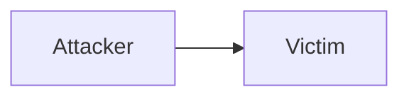

contraseña: [HackMyVM | Settings](https://hackmyvm.eu/): `12345%%`


# Sabado 12/04/2025

kali
configuracion
red
adaotador 1 - adaptador solo anfrition (elegir #2) y aceptar


# Sabado 03/05/2025 Semana 6

# Ataque

```plaintext
Ataque = motivo(objetivo) + método  + vulnerabilidad
```

- El motivo se origina en el valor del sistema o proceso objetivo, llegando a despertar ==el interés del atacante.==
- Los atacantes utilizan ==herramientas y técnicas== de ataque para explotar las vulnerabilidades del sistema, las políticas o controles de seguridad con el fin de cumplir sus objetivos.
## Motivos de los ataques a la seguridad de la información
- Interrumpir la continuidad del negocio
- Realizar robos de información
- Manipular datos
- Crear miedo y caos al interrumpir la infraestructura crítica
- Provocar pérdidas económicas al objetivo
- Exigir un rescate
- Vengarse
- Dañar la reputación del objetivo
- Objetivos militares de un estado
- Propagar creencias religiosas o políticas.


## Superficie de ataque

La **superficie de ataque** se refiere a todos los puntos de entrada o vulnerabilidades potenciales que un atacante podría explotar para infiltrarse en un sistema, red, aplicación o dispositivo.

**Tipos de superficies de ataque**
- Superficie de ataque física
- Superficie de ataque digital
- Superficie de ataque humana

## Vector de ataque
Un **vector de ataque** es un método utilizado por un actor malicioso para vulnerar la superficie de ataque y toma muchas formas, incluido ransomware, credenciales comprometidas, ==phishing== y ==malware==.

**Tipos de vectores de ataque**
- Malware
- Ransomware
- Sistemas mal configurados
- Sistemas sin parches
- Credenciales comprometidas


# Clasificación de ataques - IATF


| Tipos de ataque        | Descripción                                                                                                                                                                                                                                                                                                                |
| ---------------------- | -------------------------------------------------------------------------------------------------------------------------------------------------------------------------------------------------------------------------------------------------------------------------------------------------------------------------- |
| Ataque pasivo          | No manipulan los datos y consisten en interceptar y supervisar el tráfico de red y el flujo de datos en la red objetivo. Ejemplo: sniffer (captura y analiza el tráfico de red) y eavesdropping (escuchar/registrar comunicaciones ajenas sin autorización).                                                               |
| Ataque activo          | Manipulan los datos en tránsito o interrumpen la comunicación o los servicios entre sistemas para eludir o penetrar en los sistemas seguros. Ejemplo: Dos, Man in the Middle, Session hijacking (roba o toma el control de una sesión activa de un usuario legítimo) y SQL Injection.                                      |
| Ataque de proximidad   | Se realiza cuando el atacante está en estrecha proximidad física con el sistema o la red de destino con el fin de recopilar, modificar o interrumpir el acceso a la información. Ejemplo: ingeniería social, eaves dropping, el shoulder sufing (Mirar por encima del hombro) y el dumpster diving (búsqueda en la basura) |
| Ataque interno         | Hacen uso de acceso privilegiado para violar las reglas o causar intencionalmente una amenaza a los sistemas de información de una organización. Ejemplo: Robo de dispositivos físicos y Colocación de keyloggers, backdoors y malware.                                                                                    |
| Ataque de distribución | Se producen cuando los atacantes manipulan el hardware o el software antes de su instalación, en su origen o en tránsito.                                                                                                                                                                                                  |


# APT (Advanced Persistent Threat)
Es un **ataque sofisticado, prolongado y dirigido**, generalmente ejecutado por grupos organizados (patrocinados por estados o crimen organizado) para robar información sensible, espiar o sabotear sistemas.


✅ **Avanzado
- Usa técnicas de alto nivel (zero-day exploits, malware personalizado, ingeniería social avanzada).
- Evita detección con herramientas antimalware comunes.

✅ **Persistente**
- Permanece meses o años en la red de la víctima sin ser detectado.
- Se reactiva después de reinicios o limpiezas parciales.

✅ **Dirigido**
- Objetivos específicos (gobiernos, empresas tecnológicas, infraestructura crítica).
- Investigación previa sobre la víctima (reconocimiento).


# Metodología cyber kill chain
Utilizado para conocer y entender los patrones de comportamiento de los actores de amenazas permite comprender cómo planean y ejecutan los ciberataques.

Estudiar cada etapa bajo distintos escenarios, obtenemos una visión amplia y estructurada de los controles necesarios para prevenir estos ataques.


## 🕵️‍♂️ Reconocimiento (Reconnaissance): Identificar el objetivo

### 👨‍💻 El atacante

- Planifican sus operaciones mediante la recolección de información para identificar y seleccionar sus objetivos. Este proceso incluye el análisis de redes, sistemas, estructuras organizacionales y empleados.
	
- Reconocimiento es fundamental, permite determinar las vulnerabilidades existentes, definir el alcance del ataque, evaluar la superficie de exposición y planificar las acciones posteriores a la explotación.
	
- Recoger direcciones de correo electrónico.
	
- Identificar a los empleados en las redes sociales.
	
- Recoger comunicados de prensa adjudicaciones de contratos, listas de asistentes a conferencias.
	
- Descubrir servidores con acceso a Internet.


### 🛡️ La defensa

- Actúa utilizando técnicas de análisis preventivo para aumentar sus posibilidades de detección, intentando revelar las intenciones del atacante sobre algún activo cibernético.
- Recoge los registros de visitantes al sitio web para alertas y realizar búsquedas históricas
- Los administradores de la web realizan análisis de la navegación existente.
- Construir detectores de comportamientos de navegación (machine learning).
- Priorizar las defensas en torno a determinadas tecnologías o personas en función de la actividad de reconocimiento.


## 🧪Preparación (Weaponization): Preparación del ataque

### 👨‍💻 El atacante

- Analiza los datos recolectados, identifica las vulnerabilidades, prepara la forma de ataque tomando en cuenta que ya tiene claro el objetivo.
	
- Ejm: utiliza un troyano que tome provecho de una vulnerabilidad existente en los sistemas.
	
- Obtener un weaponizer (armamento) ya sea interno u obtenido a través de canales púbicos o privados.
	
- Los atacantes seleccionan cuidadosamente el documento señuelo que presentarán a la víctima.
	
- Eligen el implante de puerta trasera más adecuado y configuran la infraestructura de C2 necesaria para la operación.
	
- Asignan un identificador de misión específico que incrustan directamente en el código del malware.
	
- Finalmente proceden a compilar el backdoor y preparar la carga útil maliciosa que será desplegada.


### 🛡️La defensa

- Los controles de seguridad deben mantenerse actualizados para proteger los sistemas contra vulnerabilidades conocidas y posibles exploits de malware.	
	
- Realizar un análisis exhaustivo del malware, examinando tanto su carga útil como los métodos operativos que emplea durante la ejecución del ataque.
	
- Desarrollar detectores de armamento especializados e identificar nuevas variantes de carga útil maliciosa.
	
- Realizar un análisis temporal que establezca la correlación entre la fecha de creación del malware y su primer uso en ataques reales.
	
- Recopilación sistemática de archivos y sus metadatos asociados, servirán como base para investigaciones forenses.
	
- Determinar qué artefactos de armamento son característicos de las APT, ya que estos patrones permiten mejorar los sistemas de detección y respuesta.


## 🚚 Entrega (Delivery): Llevar a cabo la operación

### 👨‍💻 El atacante

- Utiliza un método de ataque definido para llevar a cabo la operación introduciendo, por ejemplo, el malware al objetivo.
- Entrega controlada de malware por el atacante.
- Correo electrónico malicioso.
- Malware en una memoria USB
- Interacciones en las redes sociales
- El sitio web es infectado con malware.


### 🛡️ La defensa

- Representa la primera y más crucial oportunidad para evaluar la efectividad de las defensas en la interrupción de un ataque. La información recopilada en etapas anteriores, junto con datos de referencia de ataques previos, permite implementar acciones oportunas para romper la cadena de ataque.
	
- Analizar a profundidad el vector de entrega utilizado, lo que implica comprender detalladamente la infraestructura de entrada empleada por los atacantes. El análisis proporciona insights valiosos para fortalecer los mecanismos de protección.
	
- Comprender los servidores, las personas, sus funciones y responsabilidades disponible.
	
- Inferir la intención del adversario basándose en los objetivos.
	
- Analizar la hora y el día en que comenzó la operación.
	
- Recoger los registros de correo electrónico y web para la reconstrucción forense.
	
- En una intrusión, los defensores deben ser capaces de determinar cuándo y cómo comenzó la entrega.


## Aprovechamiento (Exploitation)

### 👨‍💻 El atacante

- Busca aprovechar las vulnerabilidades para ganar acceso a los sistemas.
- A veces se aprovecha vulnerabilidades de tipo **zero-day** (desde fábrica), las cuales consisten en explotar fallos de seguridad desconocidos tanto para los fabricantes como para los usuarios finales. Estos exploits permiten a los atacantes obtener acceso no autorizado a los sistemas antes de que pueda implementarse algún parche de protección.
- ==Vulnerabilidad de software, hardware o humana==
- Adquirir o desarrollar un exploit de **zero-day**.
- Explotación de ls vulnerabilidades del servidor por el atacante.
- Explotación desencadenada por la víctima.
- Abrir el archivo adjunto de un correo electrónico malicioso.
- Hacer clic en un enlace malicioso.


## 🛡️La defensa
- Implementar diversas medidas de protección. Fortalecimiento de los mecanismos de autenticación mediante credenciales robustas. Mantener un estricto protocolo de actualizaciones del sistema que permita parchear vulnerabilidades conocidas.
- Fomentar entre los usuarios una cultura de seguridad cibernética que incluya el uso consciente de redes y herramientas digitales.
- Concienciación de los usuarios.
- Formación en codificación segura para los desarrolladores web.
- Escaneo regular de vulnerabilidades y pruebas de penetración.
- Medidas de endurecimiento de los `endopoints`.
- Restringir los privilegios de administrador.
- Reglas personalizadas para bloquear la ejecución de `shellcode`.
- Auditoría de los procesos de los `endpoints` para realizar forense.


## Instalación (Installation)
### El atacante

- Instalan accesos ocultos (**backdoors**) en el entorno de la víctima para mantener el acceso de forma persistente.
- La intrusión prolongada puede materializarse mediante dos método principales: la instalación de una `webshell` en el servidor web vulnerable o la implantación de un `backdoor` directamente en el sistema cliente comprometido.
- Establecer puntos de persistencia en los sistemas comprometidos mediante la creación de servicios maliciosos o la modificación de claves de registro que permiten la ejecución automática del malware.
- Evadir la detección, los adversarios suelen camuflar los archivos maliciosos, diseñándolos para que se asemejen a componentes legítimos del sistema operativo.

### La defensa

- Utilizar mecanismos técnicos (antivirus) y de gestión (procedimientos que incluyan revisión y verificación del origen del software) que supervisen instalaciones de software autorizadas o no.
- Alertar o bloquear rutas de instalación, por ejemplo, `RECYCLER`.
- Comprobar si el malware requiere privilegios de administrador o de usuario.
- Auditoría de procesos de `endpoints` para descubrir archivos anormales.
- Extrae certificados de cualquier ejecutable firmado.
- Comprender el tiempo de compilación del malware para determinar si es antiguo o nuevo.


## Comando y Control - C2: Implantar control remoto

### El atacante

- Utiliza malware para establecer un canal de comunicación remota, lo que le permite tomar el control total del equipo objetivo. Esta técnica proporciona acceso privilegiado al sistema comprometido, facilitando la ejecución de comandos de forma remota.
- Abre un canal de comunicación bidireccional con la infraestructura C2.
- Los canales C2 más comunes son a través de protocolos web, DNS y correo electrónico


### La defensa

Fase crítica, las defensas tiene la última oportunidad para interrumpir la cadena de ataque, impidiendo el establecimiento del canal de Comando y Control (C2).

Emplear mecanismos avanzados como  **Network Intrusion Prevention Systems (NIPS), Network Intrusion Detection Systems (NIDS)**, firewalls de última generación y otras herramientas similares, cuyo propósito fundamental es neutralizar los intentos del atacante y evitar que alcance sus objetivos en esta etapa del compromiso.

- Descubrir la infraestructura C2 mediante el análisis del malware.
- Endurecer configuración de la red.
- Exigir proxies para todo tipo de tráfico (HTTP, DNS).
- Personalizar los bloques de protocoles C2 en los proxies web.
- Bloqueos de categorías de proxy.
- Envenenamiento del servidor de nombres DNS.
- Realizar investigaciones de código abierto para descubrir nuevas infraestructuras C2 de los adversarios.


## Acciones sobre objetivos (Actions on Objectives)

![[Pasted image 20250503172007.png]]

### El atacante

Logra el objetivo, tomando control sobre el sistema; lo que pase luego depende del conocimiento, las habilidades y las intenciones del atacante. Por lo general, los objetivos pueden ser: El robo de la información, violación de la integridad de los datos, tomar el control del sistema, inhabilitar sistemas instrumentados de seguridad, etc.

- Recoger las credenciales del usuario.
- Escalada de privilegios.
- Reconocimiento interno.
- Movimiento lateral a través del entorno.
- Recoger y ex-filtrar datos.
- Destruir sistemas.
- Sobrescribir o corromper datos.
- Modificar subrepticiamente los datos


### La defensa

- Aplicar medidas de respuestas ante ataques, tomando en cuenta que mientras mayor tiempo se encuentra en este estado, mayores serán los daños o consecuencias desfavorables ocasionadas por el atacante. Las medidas van desde aislamiento del activo cibernético bajo ataque hasta detener el proceso. Estas medidas deben ser revertidas.
	
- Establecer un manual de respuesta a incidentes, que incluya un plan de comunicación y compromiso ejecutivo.
	
- Detectar la filtración de datos, el movimiento lateral y el uso de credenciales no autorizadas.
	
- Respuesta inmediata de los analistas a todas las alertas.
	
- Agentes forenses pre desplegados en los puntos finales para un rápido triaje (escoger, separar o clasificar).


# Tácticas Técnicas Procedimientos TTP

---

que es mitre? encargada de los cvss??

---

Utilizado para describir el *modus operandi*, comportamiento, patrones, actividades y métodos de un agente de amenaza, ayuda a analizar las amenazas y el perfil de agente, usado para fortalecer la seguridad.


| Tactics/Tools                                                          | Techniques                                                                             | Procedures                                                                           |
| ---------------------------------------------------------------------- | -------------------------------------------------------------------------------------- | ------------------------------------------------------------------------------------ |
| Una táctica es la descripción de más alto nivel de este comportamiento | Brindan una descripción más detallada del comportamiento en el contexto de una táctica | Implican una descripción de menor nivel, muy detallada en el contexto de una técnica |

## Las tácticas
Representan los lineamientos estratégicos que describen cómo un atacante planifica y ejecuta un ciberataque desde su fase inicial hasta la finalización. Este enfoque abarca diversas acciones coordinadas, que incluyen la recolección de información previa, la explotación de vulnerabilidades iniciales, la escalada de privilegios dentro del sistema, el movimiento lateral a través de la red y el establecimiento


- **Explotación inicial**:
	- Envían un correo de pishing personalizado (suplantando al proveedor) con un archivo Excel malicioso.
	- El documento explota una vulnerabilidad zero-day en macros (CVE-2022-30125).
- **Escalada de privilegios**: Usan *Mimikatz* para extraer credenciales de administrador del equipo infectado.
- **Movimiento lateral**:
	- Se mueven a servidores críticos usando RDP (Protocolo de Escritorio Remoto) con las credenciales robadas.
- **Acceso persistente**:
	- Crean tareas programadas en Windows para ejecutar malware cada 24 horas.
	- Instalan una puerta trasera (*backdoor*) en el servidor de backups.
- **Resultado**: Mantiene acceso a la red durante 9 meses, robando datos financieros sensibles.


## Las técnicas
Representan los métodos específicos que emplean los atacantes para lograr objetivos intermedios durante un compromiso de seguridad. Estas acciones especializadas abarcan desde la explotación inicial de vulnerabilidades hasta el establecimiento de canales de comunicación encubiertos con servidores de mando y control, la infiltración en infraestructuras críticas y la eliminación sistemática de evidencias tras completar la ex-filtración de datos.

**Ejemplo concreto**
El atacante podría utilizar la técnica de "Pass-the-Hash" (T1550.002 en MITRE ATT&CK) para moverse lateralmente en una red corporativa. Tras comprometer inicialmente un equipo mediante phishing, los atacantes recolectan hashes de credenciales NTLM mediante herramientas como  *Mimikatz*. Estos hashes les permiten autenticarse en otras sistemas sin necesidad de descifrar contraseñas, manteniendo acceso persistente mientras evitan la detección al no generar tráfico de red sospechoso.


## Los procedimientos


## Que utilidad tiene TTPs

- La rápida clasificación y contextualización de un evento o incidente mediante su correlación con las TTPs de actores relacionados con un ataque.
- Apoyar el proceso de investigación proporcionando rutas probables para la investigación, basándose en las TTPs anteriores utilizadas en un ataque.
- Apoyar la identificación de posibles fuentes o vectores de ataque.
- Apoyar los procesos de respuesta a incidentes y de identificación y mitigación de amenazas, ayudando a identificar los sistemas que probablemente estén comprometidos.
- Apoyar los ejercicios de modelado de amenazas ayudando a analizar e integrar los controles para defenderse de las TTPs conocidas de los actores de las amenazas.


# 09-05-2025


Un protocolo de red son un conjunto de reglas que gobiernas la comunicación


## Modelo OSI


## Principios de diseño seguro - arquitectura de red

- Modelo de amenazas
- Mínimos Privilegios
- Defensa de seguridad
- Valores predeterminados seguros
- Fallar de forma segura
- Separación de funciones
- Mantenlo simple
- Confianza cero
- Confiar pero verificar
- Responsabilidad compartida

# Ataque a la capa 2 - Data Link
En la capa enlace, **los dispositivos intercambian *tramas* utilizando las direcciones MAC de origen y destino**, los actores de las amenazas explotan este método de comunicación.

- ARP poisoning
- MAC flooding


### ARP poisoning

Suplantación de direcciones MAC (MAC spoofing) el hacker busca en la red direcciones MAC válidas originales para eludir las medidas de control de acceso.

Evadir las comprobaciones de autenticación. Ejm: *El haclker puede suplantar el gateway por defecto y puede copiar los datos transmitidos al Gateway sin ser identificado*.

- Protección de la privacidad.
- Prevención del robo de identidad.
- Acceso a aplicaciones de software de pago.

Evitar la suplantación
- Examinar el tráfico de red.
- Firewall con herramientas MAC SPOOFING.

### MAC Flooding


### MAC Cloning

Los actores de la amenaza generalmente realizan los siguientes pasos.

- Descubren


### MACsec, Media Access Control (MAC) Security

Es un estándar definido en IEEE 802.1AE, específica


# 16-05-2025


## [[Protocolos#TCP (Transmission Control Protocol)|TCP]]

**Problemas en Confiabilidad en la entrega de datos de la red**
- No conocemos las condiciones de red (congestionado, fallos físicos, equipos intermedios).
- Protocolo de máximo esfuerzo (IP).

**TCP es un protocolo confiable**
- Reenvía paquetes que se perdieron.
- **Protocolo orientado a la conexión**
- **Protocolo orientado al servicio de stream de bytes**
- **Terminación de la conexión**

![[Pasted image 20250516154025.png]]


![[Pasted image 20250516154035.png]]


<div style="width: 100%; max-width: 700px; margin: 0 auto; text-align: center; box-sizing: border-box; padding: 10px;">

    <div style="margin-bottom: 20px;">
        <div style="background-color: #4A86E8; padding: 10px 0; margin-bottom: 5px; font-weight: bold; border-radius: 5px;">
            #Puerto
        </div>
        <div style="background-color: #4A86E8; padding: 10px 0; margin-bottom: 20px; font-weight: bold; border-size: 1px; border-style: solid; border-color: #4A86E8; border-radius: 5px;">
            0-65535
        </div>

        <div style="display: flex; justify-content: space-between; gap: 10px; flex-wrap: wrap;">
            <div style="flex: 1; min-width: 100px; background-color: #4A86E8; padding: 10px 0; border-radius: 5px; font-weight: bold;">
                0-1023
            </div>
            <div style="flex: 1; min-width: 150px; background-color: #4A86E8; padding: 10px 0; border-radius: 5px; font-weight: bold;">
                1024-49151
            </div>
            <div style="flex: 1; min-width: 150px; background-color: #4A86E8; padding: 10px 0; border-radius: 5px; font-weight: bold;">
                49152-65535
            </div>
        </div>

        <div style="display: flex; justify-content: space-between; gap: 10px; margin-top: 5px; flex-wrap: wrap;">
            <div style="flex: 1; min-width: 150px; background-color: #4A86E8; padding: 8px 0; font-size: 0.9em; border-radius: 5px;">
                Puertos de sistema /Puertos bien conocidos
            </div>
            <div style="flex: 1; min-width: 150px; background-color: #4A86E8; padding: 8px 0; font-size: 0.9em; border-radius: 5px;">
                Puertos de usuarios /Puertos Registrados
            </div>
            <div style="flex: 1; min-width: 150px; background-color: #4A86E8; padding: 8px 0; font-size: 0.9em; border-radius: 5px;">
                Puertos Dinámicos /Puertos Privados
            </div>
        </div>
    </div>

    <div style="margin-top: 40px;">
        <div style="background-color: #CC0000; padding: 15px 0; margin-bottom: 5px; font-weight: bold; font-size: 1.2em; border-radius: 5px;">
            Socket
        </div>
        <div style="display: flex; justify-content: space-between; gap: 10px; flex-wrap: wrap;">
            <div style="flex: 1; min-width: 100px; background-color: #CC0000; padding: 10px 0; border-radius: 5px; font-weight: bold;">
                Dirección IP
            </div>
            <div style="flex: 1; min-width: 150px; background-color: #CC0000; padding: 10px 0; border-radius: 5px; font-weight: bold;">
                Protocolo de Transporte
            </div>
            <div style="flex: 1; min-width: 100px; background-color: #CC0000; padding: 10px 0; border-radius: 5px; font-weight: bold;">
                #Puerto
            </div>
        </div>
    </div>

</div>

## Establecimiento de la conexión

**¿Por qué necesitamos establecer la conexión?
- Para determinar el estado en ambos hosts
- Estado más importante: número de secuencia
	- Cantidad de número de bytes que se han enviado
	- Valor inicial elegido al azar.

**Flags importantes del TCP (Cada uno 1 bit)**
- SYN - sincronización, usado para establecer la conexión
- ACK - acuse de recibo de los datos recibidos
- FIN - Finalización, usado para finalizar la conexión

![[Pasted image 20250516155208.png]]


![[Pasted image 20250516160437.png]]


![[Pasted image 20250516160512.png]]


![[Pasted image 20250516161902.png]]


## Denial of Service (DoS)

El objetivo es detener el funcionamiento del servicio o los recursos sea inaccesible para los usuarios legítimos.

- Negar el servicio a los usuarios legítimos
- Suele ser un efecto temporal que pasa tan pronto como el ataque se detiene

**¿Qué afecta? La disponibilidad**
**¿Por qué preocuparse?**
- Por lo general, no hay violación de los datos
- No se utilizan en el servicio el ejército de bots
- No hay acceso a root
- No hay robo directo de dinero


## DoS: ¿Qué es?




Intenta hacer colapsar a la víctima (aprovechar los fallos del software). Intenta agotar los recursos de la víctima

- **Red: Ancho de banda**
- **Host**
	- Kernel: Tablas de estado de conexión TCP, etc.
	- Aplicación: CPU, memoria, etc.
	- A menudo se trata de ataques de alta intensidad, pero no siempre


## Ejemplo DoS: TCP SYN Flood

Cada llega de un SYN almacena el estad en el servidor

- **Bloque de control TCP (TCB**)
- **~ 280 bytes**
	- FlowID, timer info, Sequence number, flow control status, out-of-band data, MSS, other options
- **Ataque**
	- Enviar paquetes TCP SYN con una dirección src falsa.
	- Las entradas TCB semiabiertas existen hasta que se agota el tiempo de espera
	- El kernel limita el número de TCBs


## SYN Cookies

No mantiene estado hasta la autentificación, se utiliza como defensa contra los ataques de inundación SYN

- En respuesta a SYN enviar de vuelta un token autovalidante a la fuente que la fuente debe adjuntar al ACK

<div style="text-align:center; background-color:white">
<span style="color:red; font-weight:bold;">SYN -> SYN/ACK + token -> ACK + token</span>
</div>

- Verifica que la IP del receptor es válida

Como hacer el Numero de secuencia!
- 5 bits: contador de tiempo
- 3 bits: codifica el MSS
- 24 siguientes: F (IP del cliente, puerto, IP del servidor, puerto, t) ?


## Distributed Denial of Service ([[Seguridad Informatica/Miscelanea#Ataque DDoS|DDoS]]) 

**Motivación (desde la perspectiva del atacante)**

- Para un simple DoS, el atacante debe ser más poderoso que la máquina objetivo

> ¿Puede una máquina cliente generar suficiente trabajo para superar a un servidor potente?

- La solicitud debe ser significativamente más ligera que la respuesta (por ejemplo, una inundación TCP SYN)

> No siempre es el caso.

**Solución**
- El atacante utiliza muchas máquinas.


## Evolución de DDoS (Tipos/Diversidad)


- Ataque Point-to-point DoS
	- TCP SYN flood, ping of death, etc.
- Ataque Smurf (reflection)
- Coordinado DoS
- Multi-stage DDoS
- P2P [[Seguridad Informatica/Miscelanea#botnet|botnets]]
- Ataques de Amplificación (Vuelve el ataque smurf)

> El tiempo va en el orden desde el primer item hasta el ultimo item

## Tipos de Ataques

### Ataques volumétricos
Tienen como objetivo saturar el ancho de banda del recurso o servicio objetivo. Ejemplo: Amplificación de DNS, Inundación ICMP, Inundación UDP.

### Ataques de protocolo
Tienen como objetivo consumir y agotar los recursos reales de los servidores y equipamiento intermedio, Ping of Death, Ataque DDoS Smurf, Inundación SYN.

### Ataques a la capa de aplicación
Tienen como objetivo provocar una caída del servidor web con solicitud aparentemente legítimas. Ejemplo: Inundación HTTP, Low-and-slow

![[Pasted image 20250516163956.png]]

![[Pasted image 20250516164047.png]]


## [[Seguridad Informatica/Miscelanea#Ataque Smurf|Ataque Smurf]]

- El atacante localiza la dirección IP de la víctima
- El atacante crea un paquete de datos falsificado
- El atacante envía [[Protocolos#ICMP (Internet Control Message Protocol)|ICMP]] Echo o paquete dañado Request
- La victima es inundado con respuestas [[Protocolos#ICMP (Internet Control Message Protocol)|ICMP]] o es saturada por los mensajes de error
- La victima se sobrecarga
- Inunda el objetivo final y desperdicia ancho de banda para ambas víctimas.


## ¿Por qué funciona el ataque smurf?

El protocolo ICMP no incluye autenticación
- No hay conexiones
- Los receptores aceptan los mensajes sin verificar la fuente
- Permite a los atacantes falsificar el origen de los mensajes

El atacante se beneficia de un factor de un factor de amplificación.
Factor de amplificación de smurf = \[número de servidores que responden al mensaje\]:1

$$
\text{factor de amplificacion} = \dfrac{\text{Size de la respuesta total}}{\text{Size de la solicitud}}
$$

## Ataques de Reflexión


- Falsificar la dirección de origen
- Enviar la consulta al servicio
- La respuesta va a la victima
- Si la respuesta >> consulta, "amplifica" el ataque
- Oculta a la víctima el origen real del ataque
- Amplificadores:
	- Respuesta DNS (50 bytes de consulta 400 bytes de respuesta)
	- ICMP a dirección de difusión (1 pkt 50 pkt) ("smurf")


## [[Seguridad Informatica/Miscelanea#Ataque Fraggle|Ataque Fraggle]]
Una variante del ataque smurf, el atacante envía una gran cantidad de tráfico UDP a una dirección IP de difusión, con la dirección IP de origen falsificada de la víctima.

- Se envían paquetes UDP a los puertos 7 y 19.
- Logra un menor factor de amplificación que el ataque Smurf, y es mucho menos popular.


## Ataques de reflexión/amplificación

El ataque smurf es un ejemplo de ataque *DDoS* de reflexión o amplificación. El ataque *Flaggle* también se basa en las difusiones para amplificar Envía paquetes UDP falsos a direcciones UP de difusión en los puertos 7 (echo) y 13 (chargen)

echo 1500 bytes/pkt de solicitud, respuestas de igual tamaño chargen 28 bytes/pkt de solicitud, respuestas de 10k-100k bytes de ASCII

Factor Amplificación
echo \[número de host que responden a la broadcast\]:1
chargen \[número de hosts que responden a la broadcast\]\*360:1

> [!tip] Explicación
> Los ataques [[Seguridad Informatica/Miscelanea#Ataque Smurf|Ataque Smurf]] y [[Seguridad Informatica/Miscelanea#Ataque Fraggle|Ataque Fraggle]] son ejemplos clásicos de ataques DDoS que utilizan técnicas de reflexión y amplificación para saturar a la víctima con tráfico masivo. En estos ataques, el atacante envía paquete con direcciones IP falsificadas a direcciones de broadcast de redes vulnerables.
>
> - En el ataque Smurf, se envían paquetes ICMP (ping) a la dirección de broadcast, provocando que todos los hosts respondas a la víctima, amplificando el tráfico en función del número de hosts.
> - En el ataque Fraggle, se envían paquetes UDP falsificados a direcciones de broadcast, específicamente a los puertos 7 (Echo) y 19 (Chargen). Estos servicios responden con datos que pueden ser mucho mayores que la solicitud inicial, amplificando el ataque.
>
> Por ejemplo, una solicitud de 28 bytes al puerto Chargen puede generar una respuesta de entre 10,000 y 100,000 bytes, lo que representa un factor de amplificación de hasta 360 veces por host que responde. La amplificación total depende del número de hosts en la red que responden a la dirección de broadcast.
>
>
>
> Estos ataques aprovechan configuraciones inseguras en redes y servicios que permiten el reenvío de tráfico a direcciones de broadcast o la respuesta a solicitudes UDP sin restricciones, lo que facilita la generación de grandes volúmenes de tráfico dirigidos a la víctima con un esfuerzo relativamente pequeño por parte del atacante.
>
>---
>
   Esta técnica es especialmente peligrosa porque permite a los atacantes maximizar el impacto de un ataque DDoS sin necesitar una infraestructura propia masiva, utilizando servidores y dispositivos legítimos como amplificadores involuntarios. Por ello, es fundamental que las redes bloqueen el reenvío de tráfico a direcciones de broadcast y limiten las respuestas a solicitudes UDP en puertos vulnerables.
>
>---
>
   


---

# Semana 11 - 06-06-2025 

### Ataque Directory Traversal

El path traversal, directory traversal es una vulnerabilidad se seguridad web, **permite a un atacante leer, en algunos casos escribir archivos en el servidor que ejecuta una aplicación**.

**Vulnerabilidad**

<div style="background-color:#0066ff; padding: 10px; border: 1px solid #eee; border-radius: 8px;">
<span>
http://www.mipagina.com/?getFile=reporte.pdf
</span>
</div>

**Explotación**
Se pueden utilizar comandos para acceder a un fichero del servidor.

Para moverse de manera ascendente entre los directorios: `../../../`
Para descargar el fichero `passwd` con las contraseñas del sistema: `/etc/passwd`

### Ataque Directory Traversal - Payload

**Básico**: La vulnerabilidad podría permitir al atacante reemplazar `reporte.pdf` en una URL con ruta relativa como `../../../../etc/passwd`.

<div style="background-color:#0077ff; padding: 10px; border: 1px solid #eee; border-radius: 8px;">
<span>
http://www.mipagina.com/?getFile=../../../../etc/passwd
</span>
</div>

**Avanzado**:

<div style="background-color:#0066ff; padding: 10px; border: 1px solid #eee; border-radius: 8px;">
<span>
....//....//....//etc/passwd
</span>
</div>


**Encodificación**:

<div style="background-color:#0055ff; padding: 10px; border: 1px solid #eee; border-radius: 8px;">
<span>
%2e%2e%2f%2e%2e%2f%2e%2e%2fetc/passwd
</span>
</div>


**Doble Encodificación**:

<div style="background-color:#0044ff; padding: 10px; border: 1px solid #eee; border-radius: 8px;">
<span>
%252e%252e%252f%252e%252e%252fetc/passwd
</span>
</div>


**Usando slaches y back skashes**:

<div style="background-color:#0066ff; padding:10px; border-radius:8px">
<span>
..%2f..%2f..%5cetc%5cpasswd
</span>
</div>

**Null Byte**:

<div style="background-color:#0066ff; padding:10px; border-radius:8px">
<span>
../../etc/passwd%00.txt
</span>
</div>


![[Pasted image 20250606153711.png]]


### Cross Site Request Forgery

Es un ataque donde un sitio web malicioso **engaña al navegador de una víctima** para que **realice acciones no deseadas** en otro sitio **donde está autenticado**.

Induce a la víctima a **realizar una actividad que no pretende realizar**, la acción será **procesada en nombre del usuario logueado**. CSRF explota la confianza de un sitio web vulnerable.

### Ataque CSRF

Condiciones para ejecutarse un ataque CSRF:

- **Victima autenticada**: La víctima debe haber iniciado sesión en el sitio vulnerable.
- **Sesión activa**: La sesión (cookie/token) debe seguir válida en el navegador.
- **Solicitud predecible**: El atacante debe conocer los parámetros para replicar la acción.
- **No protección CSRF**: El sitio no usa tokens anti-CSRF, verificaciones de origen u otras defensas.
- **Acción relevante**: La solicitud falsificada realiza algo de valor (ej. transferencia, cambio de contraseña).


### Protegerse del ataque CSRF

La solución es agregar parámetros impredecibles. Ejemplo: CSRF Tokens.

**El CSRF Token** es un valor **único, secreto e impredecible** que genera la aplicación del lado del servidor y se transmite al cliente de tal manera que se incluye en la siguiente solicitud realizada por el cliente. Cuando se realiza la siguiente solicitud, la aplicación del lado del servidor la valida o la rechaza dependiendo de si incluye el token o no.

Los CSRF Tokens previenen estos ataques dado que el atacante no puede predecir el valor del CSRF Token del usuario, no pueden construir una solicitud co todos los parámetros necesarios para que la aplicación cumpla con la solicitud.

### Protegerse del ataque CSRF

**Implementa CORS de manera adecuada**
- Configura correctamente las políticas de CORS (Cross-Origin Resource Sharing) para limitar las solicitudes solo a los dominios específicos que deberían tener acceso a tu aplicación web.
	
- Utilizar encabezados como Origin y Access-Control-Allow-Origin para controlar las solicitudes cruzadas.

**Utiliza el Encabezado `SameSite` para Cookies**
- Configura las cookies de sesión con el atributo `<<SameSite>>` para limitar su acceso a solicitudes del mismo sitio. (Same-Site Cookies).
	
- Esto evita que las cookies se envíen en solicitudes cruzadas y ayuda a prevenir ataques CSRF.

**Establece Cookies como `HttpOnly`**
- Marca las cookies de sesión como  `<<HttpOnly>>` para que no puedan ser accedidas ni modificadas por JavaScript. Esto reduce la exposición de las cookies a ataques CSRF.

**Valida el Origen de las Solicitudes**
- Verifica que las solicitudes entrantes provengan de fuentes legítimas al comprobar el encabezado `Refer` y/o en encabezado `Origin`.

**Implementa Protección de Tiempo**
- Limita la validez de los tokens anti-CSRF en tiempo y asocia un periodo de tiempo limitado durante el cual un token es válido.
	
- Refresca o renueva los tokens regularmente para evitar la reutilización de tokens expirados.

**Utiliza Autenticación de Doble Factor (2FA)**
Implementa la autenticación de doble factor para ciertas acciones críticas o sensibles.


![[Pasted image 20250606165424.png]]

### XML External Entity

Los ataques XXE explotan vulnerabilidades en el procesamiento de documentos XML, permitiendo a un atacante leer archivos locales, realizar solicitudes a servidores internos (SSRF) o incluso causar denegación de servicio (DoS). El atacante puede **interferir con el procesamiento de datos XML** de una aplicación.

En XML, una entidad es una forma de representar datos, como variables. Las **entidades externas** son un tipo especial que carga su valor desde fuentes externas, como:

- Archivos locales (`file://etc/passwd`).
- URLs remotas (`http://ejemplo.com/data`).

Se definen dentro de una DTD (Document Type Definition) usando SYSTEM.

### Como se realizan los ataques XXE

**Creación del XML malicioso**
El atacante diseña un documento XML con una entidad externa que apunta a:
- Archivos locales (``file:///etc/passwd`)
- URLs internas (`http://localhost/admin`).

**Procesamiento Vulnerable**
- La aplicación recibe el XML y el **parser lo interpreta sin validar**.
- Resuelve la entidad externa, accediendo a recursos sensibles sin autorización.

**Impacto**
- Leer archivos del sistema (ejemplo: contraseñas, configuraciones).
- SSRF: Atacar servicios internos (bases de datos, APIs)
- Exfiltrar: datos a servidores controlados por el atacante.


![[Pasted image 20250606170645.png]]

### XML external entity (XXE) injection

La estructura básica implica la redefinición de una entidad XML

```xml
<?xml version='1.0'?>
<!ENTITY mensahe "Hola">
]>
<respuesta>&mensaje</respuesta>
```

Acceder a un archivo privado del servidor

```xml
<?xml version='1.0'?>
<!ENTITY SYSTEM "file:///etc/passwd">
]>
<respuesta>?mensaje</respuesta>
```


ejecución externa, como el monitoreo de los recursos de la red local

```xml
<?xml version='1.0'?>
<!ENTITY SYSTEM "http://192.168.2.23/private">
]>
<respuesta>&mensaje</respuesta>
```

Construir una jerarquía compleja para realizar un ataque DoS

```xml
<?xml version='1.0'?>
<!ENTITY ha "ha!">
<!ENTITY ha2 "&ha; &ha;">
<!ENTITY ha3 "&ha2; &ha2;">
<!ENTITY ha4 "&h3; &ha3;">
]>
<respuesta>&mensaje</respuesta>
```


### Mitigar el riesgo de los ataques XXE

**Validación de Entrada Robusta**
Implica examinar los datos entrantes en busca de patrones maliciosos y asegurar que solo se procesen datos validados y saneados.

**Deshabilitar el Procesamiento de Entidades Externas**
Configurar el analizador XML para ignorar las entidades externas neutraliza efectivamente la amenaza, ya que las referencias maliciosas ya no se resuelven.

**Emplear Bibliotecas de Análisis XML Seguras**
Utilizar bibliotecas y analizadores que inherentemente mitiguen los riesgos XXE asegura que las aplicaciones sean menos susceptibles a estas vulnerabilidades.

**Usar formatos más seguros** como JSON.


![[Pasted image 20250606171706.png]]


Descargar metasploit

![[Pasted image 20250606171853.png]]
 buscar en el univirtual

> FIN DE LA CLASE
---


# 20-06-2025

## Cifrado en bloque

- El texto plano y el texto cifrado consisten en bloques de tamaño fijo por lo general de 8 o 16 bytes (64 o 128 bits)
- El modo de cifrado por bloques independientes no se usará
- El texto cifrado se obtiene del texto claro mediante la iteración de una función round
- La entrada al afuncion round consite ...


## Modo ECB Electronic CodeBook

Cifra cada bloque con la clave $k$ de forma independiente. Divide el mensaje en bloques y los cifra en paralelo con acceso aleatorio a diferentes bloques.
- Cuando se cifre un bloque con cierto valor, siempre se obtendrá el mismo resultado. Esto hace posible los ataques de diccionario.
- Es posible que un atacante elimine ciertos bloques sin ser detectado, o que capture algunos bloques y los reenvíe más adelante.


## Modo CBC - Cipher Block Chaining Mode

- Es una extensión de ECB que añade cierta seguridad.
- Divide el mensaje en bloques y usa XOR para combinar el cifrado del bloque anterior con el texto plano del bloque actual.
- **El cifrado no puede ser paralelizado**.


<div style="background-color:#FFFFFF">

</div>


<div style="background-color:#FFFFFF">

</div>

[Understand AES Encryption - EaseFilter](https://www.easefilter.com/kb/understand-aes-encryption.htm)


## CTR - Counter Mode

- CTR simula un cifrado de flujo, produce un flujo pseudo aleatorio cnocido como keystream.
- El flujo se combina con el texto plano mediante XOR dando lugar al cifrado.
- Para generar el keystream se cifra un contador combinado con un número aleatorio (nonce) mediante ECB y se va incrementando.


[CTR mode introduction | Bernardo de Araujo](https://bernardoamc.com/ctr-mode-introduction/)


## Cifrado de Bloques
Un texto cifrado de bloques con llave simétrica cifra un bloque de n bits de texto claro o descifra un bloque de n bits de texto cifrado. El algoritmo de cifrado o descifrado utiliza una clave de k bits


## Moderno Cifrado de Bloques


## Componentes de un Cifrador de Bloques

Los cifradores de bloques suelen ser cifradores de 


## Cajas P

**Invertibilidad**: Una caja P recta es invertible. Significa que podemos utilizar una caja P recta en el cifrado y su inversa en el descifrado.

Las cajas P de compresión y expansión no tienen inversos.

## Cajas S

Pueden considerarse como un cifrado ...


## Desplazamiento Circular


## Swap

La operación de intercambio ...

## Dividir / Combinar

La operación de **división** normalmente


## Rondas

Cada iteración se denomina **ronda**. El cifrado por bloques utiliza un **sistema de claves** o un **generador de claves** encargado de crear diferentes claves para cada ronda a partir de la **clave de cifrado**. En un cifrado de N rondas, el texto cifrado se encripta N veces;


## Cifradores de Producto
Todos los cifradores modernos de bloque son cifradores de producto, ellos se dividen en dos clases.

**1. Cifrado Feistel: DES**
- Se utiliza desde hace décadas.
- Puede tener tres tipos de componentes: autoinvertibles, invertibles y no invertibles

**2. Cifras no Feistel: AES**
- Sólo utiliza componentes invertibles.
- Un componente en el cifrado tiene su correspondiente componentes en el descifrado.


## Primera Idea de Feistel


imagen


Combina elementos no invertibles en una unidad y usa la misma unidad para cifrar y descifrar (el mezclador es auto invertible).


...


Se desea que la función utilice parte del texto plano durante el cifrado y parte del texto cifrado durante el descifrado.
Se divide el texto plano y el texto cifrado en dos bloques de igual longitud, izquierdo y derecho.


## AES (Advanced Encryption Standard)

En febrero de 2001, el NIST anuncia la publicación de un borrador de la Norma Federal de Procesamiento de la Información (FIPS) para la revisión y los comentarios públicos sobre una propuesta de cifrado. Finalmente, AES se publicó como FIPS 197 en el Registro Federal en Diciembre de 2001.

Los criterios definidos por el NIST para seleccionar AES se dividen en  tres áreas:

- Seguridad
- costo
- implantación


## SubByte


## ShiftRow

## Mixing - Mezcla

Necesitamos una transformación interbyte, cambia los bits dentro de un byte, basándose en los bits dentro de los butes vecinos. Necesitamos mezclar btytes para proporcionar difusion a nivel de bits.


## AddRoundKey


# 28-06-2025

![[Pasted image 20250628153150.png]]

### Compartir llaves

Una llave vulnerada permite a los interceptores (*eavesdropper*) el poder descifrar cualquier texto cifrado que hayan obtenido.

Solución para mitigar el daño
- Cambiar las llaves con frecuencia para limitar los daños

La distribución de llaves es un problema
- Las llaves deben transmitirse de forma segura.
	- ¿Utilizar mensajeros?
	- ¿Distribuirlas en trozos por canales separados?


![[Pasted image 20250628153602.png]]


### Gestión de llaves

Problema


![[Pasted image 20250628153451.png]]


![[Pasted image 20250628154328.png]]


![[Pasted image 20250628160416.png]]
