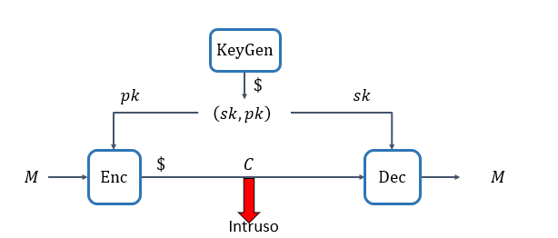

## Esquema de Cifrado de Llave Pública
Es la base de la criptografía asimétrica. Este esquema se define formalmente como una tupla
$$
\Sigma = (\text{KeyGen}, \text{Enc}, \text{Dec})
$$

### KeyGen (Generación de claves)

$$
(sk, pk) \xleftarrow{\$} \text{KeyGen}
$$
Donde $sk$ es la llave secreta, $pk$ es la llave publica.

**KeyGen** es el algoritmo de generación de claves. Es un proceso probabilístico, lo que se indica con el símbolo de dólar ($) sobre la flecha, significando que incluye una fuente de aleatoriedad (entropía) para producir un par de claves único y seguro en cada ejecución.

**Secret Key / Llave Privada**
Es un valor secreto que debe ser mantenido confidencial por el propietario. Se utiliza exclusivamente para la operación de descifrado. $\mathcal{SK}$ es el espacio de llave privada. Representa el conjunto de todos los posibles valores que puede tomar una llave privada.

**Public Key / Llave Pública**
Es un valor que puede ser distribuido libremente y es conocido por cualquier entidad. Se utiliza para la operación de cifrado. El  $\mathcal{PK}$ es el espacio de llave pública. Representa el conjunto de todos los posibles valores que puede tomar una llave pública.

La llave pública y la llave privada están matemáticamente vinculadas. Sin embargo, la seguridad del esquema radica en la dificultad computacional de derivar la llave privada a partir de la llave pública. Esta dificultad se basa en problemas matemáticos difíciles de resolver, como la factorización de números grandes (utilizado en **RSA**) o el problema del **logaritmo discreto** (utilizado en ElGamal o Criptografía de Curva Elíptica).

### Enc (Cifrado / Encriptación)
Representación: Enc : PK×M→C y Enc(pk,M)=Encpk​(M)=C

$$
\text{Enc} : \mathcal{PK} \times \mathcal{M} \to \mathcal{C}
$$
$$
\text{Enc(pk, M)} = \text{Enc}_{pk}(M) = C
$$

$\text{Enc}$ es el algoritmo de cifrado. Su propósito es transformar un mensaje legible en un criptograma ilegible utilizando la llave pública.

- Entradas: Toma dos entradas: la llave pública (pk) del $\mathcal{PK}$ y el mensaje **M** (del $\mathcal{M}$ espacio de mensajes).
- Salida: Produce un criptograma **C** que pertenece al $\mathcal{C}$ (espacio de criptograma).

Probabilismo: El símbolo de dólar ($) sobre la caja "Enc" en el diagrama sugiere que el algoritmo de cifrado es probabilístico. Esto significa que cifrar el mismo mensaje (M) múltiples veces con la misma llave pública (pk) producirá diferentes criptogramas (C). Esta propiedad es crucial para lograr la seguridad contra ataques de texto claro elegido (CPA-security), ya que impide que un atacante determine si dos criptogramas corresponden al mismo mensaje subyacente.

### Descifrado / Desencriptación

$$
\text{Dec} : \mathcal{SK} \times \mathcal{C} \to \mathcal{M}
$$
$$
\text{Dec(sk, C)} = \text{Dec}_{sk}(C) = M
$$

**Dec** es el algoritmo de descifrado. Su función es revertir el proceso de cifrado, transformando un criptograma ilegible de nuevo en el mensaje original legible, pero solo si se posee la llave privada correcta.

- **Entradas**: Toma dos entradas: la llave privada (sk) del $\mathcal{SK}$ (espacio de llave privada) y el criptograma (C) del $\mathcal{C}$ (espacio de criptograma).

- **Salida**: Produce el mensaje original (M) del $\mathcal{M}$ (espacio de mensajes).

Solo la entidad que posee la llave privada correspondiente a la llave pública utilizada para el cifrado puede descifrar el mensaje con éxito.

### Flujo del Proceso y Seguridad (El "Intruso")

1. Generación: Una entidad (Alice, por ejemplo) genera un par de claves (sk,pk) utilizando KeyGen.

2. Distribución de Llave Pública: Alice distribuye su pk a quien desee (Bob, por ejemplo) o la publica en un directorio. Su sk la mantiene en secreto.

3. Cifrado: Bob, queriendo enviar un mensaje M confidencialmente a Alice, utiliza la pk de Alice para cifrar M con el algoritmo Enc, obteniendo el criptograma C.

4. Transmisión: Bob envía C a Alice a través de un canal potencialmente inseguro.

Intercepción (Intruso): El "Intruso" en el diagrama representa a un atacante que puede interceptar el criptograma C durante su transmisión. El intruso también puede conocer la llave pública pk de Alice (ya que es pública).

La seguridad del esquema de cifrado de llave pública reside en la garantía de que, incluso si el intruso tiene acceso al criptograma C y a la llave pública pk, le resulta computacionalmente inviable (es decir, prácticamente imposible con los recursos actuales) recuperar el mensaje original M sin la llave privada sk.

Descifrado: Alice recibe C y utiliza su sk (que solo ella posee) con el algoritmo Dec para recuperar el mensaje original M.

## Compartir llaves

El cifrado de llave pública (asimétrico) ofrece varias ventajas fundamentales sobre el cifrado simétrico, y la forma en que la llave es pública es precisamente la clave de estas ventajas.

Ventajas sobre el Cifrado Simétrico:

Resolución del Problema de Distribución de Claves:

Cifrado Simétrico: Requiere que ambas partes compartan una misma clave secreta antes de poder comunicarse de forma segura. El gran desafío es cómo establecer esa clave inicial de forma segura, especialmente en un entorno distribuido o a gran escala. Si el canal inicial es inseguro, un atacante podría interceptar la clave.

Cifrado Asimétrico: Elimina la necesidad de un canal seguro preexistente para el intercambio de claves secretas. La llave pública puede ser distribuida abiertamente (por correo electrónico, publicada en un directorio, etc.) sin comprometer la seguridad del sistema. Solo la llave privada debe mantenerse en secreto.

No Repudio y Autenticación (mediante Firmas Digitales):

Cifrado Simétrico: Por sí solo, no proporciona no repudio. Si Alice y Bob comparten una clave, y Alice envía un mensaje cifrado, Bob no puede probar a un tercero que fue Alice quien lo envió, ya que él mismo podría haberlo cifrado con la misma clave.

Cifrado Asimétrico: Permite la creación de firmas digitales. Una entidad puede "firmar" un mensaje utilizando su propia llave privada. Cualquiera puede verificar esta firma utilizando la llave pública de la entidad. Si la firma es válida, se tiene la certeza de que el mensaje provino del titular de la llave privada (autenticación) y que este no puede negar haberlo enviado (no repudio). Esta es una funcionalidad que el cifrado simétrico no ofrece intrínsecamente.

Gestión de Claves en Redes Grandes:

Cifrado Simétrico: En un sistema con "n" usuarios, para que cada par de usuarios pueda comunicarse de forma segura, se necesitarían n(n−1)/2 claves únicas. Esto lleva a un problema de gestión de claves exponencialmente creciente.

Cifrado Asimétrico: Cada usuario solo necesita generar un único par de llaves (pública/privada). Para comunicarse con cualquier otro usuario, solo necesita conocer su llave pública. La gestión de claves se simplifica drásticamente, escalando linealmente (n pares de claves).

Cómo la Llave Es Pública y Por Qué No Compromete la Seguridad:

La razón por la que la llave pública puede ser, valga la redundancia, "pública" sin comprometer la seguridad radica en las propiedades matemáticas asimétricas subyacentes a los algoritmos.

Funciones de un Solo Sentido (Trapdoor Functions):

Los algoritmos de cifrado de llave pública se basan en lo que se conoce como "funciones de un solo sentido con puerta trasera" (one-way trapdoor functions). Esto significa que es muy fácil realizar la operación en una dirección, pero computacionalmente inviable (imposible en la práctica) revertirla sin poseer información secreta: la "puerta trasera".

Para Cifrar: Usar la llave pública (pk) para transformar un mensaje (M) en un criptograma (C) es computacionalmente fácil: C=Encpk​(M).

Para Descifrar: Revertir este proceso para obtener M desde C sin la llave privada (sk) es la operación difícil. Solo quien posee la sk puede usar la "puerta trasera" para realizar fácilmente la operación inversa: M=Decsk​(C).

Relación Matemática Única:

Las llaves pública y privada están matemáticamente vinculadas. Por ejemplo, en RSA, la seguridad se basa en la dificultad de factorizar números grandes. La llave pública incluye un número grande que es el producto de dos números primos (muy grandes). La llave privada incluye esos dos números primos. Es fácil multiplicar dos primos (para obtener la llave pública), pero extremadamente difícil encontrar esos dos primos originales dado solo su producto (la base para derivar la llave privada desde la pública).

Por lo tanto, incluso si un atacante conoce el algoritmo, el criptograma y la llave pública, la información disponible no es suficiente para realizar la operación inversa (descifrado) dentro de un tiempo razonable, a menos que tenga la llave privada.

En resumen, la "publicidad" de la llave pública es una característica habilitadora, no una vulnerabilidad. Permite que cualquier persona cifre un mensaje para el destinatario, mientras que solo el destinatario puede descifrarlo debido a la imposibilidad práctica de derivar la llave privada a partir de la llave pública.